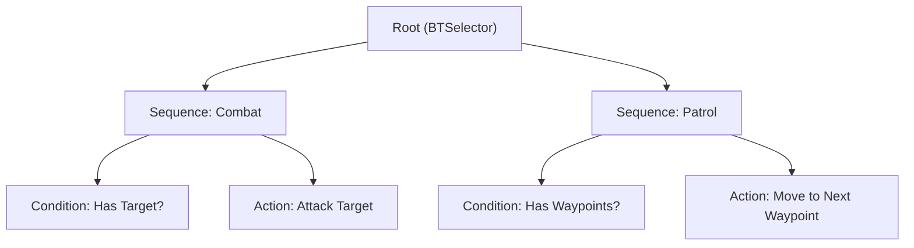

# 🧠 Godot 4 Behavior Trees & Sensory Perception Engine

This skill provides a modular, high-performance, and typed **Behavior Tree & Perception Architecture** for Godot 4.x.

---

## 🌲 1. Behavior Tree Architecture

Every node in the tree inherits from `BTNode` and returns a `Status`: `SUCCESS`, `FAILURE`, or `RUNNING`.



### 💎 Node Evaluation Rules:
*   **Selector (`?`)**: Executes children from left to right. Returns `SUCCESS` or `RUNNING` on the first non-failing child. Returns `FAILURE` only if all children fail (OR logic).
*   **Sequence (`→`)**: Executes children from left to right. Returns `FAILURE` or `RUNNING` on the first non-successful child. Returns `SUCCESS` only if all children succeed (AND logic).
*   **Decorator**: Wraps a single child to modify its return status (e.g. `Inverter`, `CooldownTimer`).
*   **Action**: Leaf node executing game logic (e.g. `MoveTo`, `PlayAnimation`, `Attack`).

---

## 💎 2. Core Behavior Tree Nodes

### 🌿 Base Node: `BTNode.gd`
```gdscript
# res://src/core/components/behavior_tree/bt_node.gd
class_name BTNode
extends Node

enum Status { SUCCESS, FAILURE, RUNNING }

var blackboard: Blackboard = null
var actor: Node = null

func initialize(p_actor: Node, p_blackboard: Blackboard) -> void:
	actor = p_actor
	blackboard = p_blackboard
	for child: Node in get_children():
		if child is BTNode:
			(child as BTNode).initialize(p_actor, p_blackboard)

## Evaluates the node. Must be overridden by subclasses.
func tick(_delta: float) -> Status:
	return Status.SUCCESS
```

### 🔀 Selector: `BTSelector.gd`
```gdscript
# res://src/core/components/behavior_tree/bt_selector.gd
class_name BTSelector
extends BTNode

var _running_child_index: int = 0

func tick(delta: float) -> Status:
	for i: int in range(_running_child_index, get_child_count()):
		var child: BTNode = get_child(i) as BTNode
		if child == null:
			continue

		var result: Status = child.tick(delta)
		if result == Status.RUNNING:
			_running_child_index = i
			return Status.RUNNING
		elif result == Status.SUCCESS:
			_running_child_index = 0
			return Status.SUCCESS

	_running_child_index = 0
	return Status.FAILURE
```

### ➡️ Sequence: `BTSequence.gd`
```gdscript
# res://src/core/components/behavior_tree/bt_sequence.gd
class_name BTSequence
extends BTNode

var _running_child_index: int = 0

func tick(delta: float) -> Status:
	for i: int in range(_running_child_index, get_child_count()):
		var child: BTNode = get_child(i) as BTNode
		if child == null:
			continue

		var result: Status = child.tick(delta)
		if result == Status.RUNNING:
			_running_child_index = i
			return Status.RUNNING
		elif result == Status.FAILURE:
			_running_child_index = 0
			return Status.FAILURE

	_running_child_index = 0
	return Status.SUCCESS
```

---

## 💾 3. Shared Agent Memory: `Blackboard.gd`

```gdscript
# res://src/core/components/behavior_tree/blackboard.gd
class_name Blackboard
extends RefCounted

var _data: Dictionary[StringName, Variant] = {}

func set_value(key: StringName, value: Variant) -> void:
	_data[key] = value

func get_value(key: StringName, default_value: Variant = null) -> Variant:
	return _data.get(key, default_value)

func has_value(key: StringName) -> bool:
	return _data.has(key)

func erase_value(key: StringName) -> void:
	_data.erase(key)

func clear() -> void:
	_data.clear()
```

---

## 👁️ 4. Sensory Perception Engine (Vision Cone & Hearing)

```gdscript
# res://src/core/components/ai/perception_component_2d.gd
class_name PerceptionComponent2D
extends Node2D

signal target_spotted(target: Node2D)
signal target_lost()
signal alert_level_changed(new_level: AlertLevel)

enum AlertLevel { UNAWARE, SUSPICIOUS, ALERT, COMBAT }

@export_group("Vision Settings")
@export var vision_range: float = 350.0
@export var vision_angle_degrees: float = 90.0
@export var raycast: RayCast2D
@export var target_group: StringName = &"player"

@export_group("Alert Dynamics")
@export var suspicion_build_rate: float = 1.5
@export var suspicion_decay_rate: float = 0.5

var current_alert_level: AlertLevel = AlertLevel.UNAWARE
var suspicion_meter: float = 0.0
var current_target: Node2D = null

func _physics_process(delta: float) -> void:
	var potential_target: Node2D = _find_target_in_vision_cone()

	if potential_target != null:
		suspicion_meter = minf(1.0, suspicion_meter + suspicion_build_rate * delta)
		if suspicion_meter >= 1.0 and current_alert_level != AlertLevel.COMBAT:
			_set_alert_level(AlertLevel.COMBAT)
			current_target = potential_target
			target_spotted.emit(current_target)
		elif current_alert_level == AlertLevel.UNAWARE:
			_set_alert_level(AlertLevel.SUSPICIOUS)
	else:
		suspicion_meter = maxf(0.0, suspicion_meter - suspicion_decay_rate * delta)
		if is_zero_approx(suspicion_meter) and current_alert_level != AlertLevel.UNAWARE:
			_set_alert_level(AlertLevel.UNAWARE)
			current_target = null
			target_lost.emit()

func _find_target_in_vision_cone() -> Node2D:
	var targets: Array[Node] = get_tree().get_nodes_in_group(target_group)
	for node: Node in targets:
		if not (node is Node2D):
			continue
		var candidate: Node2D = node as Node2D
		var to_target: Vector2 = candidate.global_position - global_position
		var distance: float = to_target.length()

		if distance > vision_range:
			continue

		var forward: Vector2 = Vector2.RIGHT.rotated(global_rotation)
		var angle_to_target: float = rad_to_deg(abs(forward.angle_to(to_target)))

		if angle_to_target <= vision_angle_degrees * 0.5:
			# Raycast line-of-sight check
			if raycast:
				raycast.global_position = global_position
				raycast.target_position = raycast.to_local(candidate.global_position)
				raycast.force_raycast_update()
				if not raycast.is_colliding() or raycast.get_collider() == candidate:
					return candidate
			else:
				return candidate
	return null

func _set_alert_level(new_level: AlertLevel) -> void:
	if current_alert_level != new_level:
		current_alert_level = new_level
		alert_level_changed.emit(current_alert_level)
```
