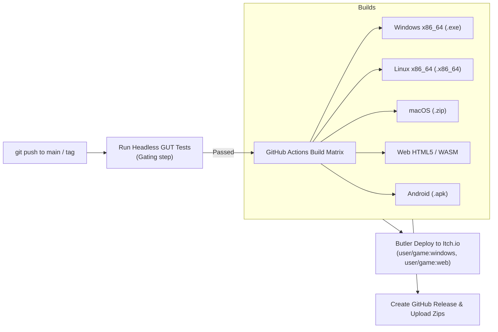

# 🚀 Godot 4 CI/CD & Headless Multi-Platform Export Automation

This skill provides a complete **Continuous Integration & Continuous Delivery (CI/CD)** pipeline for Godot 4.x games using GitHub Actions, Butler (itch.io), and headless export automation.

---

## 🏗️ 1. Automated Delivery Pipeline



---

## 💎 2. Production GitHub Actions Workflow: `deploy.yml`

```yaml
# .github/workflows/deploy.yml
name: "🚀 Godot 4 CI/CD: Test, Build & Deploy"

on:
  push:
    branches: [ "main" ]
    tags: [ "v*" ]

env:
  GODOT_VERSION: "4.3"
  EXPORT_NAME: "GodotGame"

jobs:
  # 1. TEST SUITE GATING
  test:
    name: "🧪 Run GUT Unit Tests"
    runs-on: ubuntu-latest
    steps:
      - name: "Checkout Code"
        uses: actions/checkout@v4

      - name: "Run Headless GUT Tests"
        uses: barichello/godot-ci@v4.3.0
        with:
          godot_version: ${{ env.GODOT_VERSION }}
        env:
          DIRECT_CMD: "godot --headless -s addons/gut/gut_cmdln.gd -gdir=res://test/unit -gexit"

  # 2. MATRIX EXPORT BUILD
  build:
    name: "📦 Export Matrix (${{ matrix.preset }})"
    needs: test
    runs-on: ubuntu-latest
    strategy:
      fail-fast: false
      matrix:
        include:
          - preset: "Windows Desktop"
            filename: "GodotGame.exe"
            channel: "windows"
          - preset: "Linux"
            filename: "GodotGame.x86_64"
            channel: "linux"
          - preset: "Web"
            filename: "index.html"
            channel: "web"

    steps:
      - name: "Checkout Code"
        uses: actions/checkout@v4

      - name: "Setup Export Directory"
        run: mkdir -v -p build/${{ matrix.channel }}

      - name: "Export Game"
        uses: barichello/godot-ci@v4.3.0
        with:
          godot_version: ${{ env.GODOT_VERSION }}
          export_preset: ${{ matrix.preset }}
          export_path: "build/${{ matrix.channel }}/${{ matrix.filename }}"

      - name: "Upload Build Artifact"
        uses: actions/upload-artifact@v4
        with:
          name: "${{ env.EXPORT_NAME }}-${{ matrix.channel }}"
          path: "build/${{ matrix.channel }}"

      # 3. ITCH.IO DEPLOYMENT (On Tags)
      - name: "Deploy to Itch.io via Butler"
        if: startsWith(github.ref, 'refs/tags/v') && env.BUTLER_API_KEY != ''
        uses: josephbmanley/butler-publish-action@v1.0.3
        env:
          BUTLER_API_KEY: ${{ secrets.BUTLER_API_KEY }}
          ITCH_GAME: ${{ secrets.ITCH_GAME_NAME }}
          ITCH_USER: ${{ secrets.ITCH_USER_NAME }}
          PACKAGE: "build/${{ matrix.channel }}"
          CHANNEL: ${{ matrix.channel }}
```

---

## 💻 3. Local PowerShell Export Automation: `export_game.ps1`

```powershell
# PowerShell script to export Godot 4 release builds locally
param (
    [string]$Preset = "Windows Desktop",
    [string]$OutputPath = "build/windows/GodotGame.exe"
)

Write-Host "🚀 Exporting Godot 4 Release for [$Preset]..." -ForegroundColor Cyan

$OutDir = Split-Path $OutputPath
if (-not (Test-Path $OutDir)) {
    New-Item -ItemType Directory -Path $OutDir | Out-Null
}

$Args = @(
    "--headless",
    "--export-release",
    "$Preset",
    "$OutputPath"
)

& "godot" $Args
if ($LASTEXITCODE -eq 0) {
    Write-Host "✅ Export Completed Successfully -> $OutputPath" -ForegroundColor Green
} else {
    Write-Host "❌ Export Failed with code $LASTEXITCODE" -ForegroundColor Red
}
exit $LASTEXITCODE
```
