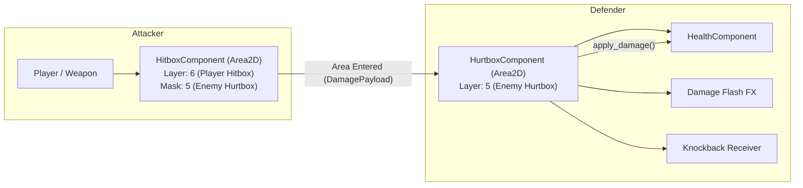

# ⚔️ Godot 4 Combat Engine (Hitbox, Hurtbox & Juice)

This skill provides a frame-perfect, modular, and juice-packed combat architecture for Godot 4.x.

---

## 🎯 1. Collision Layers & Architecture

Never mix up attack collisions with body physics collisions. Dedicate separate collision layers:

```text
Layer 1: World / Environment (Static solids, tilemaps)
Layer 2: Player Body (Physics & Navigation)
Layer 3: Enemy Body (Physics & Navigation)
Layer 4: Player Hurtbox (Receives Enemy Attacks)
Layer 5: Enemy Hurtbox (Receives Player Attacks)
Layer 6: Player Hitbox (Deals damage to Layer 5)
Layer 7: Enemy Hitbox (Deals damage to Layer 4)
```



---

## 💎 2. Typed Damage Payload: `DamagePayload.gd`

```gdscript
# res://src/core/types/damage_payload.gd
class_name DamagePayload
extends RefCounted

enum ElementType { PHYSICAL, FIRE, ICE, LIGHTNING, POISON, VOID }

var base_damage: float = 10.0
var knockback_force: Vector2 = Vector2.ZERO
var hitstop_duration: float = 0.08 # Freeze-frame in seconds
var stun_duration: float = 0.2
var is_critical: bool = false
var element: ElementType = ElementType.PHYSICAL
var attacker: Node = null

func _init(
	p_damage: float = 10.0,
	p_knockback: Vector2 = Vector2.ZERO,
	p_hitstop: float = 0.08,
	p_is_crit: bool = false,
	p_attacker: Node = null,
	p_element: ElementType = ElementType.PHYSICAL
) -> void:
	base_damage = p_damage
	knockback_force = p_knockback
	hitstop_duration = p_hitstop
	is_critical = p_is_crit
	attacker = p_attacker
	element = p_element
```

---

## 💎 3. Hitbox & Hurtbox Components

### 🗡️ HitboxComponent2D.gd
```gdscript
# res://src/core/components/combat/hitbox_component_2d.gd
class_name HitboxComponent2D
extends Area2D

signal hit_landed(hurtbox: HurtboxComponent2D, payload: DamagePayload)

@export var base_damage: float = 15.0
@export var knockback_magnitude: float = 300.0
@export var hitstop_seconds: float = 0.08
@export var is_critical: bool = false

func create_payload(target_position: Vector2) -> DamagePayload:
	var knockback_dir: Vector2 = (target_position - global_position).normalized()
	if is_zero_approx(knockback_dir.length()):
		knockback_dir = Vector2.RIGHT
	var knockback_vector: Vector2 = knockback_dir * knockback_magnitude

	return DamagePayload.new(
		base_damage,
		knockback_vector,
		hitstop_seconds,
		is_critical,
		owner
	)

func notify_hit_landed(hurtbox: HurtboxComponent2D, payload: DamagePayload) -> void:
	hit_landed.emit(hurtbox, payload)
```

### 🛡️ HurtboxComponent2D.gd
```gdscript
# res://src/core/components/combat/hurtbox_component_2d.gd
class_name HurtboxComponent2D
extends Area2D

signal payload_received(payload: DamagePayload)

@export var health_component: HealthComponent
@export var invulnerability_duration: float = 0.4

var _is_invulnerable: bool = false
var _invuln_timer: float = 0.0

func _ready() -> void:
	area_entered.connect(_on_area_entered)

func _physics_process(delta: float) -> void:
	if _is_invulnerable:
		_invuln_timer -= delta
		if _invuln_timer <= 0.0:
			_is_invulnerable = false

func _on_area_entered(area: Area2D) -> void:
	if _is_invulnerable or not (area is HitboxComponent2D):
		return

	var hitbox: HitboxComponent2D = area as HitboxComponent2D
	var payload: DamagePayload = hitbox.create_payload(global_position)

	if health_component and health_component.is_alive():
		health_component.apply_damage(payload.base_damage, payload.attacker)

	# Trigger Invulnerability
	if invulnerability_duration > 0.0:
		_is_invulnerable = true
		_invuln_timer = invulnerability_duration

	payload_received.emit(payload)
	hitbox.notify_hit_landed(self, payload)
```

---

## 📳 4. Screen Shake Trauma Engine: `ScreenShakeDirector.gd`

Using the **Trauma / Stress Equation** ($Trauma^2$ or $Trauma^3$ with Perlin Noise) produces vastly more satisfying screen shake than linear random noise.

```gdscript
# res://src/core/services/screen_shake_director.gd
class_name ScreenShakeDirector
extends Node

@export var camera: Camera2D
@export var max_offset: Vector2 = Vector2(24.0, 16.0)
@export var max_roll_degrees: float = 4.0
@export var trauma_decay: float = 1.4

var trauma: float = 0.0 # Range 0.0 to 1.0
var _noise: FastNoiseLite = FastNoiseLite.new()
var _noise_y: float = 0.0

func _ready() -> void:
	_noise.noise_type = FastNoiseLite.TYPE_PERLIN
	_noise.frequency = 0.05

## Adds trauma to the screen shake (clamped to 1.0).
func add_trauma(amount: float) -> void:
	trauma = minf(1.0, trauma + amount)

func _process(delta: float) -> void:
	if not camera or is_zero_approx(trauma):
		return

	trauma = maxf(0.0, trauma - trauma_decay * delta)
	var shake_amount: float = trauma * trauma # Non-linear quadratic curve

	_noise_y += delta * 60.0
	camera.offset.x = max_offset.x * shake_amount * _noise.get_noise_2d(10.0, _noise_y)
	camera.offset.y = max_offset.y * shake_amount * _noise.get_noise_2d(100.0, _noise_y)
	camera.rotation = deg_to_rad(max_roll_degrees * shake_amount * _noise.get_noise_2d(200.0, _noise_y))
```
