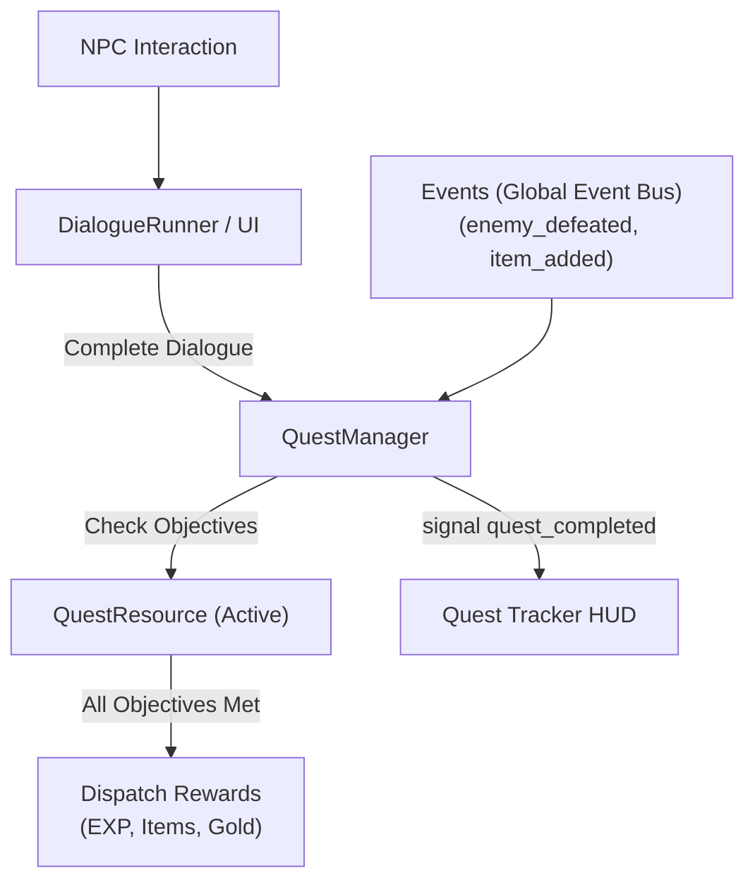

# 📜 Godot 4 Branching Dialogue & Quest Engine

This skill provides an enterprise-grade, event-driven **Dialogue and Quest Progression System** for Godot 4.x.

---

## 🏗️ 1. Architecture Overview

Quests and Dialogue are driven by **Custom Resources** and synchronized with the **Event Bus**.



---

## 💎 2. Branching Dialogue Node: `DialogueNode.gd`

```gdscript
# res://src/core/types/dialogue_node.gd
class_name DialogueNode
extends Resource

@export var id: StringName = &""
@export var speaker_name: String = ""
@export var speaker_portrait: Texture2D
@export_multiline var dialogue_text: String = ""
@export var choices: Array[DialogueChoice] = []
@export var next_node_id: StringName = &"" # If choices are empty
@export var quest_trigger_id: StringName = &"" # Starts quest on reaching this node

# Sub-resource for dialogue choices
# class_name DialogueChoice extends Resource
# @export var choice_text: String
# @export var target_node_id: StringName
# @export var required_quest_flag: StringName
```

---

## 💎 3. Quest Data Structure: `QuestResource.gd`

```gdscript
# res://src/core/types/quest_resource.gd
class_name QuestResource
extends Resource

enum QuestState { NOT_STARTED, IN_PROGRESS, READY_TO_TURN_IN, COMPLETED, FAILED }
enum ObjectiveType { KILL_ENEMIES, COLLECT_ITEMS, REACH_LOCATION, TALK_TO_NPC }

@export_group("Quest Metadata")
@export var id: StringName = &""
@export var title: String = ""
@export_multiline var description: String = ""

@export_group("Objectives")
@export var objective_type: ObjectiveType = ObjectiveType.KILL_ENEMIES
@export var target_id: StringName = &"" # e.g., &"enemy_slime" or &"item_herbs"
@export var target_amount: int = 5
@export var current_amount: int = 0

@export_group("Rewards")
@export var exp_reward: int = 150
@export var gold_reward: int = 50
@export var item_rewards: Array[ItemData] = []

var state: QuestState = QuestState.NOT_STARTED

## Advances progress and returns true if objective is newly fulfilled.
func advance_progress(amount: int = 1) -> bool:
	if state != QuestState.IN_PROGRESS:
		return false

	current_amount = mini(current_amount + amount, target_amount)
	if current_amount >= target_amount:
		state = QuestState.READY_TO_TURN_IN
		return true
	return false

## Returns formatted progress string (e.g. "3 / 5").
func get_progress_string() -> String:
	return "%d / %d" % [current_amount, target_amount]
```

---

## 💎 4. Quest Manager Service: `QuestManager.gd`

```gdscript
# res://src/core/services/quest_manager.gd
class_name QuestManager
extends Node

signal quest_started(quest: QuestResource)
signal quest_updated(quest: QuestResource)
signal quest_completed(quest: QuestResource)

var active_quests: Dictionary[StringName, QuestResource] = {}
var completed_quest_ids: Array[StringName] = []

func _ready() -> void:
	# Listen to global events
	Events.enemy_defeated.connect(_on_enemy_defeated)

## Starts a new quest by resource template.
func start_quest(quest_template: QuestResource) -> void:
	if quest_template == null or active_quests.has(quest_template.id) or completed_quest_ids.has(quest_template.id):
		return

	var quest_instance: QuestResource = quest_template.duplicate(true) as QuestResource
	quest_instance.state = QuestResource.QuestState.IN_PROGRESS
	quest_instance.current_amount = 0
	active_quests[quest_instance.id] = quest_instance

	quest_started.emit(quest_instance)

## Evaluates enemy defeated events against active quests.
func _on_enemy_defeated(enemy_id: StringName, _exp: int, _pos: Vector3) -> void:
	for quest: QuestResource in active_quests.values():
		if quest.objective_type == QuestResource.ObjectiveType.KILL_ENEMIES and quest.target_id == enemy_id:
			var completed_now: bool = quest.advance_progress(1)
			quest_updated.emit(quest)
			if completed_now:
				Events.notification_requested.emit("Quest Ready!", "%s is ready to turn in." % quest.title, null)

## Completes quest, transfers rewards, and moves to completed list.
func complete_quest(quest_id: StringName, player_inventory: InventoryComponent) -> bool:
	if not active_quests.has(quest_id):
		return false

	var quest: QuestResource = active_quests[quest_id]
	if quest.state != QuestResource.QuestState.READY_TO_TURN_IN and quest.state != QuestResource.QuestState.IN_PROGRESS:
		return false

	quest.state = QuestResource.QuestState.COMPLETED
	active_quests.erase(quest_id)
	completed_quest_ids.append(quest_id)

	# Grant item rewards if inventory provided
	if player_inventory:
		for item: ItemData in quest.item_rewards:
			player_inventory.add_item(item, 1)

	quest_completed.emit(quest)
	return true
```
