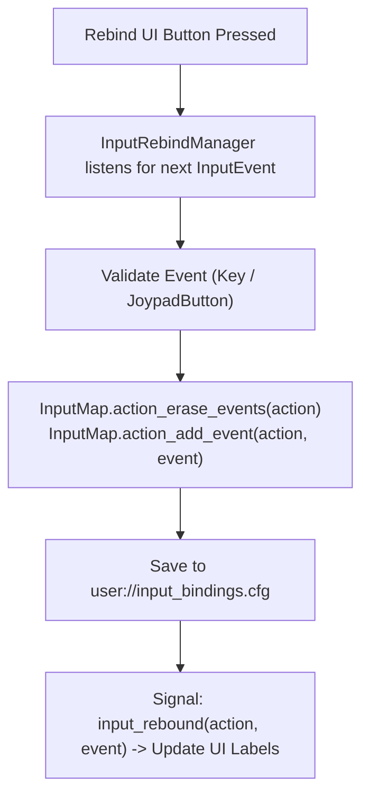

# 🎮 Godot 4 Input Remapping & Buffering Architecture

This skill provides a complete solution for **Runtime Input Remapping**, **ConfigFile Persistence**, and **Action Input Buffering** in Godot 4.x.

---

## ⚡ 1. Input Remapping Architecture



---

## 💎 2. Input Rebind Manager: `InputRebindManager.gd`

```gdscript
# res://src/core/services/input/input_rebind_manager.gd
class_name InputRebindManager
extends Node

signal input_rebound(action_name: StringName, event: InputEvent)

const CONFIG_PATH: String = "user://input_bindings.cfg"

## Rebinds an action to a new input event and persists to disk.
static func rebind_action(action_name: StringName, new_event: InputEvent) -> void:
	if not InputMap.has_action(action_name):
		return

	InputMap.action_erase_events(action_name)
	InputMap.action_add_event(action_name, new_event)
	save_bindings_to_disk()

## Saves all custom mappings to ConfigFile.
static func save_bindings_to_disk() -> void:
	var config: ConfigFile = ConfigFile.new()
	for action in InputMap.get_actions():
		var events: Array[InputEvent] = InputMap.action_get_events(action)
		if not events.is_empty():
			config.set_value("bindings", str(action), events[0])
	config.save(CONFIG_PATH)

## Loads saved bindings from disk on game startup.
static func load_bindings_from_disk() -> void:
	var config: ConfigFile = ConfigFile.new()
	if config.load(CONFIG_PATH) != OK:
		return # No custom bindings saved yet

	for action_str in config.get_section_keys("bindings"):
		var action_name: StringName = StringName(action_str)
		var event: InputEvent = config.get_value("bindings", action_str) as InputEvent
		if event and InputMap.has_action(action_name):
			InputMap.action_erase_events(action_name)
			InputMap.action_add_event(action_name, event)
```

---

## ⏱️ 3. Frame-Accurate Input Buffer: `InputBufferComponent.gd`

Queue actions pressed during uninterruptible states (e.g. animation lock) so they fire the moment the character becomes free.

```gdscript
# res://src/core/components/input/input_buffer_component.gd
class_name InputBufferComponent
extends Node

@export var buffer_duration: float = 0.15

var _buffer: Dictionary[StringName, float] = {} # ActionName -> Timestamp

func _unhandled_input(event: InputEvent) -> void:
	for action: StringName in _buffer.keys():
		if event.is_action_pressed(action):
			_buffer[action] = Time.get_ticks_msec() / 1000.0

## Registers an action to be buffered automatically.
func register_action(action_name: StringName) -> void:
	_buffer[action_name] = -999.0

## Consumes a buffered action if pressed within buffer_duration. Returns true if successful.
func consume_action(action_name: StringName) -> bool:
	if not _buffer.has(action_name):
		return false

	var press_time: float = _buffer[action_name]
	var current_time: float = Time.get_ticks_msec() / 1000.0

	if current_time - press_time <= buffer_duration:
		_buffer[action_name] = -999.0 # Invalidate
		return true

	return false
```
