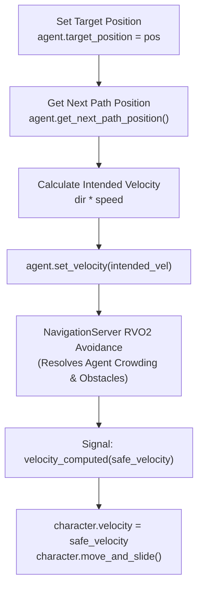

# 🧭 Godot 4 NavigationServer & Dynamic Pathfinding

This skill provides the production architecture for **2D & 3D NavigationAgents**, **RVO2 Dynamic Obstacle Avoidance**, and **Runtime NavMesh Baking** in Godot 4.x.

---

## ⚡ 1. Navigation Flow & Avoidance Loop

In Godot 4, dynamic obstacle avoidance is processed asynchronously by the NavigationServer. **Never assign agent velocity directly when avoidance is enabled**; you must pass intention via `set_velocity()` and wait for `velocity_computed`.



---

## 💎 2. Production 2D Navigation Controller: `NavAgentController2D.gd`

```gdscript
# res://src/core/components/ai/nav_agent_controller_2d.gd
class_name NavAgentController2D
extends Node

signal destination_reached()

@export var agent: NavigationAgent2D
@export var character: CharacterBody2D
@export var movement_speed: float = 160.0
@export var acceleration: float = 1200.0

var _is_active: bool = false

func _ready() -> void:
	if agent:
		agent.velocity_computed.connect(_on_velocity_computed)
		agent.navigation_finished.connect(_on_navigation_finished)

## Commands the agent to navigate towards a world coordinate.
func set_target(destination: Vector2) -> void:
	if not agent or not character:
		return
	agent.target_position = destination
	_is_active = true

func _physics_process(delta: float) -> void:
	if not _is_active or not agent or not character:
		return

	if agent.is_navigation_finished():
		_is_active = false
		character.velocity = character.velocity.move_toward(Vector2.ZERO, acceleration * delta)
		character.move_and_slide()
		return

	var next_path_pos: Vector2 = agent.get_next_path_position()
	var intended_direction: Vector2 = (next_path_pos - character.global_position).normalized()
	var intended_velocity: Vector2 = intended_direction * movement_speed

	if agent.avoidance_enabled:
		agent.set_velocity(intended_velocity)
	else:
		_on_velocity_computed(intended_velocity)

func _on_velocity_computed(safe_velocity: Vector2) -> void:
	if character:
		character.velocity = safe_velocity
		character.move_and_slide()

func _on_navigation_finished() -> void:
	_is_active = false
	destination_reached.emit()
```

---

## 💎 3. Production 3D Navigation Controller: `NavAgentController3D.gd`

```gdscript
# res://src/core/components/ai/nav_agent_controller_3d.gd
class_name NavAgentController3D
extends Node

signal destination_reached()

@export var agent: NavigationAgent3D
@export var character: CharacterBody3D
@export var movement_speed: float = 5.0
@export var rotation_speed: float = 8.0

var _is_active: bool = false

func _ready() -> void:
	if agent:
		agent.velocity_computed.connect(_on_velocity_computed)
		agent.navigation_finished.connect(_on_navigation_finished)

func set_target(destination: Vector3) -> void:
	if not agent or not character:
		return
	agent.target_position = destination
	_is_active = true

func _physics_process(delta: float) -> void:
	if not _is_active or not agent or not character:
		return

	if agent.is_navigation_finished():
		_is_active = false
		return

	var next_path_pos: Vector3 = agent.get_next_path_position()
	var move_dir: Vector3 = (next_path_pos - character.global_position).normalized()
	move_dir.y = 0.0 # Maintain ground plane direction

	# Smooth rotation toward movement vector
	if move_dir.length_squared() > 0.001:
		var target_rot: float = atan2(move_dir.x, move_dir.z)
		character.rotation.y = rotate_toward(character.rotation.y, target_rot, rotation_speed * delta)

	var intended_velocity: Vector3 = move_dir * movement_speed

	if agent.avoidance_enabled:
		agent.set_velocity(intended_velocity)
	else:
		_on_velocity_computed(intended_velocity)

func _on_velocity_computed(safe_velocity: Vector3) -> void:
	if character:
		character.velocity.x = safe_velocity.x
		character.velocity.z = safe_velocity.z
		character.move_and_slide()

func _on_navigation_finished() -> void:
	_is_active = false
	destination_reached.emit()
```

---

## 🔄 4. Runtime NavMesh Baker: `RuntimeNavMeshBaker.gd`

After generating a procedural dungeon or placing obstacles at runtime, rebuild the navigation region dynamically.

```gdscript
# res://src/core/services/pcg/runtime_nav_mesh_baker.gd
class_name RuntimeNavMeshBaker
extends Node

signal baking_completed()

@export var navigation_region_2d: NavigationRegion2D
@export var navigation_region_3d: NavigationRegion3D

## Re-bakes 2D NavigationPolygon asynchronously.
func rebake_2d() -> void:
	if navigation_region_2d:
		navigation_region_2d.bake_navigation_polygon(true)
		baking_completed.emit()

## Re-bakes 3D NavigationMesh asynchronously.
func rebake_3d() -> void:
	if navigation_region_3d:
		navigation_region_3d.bake_navigation_mesh(true)
		baking_completed.emit()
```
