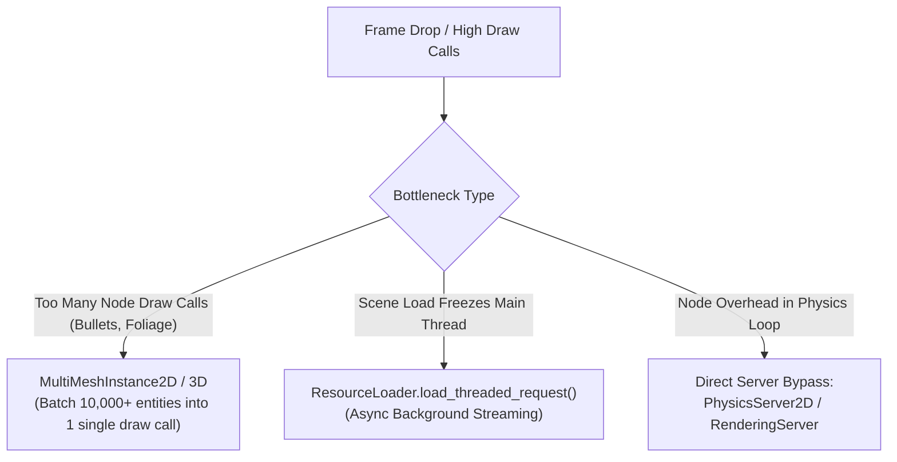

# ⚡ Godot 4 Performance Profiling & MultiMesh Optimization

This skill provides the architecture and tools for **maximizing frame rates, slashing draw calls, and background asset streaming** in Godot 4.x.

---

## 🎯 1. Optimization Hierarchy



---

## 💎 2. 50,000+ Bullet Batcher: `MultiMeshBulletManager2D.gd`

Instead of spawning 5,000 `Area2D` or `Sprite2D` nodes (which crushes CPU and GPU), manage them in a single `MultiMeshInstance2D`.

```gdscript
# res://src/core/services/vfx/multimesh_bullet_manager_2d.gd
class_name MultiMeshBulletManager2D
extends MultiMeshInstance2D

@export var max_bullets: int = 10000

struct Bullet:
	var position: Vector2
	var velocity: Vector2
	var is_alive: bool

var _bullets: Array[Dictionary] = [] # [{pos, vel, alive}]
var _active_count: int = 0

func _ready() -> void:
	multimesh.instance_count = max_bullets
	multimesh.visible_instance_count = 0

	for i in range(max_bullets):
		_bullets.append({
			"pos": Vector2.ZERO,
			"vel": Vector2.ZERO,
			"alive": false
		})

## Spawns a new bullet without scene instantiation.
func spawn_bullet(pos: Vector2, vel: Vector2) -> void:
	for i in range(max_bullets):
		if not _bullets[i]["alive"]:
			_bullets[i]["pos"] = pos
			_bullets[i]["vel"] = vel
			_bullets[i]["alive"] = true
			_active_count = maxi(_active_count, i + 1)
			return

func _physics_process(delta: float) -> void:
	var live_count: int = 0
	var screen_rect: Rect2 = get_viewport_rect()

	for i in range(_active_count):
		if _bullets[i]["alive"]:
			_bullets[i]["pos"] += _bullets[i]["vel"] * delta
			
			# Check screen bounds
			if not screen_rect.has_point(_bullets[i]["pos"]):
				_bullets[i]["alive"] = false
				continue

			# Update MultiMesh Transform
			var xform: Transform2D = Transform2D(0.0, _bullets[i]["pos"])
			multimesh.set_instance_transform_2d(i, xform)
			live_count = i + 1

	multimesh.visible_instance_count = live_count
```

---

## 💎 3. Background Threaded Scene Loader: `ThreadedSceneLoader.gd`

```gdscript
# res://src/core/services/scene_loader/threaded_scene_loader.gd
class_name ThreadedSceneLoader
extends Node

signal progress_updated(progress_ratio: float)
signal load_completed(loaded_scene: PackedScene)
signal load_failed()

var _target_scene_path: String = ""
var _is_loading: bool = false

func start_loading(scene_path: String) -> void:
	_target_scene_path = scene_path
	var err: Error = ResourceLoader.load_threaded_request(scene_path, "", true)
	if err != OK:
		push_error("ThreadedSceneLoader: Failed to initiate background load for: %s" % scene_path)
		load_failed.emit()
		return
	_is_loading = true

func _process(_delta: float) -> void:
	if not _is_loading:
		return

	var progress_array: Array = []
	var status: ResourceLoader.ThreadLoadStatus = ResourceLoader.load_threaded_get_status(_target_scene_path, progress_array)

	match status:
		ResourceLoader.THREAD_LOAD_IN_PROGRESS:
			var progress_val: float = progress_array[0] if not progress_array.is_empty() else 0.0
			progress_updated.emit(progress_val)
		ResourceLoader.THREAD_LOAD_LOADED:
			_is_loading = false
			var scene: PackedScene = ResourceLoader.load_threaded_get(_target_scene_path) as PackedScene
			progress_updated.emit(1.0)
			load_completed.emit(scene)
		ResourceLoader.THREAD_LOAD_FAILED, ResourceLoader.THREAD_LOAD_INVALID_RESOURCE:
			_is_loading = false
			push_error("ThreadedSceneLoader: Background load failed for: %s" % _target_scene_path)
			load_failed.emit()
```

---

## 📊 4. In-Game Performance Overlay: `PerformanceMonitorOverlay.gd`

```gdscript
# res://src/ui/debug/performance_monitor_overlay.gd
class_name PerformanceMonitorOverlay
extends CanvasLayer

@onready var label: Label = Label.new()

func _ready() -> void:
	layer = 128 # Always on top
	label.position = Vector2(16, 16)
	label.modulate = Color(0.2, 1.0, 0.4)
	add_child(label)

func _process(_delta: float) -> void:
	var fps: float = Performance.get_monitor(Performance.TIME_FPS)
	var process_time: float = Performance.get_monitor(Performance.TIME_PROCESS) * 1000.0
	var physics_time: float = Performance.get_monitor(Performance.TIME_PHYSICS_PROCESS) * 1000.0
	var draw_calls: float = Performance.get_monitor(Performance.RENDER_TOTAL_DRAW_CALLS_IN_FRAME)
	var video_mem: float = Performance.get_monitor(Performance.RENDER_VIDEO_MEM_USED) / (1024.0 * 1024.0)

	label.text = "FPS: %d | Frame: %.2f ms | Physics: %.2f ms\nDraw Calls: %d | VRAM: %.1f MB" % [
		int(fps), process_time, physics_time, int(draw_calls), video_mem
	]
```
