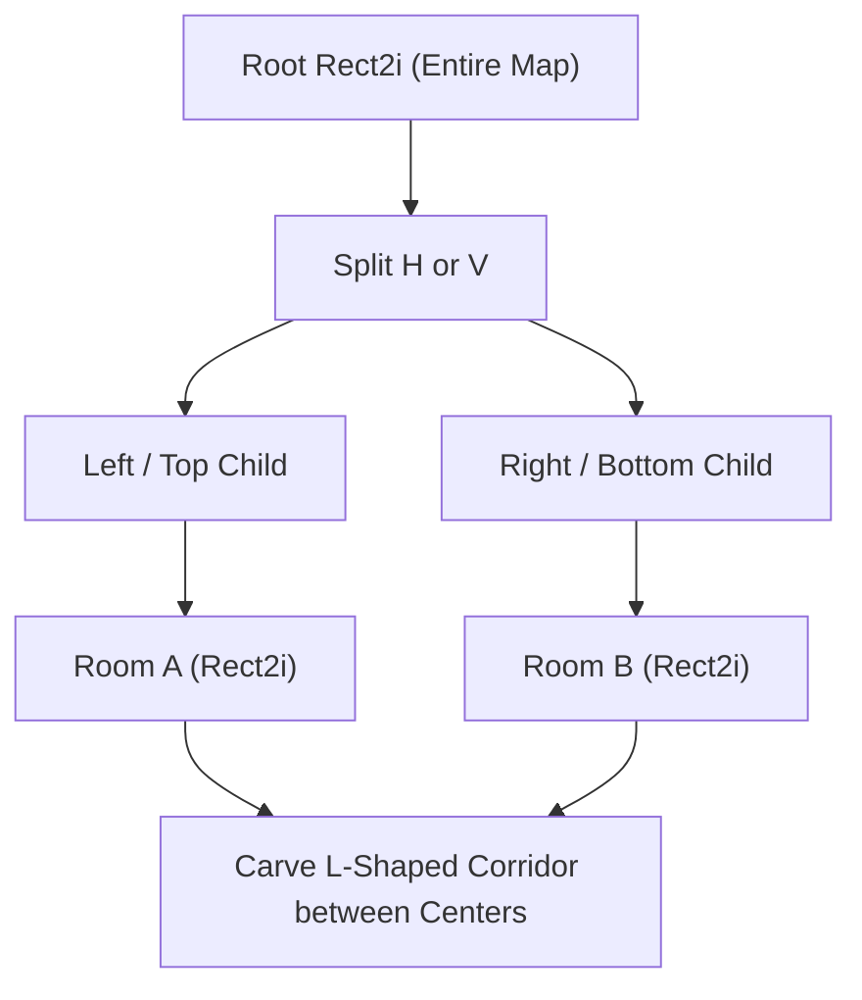

# 🗺️ Godot 4 Procedural Generation (PCG) Mastery

This skill provides production algorithms for **BSP Dungeons**, **Cellular Automata Caves**, and **Noise Terrain Generation** for Godot 4.3+ using the modern `TileMapLayer` API.

---

## 🏰 1. Binary Space Partitioning (BSP) Dungeon Generator



### 💎 Production BSP Generator: `BSPDungeonGenerator.gd`
```gdscript
# res://src/core/services/pcg/bsp_dungeon_generator.gd
class_name BSPDungeonGenerator
extends Node

@export var map_size: Vector2i = Vector2i(80, 50)
@export var min_leaf_size: int = 12
@export var min_room_size: int = 6
@export var room_padding: int = 2

class BSPLeaf extends RefCounted:
	var rect: Rect2i
	var left_child: BSPLeaf = null
	var right_child: BSPLeaf = null
	var room: Rect2i = Rect2i()

	func _init(p_rect: Rect2i) -> void:
		rect = p_rect

	func split(min_size: int) -> bool:
		if left_child != null or right_child != null:
			return false

		var split_horizontally: bool = randf() > 0.5
		if rect.size.x > rect.size.y and float(rect.size.x) / float(rect.size.y) >= 1.25:
			split_horizontally = false
		elif rect.size.y > rect.size.x and float(rect.size.y) / float(rect.size.x) >= 1.25:
			split_horizontally = true

		var max_limit: int = (rect.size.y if split_horizontally else rect.size.x) - min_size
		if max_limit <= min_size:
			return false

		var split_pos: int = randi_range(min_size, max_limit)
		if split_horizontally:
			left_child = BSPLeaf.new(Rect2i(rect.position.x, rect.position.y, rect.size.x, split_pos))
			right_child = BSPLeaf.new(Rect2i(rect.position.x, rect.position.y + split_pos, rect.size.x, rect.size.y - split_pos))
		else:
			left_child = BSPLeaf.new(Rect2i(rect.position.x, rect.position.y, split_pos, rect.size.y))
			right_child = BSPLeaf.new(Rect2i(rect.position.x + split_pos, rect.position.y, rect.size.x - split_pos, rect.size.y))

		return true

	func create_rooms(min_size: int, padding: int) -> void:
		if left_child != null or right_child != null:
			if left_child: left_child.create_rooms(min_size, padding)
			if right_child: right_child.create_rooms(min_size, padding)
		else:
			var w: int = randi_range(min_size, rect.size.x - padding * 2)
			var h: int = randi_range(min_size, rect.size.y - padding * 2)
			var x: int = randi_range(rect.position.x + padding, rect.position.x + rect.size.x - w - padding)
			var y: int = randi_range(rect.position.y + padding, rect.position.y + rect.size.y - h - padding)
			room = Rect2i(x, y, w, h)

## Generates a complete grid matrix (0 = Wall, 1 = Floor).
func generate_dungeon_grid() -> Array[Array]:
	var grid: Array[Array] = []
	grid.resize(map_size.y)
	for y in range(map_size.y):
		var row: Array[int] = []
		row.resize(map_size.x)
		row.fill(0) # Wall by default
		grid[y] = row

	var root_leaf: BSPLeaf = BSPLeaf.new(Rect2i(0, 0, map_size.x, map_size.y))
	var leaves: Array[BSPLeaf] = [root_leaf]

	var did_split: bool = true
	while did_split:
		did_split = false
		for leaf: BSPLeaf in leaves.duplicate():
			if leaf.left_child == null and leaf.right_child == null:
				if leaf.rect.size.x > min_leaf_size * 2 or leaf.rect.size.y > min_leaf_size * 2:
					if leaf.split(min_leaf_size):
						leaves.append(leaf.left_child)
						leaves.append(leaf.right_child)
						did_split = true

	root_leaf.create_rooms(min_room_size, room_padding)
	_carve_leaf_rooms(root_leaf, grid)
	_carve_corridors(root_leaf, grid)

	return grid

func _carve_leaf_rooms(leaf: BSPLeaf, grid: Array[Array]) -> void:
	if leaf.left_child != null or leaf.right_child != null:
		if leaf.left_child: _carve_leaf_rooms(leaf.left_child, grid)
		if leaf.right_child: _carve_leaf_rooms(leaf.right_child, grid)
	elif leaf.room.size.x > 0:
		for y in range(leaf.room.position.y, leaf.room.position.y + leaf.room.size.y):
			for x in range(leaf.room.position.x, leaf.room.position.x + leaf.room.size.x):
				grid[y][x] = 1

func _carve_corridors(leaf: BSPLeaf, grid: Array[Array]) -> void:
	if leaf.left_child == null or leaf.right_child == null:
		return

	_carve_corridors(leaf.left_child, grid)
	_carve_corridors(leaf.right_child, grid)

	var p1: Vector2i = _get_room_center(leaf.left_child)
	var p2: Vector2i = _get_room_center(leaf.right_child)

	# Carve L-shaped corridor
	for x in range(mini(p1.x, p2.x), maxi(p1.x, p2.x) + 1):
		grid[p1.y][x] = 1
	for y in range(mini(p1.y, p2.y), maxi(p1.y, p2.y) + 1):
		grid[y][p2.x] = 1

func _get_room_center(leaf: BSPLeaf) -> Vector2i:
	if leaf.room.size.x > 0:
		return leaf.room.position + leaf.room.size / 2
	if leaf.left_child:
		return _get_room_center(leaf.left_child)
	return leaf.rect.position + leaf.rect.size / 2
```

---

## 🕳️ 2. Cellular Automata Cave Generator

```gdscript
# res://src/core/services/pcg/cellular_automata_cave_generator.gd
class_name CellularAutomataCaveGenerator
extends RefCounted

## Generates organic caves using the 4-5 rule over multiple simulation steps.
static func generate_caves(width: int, height: int, fill_ratio: float = 0.45, iterations: int = 5) -> Array[Array]:
	var map: Array[Array] = []
	map.resize(height)

	# 1. Random noise seed
	for y in range(height):
		var row: Array[int] = []
		row.resize(width)
		for x in range(width):
			if x == 0 or x == width - 1 or y == 0 or y == height - 1:
				row[x] = 1 # Outer boundary wall
			else:
				row[x] = 1 if randf() < fill_ratio else 0
		map[y] = row

	# 2. Simulation smoothing iterations (4-5 rule)
	for step in range(iterations):
		var next_map: Array[Array] = []
		next_map.resize(height)
		for y in range(height):
			var new_row: Array[int] = []
			new_row.resize(width)
			for x in range(width):
				if x == 0 or x == width - 1 or y == 0 or y == height - 1:
					new_row[x] = 1
				else:
					var neighbor_walls: int = _count_wall_neighbors(map, x, y, width, height)
					new_row[x] = 1 if neighbor_walls > 4 else 0
			next_map[y] = new_row
		map = next_map

	return map

static func _count_wall_neighbors(map: Array[Array], x: int, y: int, width: int, height: int) -> int:
	var count: int = 0
	for ny in range(y - 1, y + 2):
		for nx in range(x - 1, x + 2):
			if nx == x and ny == y:
				continue
			if nx < 0 or nx >= width or ny < 0 or ny >= height or map[ny][nx] == 1:
				count += 1
	return count
```
