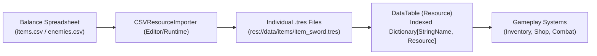

# 📊 Godot 4 Resource Data Tables & CSV Importer

This skill provides a complete **Data-Driven Resource Table & CSV Import Pipeline** for game balancing in Godot 4.x.

---

## 🏗️ 1. Resource Data Architecture



---

## 💎 2. Indexed Data Table: `DataTable.gd`

```gdscript
# res://src/core/types/data_table.gd
class_name DataTable
extends Resource

@export var records: Array[Resource] = []:
	set(value):
		records = value
		_rebuild_index()

var _index_map: Dictionary[StringName, Resource] = {}

func _rebuild_index() -> void:
	_index_map.clear()
	for res: Resource in records:
		if res == null:
			continue
		var id: StringName = &""
		if "id" in res:
			id = res.get("id")
		elif "name" in res:
			id = StringName(res.get("name"))
		else:
			id = StringName(res.resource_name)

		if not id.is_empty():
			_index_map[id] = res

## Returns a resource by its unique primary key ID in O(1) time.
func get_record(id: StringName) -> Resource:
	if _index_map.is_empty() and not records.is_empty():
		_rebuild_index()
	return _index_map.get(id)

## Returns true if a record exists.
func has_record(id: StringName) -> bool:
	if _index_map.is_empty() and not records.is_empty():
		_rebuild_index()
	return _index_map.has(id)
```

---

## 📥 3. CSV to Resource Importer: `CSVResourceImporter.gd`

```gdscript
# res://src/core/services/data/csv_resource_importer.gd
class_name CSVResourceImporter
extends RefCounted

## Parses a CSV file and converts each row into an ItemData resource.
static func import_items_from_csv(csv_path: String) -> Array[ItemData]:
	var result: Array[ItemData] = []
	var file: FileAccess = FileAccess.open(csv_path, FileAccess.READ)
	if file == null:
		push_error("CSVResourceImporter: Failed to open CSV at: %s" % csv_path)
		return result

	var headers: PackedStringArray = file.get_csv_line() # First row = column headers

	while not file.eof_reached():
		var row: PackedStringArray = file.get_csv_line()
		if row.size() < headers.size() or row[0].strip_edges().is_empty():
			continue

		var item: ItemData = ItemData.new()
		for i in range(mini(headers.size(), row.size())):
			var header: String = headers[i].strip_edges()
			var val: String = row[i].strip_edges()

			match header:
				"id": item.id = StringName(val)
				"display_name": item.display_name = val
				"description": item.description = val
				"max_stack_size": item.max_stack_size = int(val)
				"gold_value": item.gold_value = int(val)

		result.append(item)

	file.close()
	return result
```
