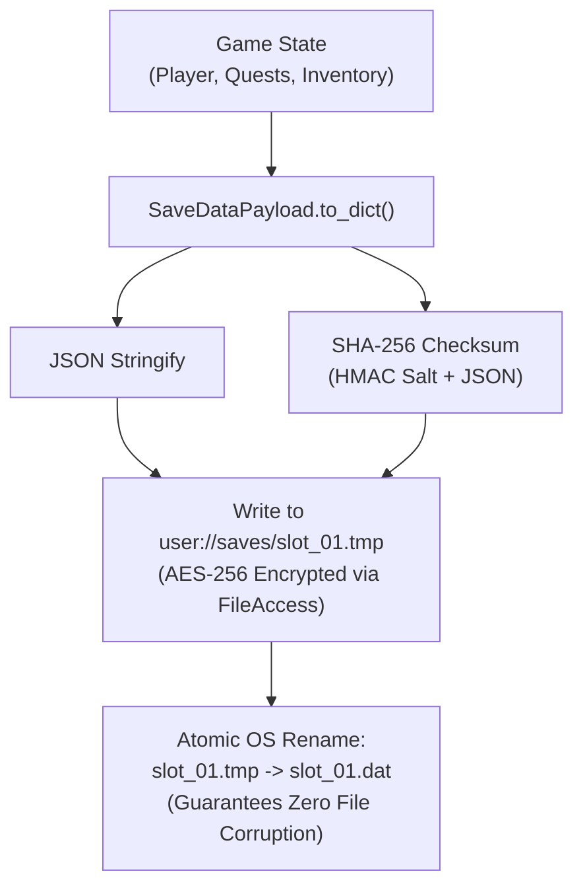

# 💾 Godot 4 Secure Save & Persistence Architecture

This skill provides an enterprise-grade, **AES-256 encrypted, crash-proof, and anti-tamper Save/Load engine** for Godot 4.x.

---

## 🔒 1. Persistence & Security Pipeline



---

## 💎 2. Typed Save Data Payload: `SaveDataPayload.gd`

```gdscript
# res://src/core/types/save_data_payload.gd
class_name SaveDataPayload
extends Resource

@export var schema_version: int = 1
@export var save_timestamp: int = 0
@export var playtime_seconds: float = 0.0
@export var current_scene_path: String = ""

@export_group("Player State")
@export var player_position: Vector3 = Vector3.ZERO
@export var player_health: float = 100.0
@export var player_max_health: float = 100.0
@export var player_gold: int = 0

@export_group("Subsystem Data")
@export var inventory_slots: Array[Dictionary] = [] # [{id, count}]
@export var active_quests: Array[Dictionary] = []
@export var completed_quest_ids: Array[StringName] = []
@export var unlocked_flags: Dictionary = {}

func to_dict() -> Dictionary:
	return {
		"schema_version": schema_version,
		"save_timestamp": int(Time.get_unix_time_from_system()),
		"playtime_seconds": playtime_seconds,
		"current_scene_path": current_scene_path,
		"player": {
			"pos_x": player_position.x,
			"pos_y": player_position.y,
			"pos_z": player_position.z,
			"health": player_health,
			"max_health": player_max_health,
			"gold": player_gold
		},
		"inventory": inventory_slots,
		"quests": {
			"active": active_quests,
			"completed": completed_quest_ids
		},
		"flags": unlocked_flags
	}

func from_dict(dict: Dictionary) -> void:
	schema_version = dict.get("schema_version", 1)
	save_timestamp = dict.get("save_timestamp", 0)
	playtime_seconds = dict.get("playtime_seconds", 0.0)
	current_scene_path = dict.get("current_scene_path", "")

	var p_data: Dictionary = dict.get("player", {})
	player_position = Vector3(p_data.get("pos_x", 0.0), p_data.get("pos_y", 0.0), p_data.get("pos_z", 0.0))
	player_health = p_data.get("health", 100.0)
	player_max_health = p_data.get("max_health", 100.0)
	player_gold = p_data.get("gold", 0)

	inventory_slots = dict.get("inventory", [])
	var q_data: Dictionary = dict.get("quests", {})
	active_quests = q_data.get("active", [])
	completed_quest_ids = q_data.get("completed", [])
	unlocked_flags = dict.get("flags", {})
```

---

## 💎 3. Save Manager Singleton: `SaveManager.gd`

```gdscript
# res://src/core/services/save/save_manager.gd
class_name SaveManager
extends Node

const SAVE_DIR: String = "user://saves/"
const ENCRYPTION_PASSPHRASE: String = "GD4_SECURE_SALT_99381A"

## Saves game data to disk with atomic write and AES-256 encryption.
static func save_game(slot_index: int, payload: SaveDataPayload) -> bool:
	DirAccess.make_dir_recursive_absolute(SAVE_DIR)

	var target_path: String = SAVE_DIR + "slot_%02d.dat" % slot_index
	var temp_path: String = SAVE_DIR + "slot_%02d.tmp" % slot_index

	var data_dict: Dictionary = payload.to_dict()
	var json_string: String = JSON.stringify(data_dict)

	# Generate anti-tamper checksum
	var checksum: String = (json_string + ENCRYPTION_PASSPHRASE).sha256_text()
	var final_envelope: Dictionary = {
		"checksum": checksum,
		"data": data_dict
	}

	# 1. Write to temporary file with encryption
	var file: FileAccess = FileAccess.open_encrypted_with_pass(temp_path, FileAccess.WRITE, ENCRYPTION_PASSPHRASE)
	if file == null:
		push_error("SaveManager: Failed to create temp save file at: %s" % temp_path)
		return false

	file.store_string(JSON.stringify(final_envelope))
	file.close()

	# 2. Atomic OS Swap
	if FileAccess.file_exists(target_path):
		DirAccess.remove_absolute(target_path)
	var err: Error = DirAccess.rename_absolute(temp_path, target_path)

	return err == OK

## Loads and verifies encrypted save data from disk.
static func load_game(slot_index: int) -> SaveDataPayload:
	var target_path: String = SAVE_DIR + "slot_%02d.dat" % slot_index
	if not FileAccess.file_exists(target_path):
		return null

	var file: FileAccess = FileAccess.open_encrypted_with_pass(target_path, FileAccess.READ, ENCRYPTION_PASSPHRASE)
	if file == null:
		push_error("SaveManager: Failed to decrypt save file: %s" % target_path)
		return null

	var content: String = file.get_as_text()
	file.close()

	var parse_result: Variant = JSON.parse_string(content)
	if not (parse_result is Dictionary):
		push_error("SaveManager: Corrupted save data envelope.")
		return null

	var envelope: Dictionary = parse_result as Dictionary
	var recorded_checksum: String = envelope.get("checksum", "")
	var data_dict: Dictionary = envelope.get("data", {})

	# Anti-Tamper Checksum Verification
	var expected_checksum: String = (JSON.stringify(data_dict) + ENCRYPTION_PASSPHRASE).sha256_text()
	if recorded_checksum != expected_checksum:
		push_error("SaveManager: Save data tampering detected! Aborting load.")
		return null

	var payload: SaveDataPayload = SaveDataPayload.new()
	payload.from_dict(data_dict)
	return payload
```
