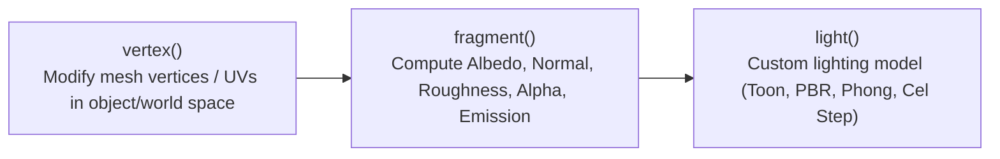

# 🎨 Godot 4 Shader Development & Visual FX

This skill provides production-grade shader recipes written in the **Godot 4.x Shading Language** (`.gdshader`) for 2D and 3D rendering pipelines.

---

## 📐 1. Shading Pipeline Overview

Godot 4 shaders are divided into processor functions:



### 💎 Critical Godot 4 Shader Invariants:
1. **Type Suffixes**: Always use float literals with decimal points (e.g., `1.0` not `1` for floats).
2. **Hints**: Use `@export` equivalents in shaders: `uniform vec4 color : source_color`, `uniform float speed : hint_range(0.0, 10.0, 0.1)`.
3. **Screen Texture**: Always use `hint_screen_texture` or `hint_depth_texture` instead of legacy Godot 3 `SCREEN_TEXTURE`.

---

## 💎 2. 2D / 3D Noise Dissolve with Burning Edge Glow

```glsl
// res://assets/shaders/dissolve_burn.gdshader
shader_type canvas_item;
render_mode blend_mix;

uniform sampler2D noise_texture : repeat_enable, filter_linear;
uniform float dissolve_amount : hint_range(0.0, 1.0, 0.01) = 0.0;
uniform float burn_size : hint_range(0.0, 0.2, 0.01) = 0.05;
uniform vec4 burn_color : source_color = vec4(1.0, 0.4, 0.0, 1.0);
uniform float emission_intensity : hint_range(1.0, 10.0, 0.1) = 3.0;

void fragment() {
	vec4 main_tex = texture(TEXTURE, UV);
	float noise_val = texture(noise_texture, UV).r;

	// Discard pixel if below threshold
	if (noise_val < dissolve_amount) {
		discard;
	}

	// Calculate burning edge threshold
	float edge_dist = noise_val - dissolve_amount;
	if (edge_dist < burn_size && dissolve_amount > 0.0) {
		float factor = 1.0 - (edge_dist / burn_size);
		vec3 glow = burn_color.rgb * emission_intensity;
		COLOR = vec4(mix(main_tex.rgb, glow, factor), main_tex.a);
	} else {
		COLOR = main_tex;
	}
}
```

---

## 💎 3. 2D Pixel-Perfect Outline Shader

```glsl
// res://assets/shaders/outline_2d.gdshader
shader_type canvas_item;

uniform vec4 outline_color : source_color = vec4(0.0, 0.0, 0.0, 1.0);
uniform float outline_width : hint_range(0.0, 10.0, 1.0) = 1.0;
uniform bool is_active = true;

void fragment() {
	vec4 col = texture(TEXTURE, UV);
	
	if (!is_active || col.a > 0.5) {
		COLOR = col;
		return;
	}

	vec2 size = TEXTURE_PIXEL_SIZE * outline_width;
	float max_alpha = 0.0;

	// 8-directional edge sampling
	max_alpha = max(max_alpha, texture(TEXTURE, UV + vec2(0.0, -size.y)).a);
	max_alpha = max(max_alpha, texture(TEXTURE, UV + vec2(0.0, size.y)).a);
	max_alpha = max(max_alpha, texture(TEXTURE, UV + vec2(-size.x, 0.0)).a);
	max_alpha = max(max_alpha, texture(TEXTURE, UV + vec2(size.x, 0.0)).a);
	max_alpha = max(max_alpha, texture(TEXTURE, UV + vec2(-size.x, -size.y)).a);
	max_alpha = max(max_alpha, texture(TEXTURE, UV + vec2(size.x, -size.y)).a);
	max_alpha = max(max_alpha, texture(TEXTURE, UV + vec2(-size.x, size.y)).a);
	max_alpha = max(max_alpha, texture(TEXTURE, UV + vec2(size.x, size.y)).a);

	if (max_alpha > 0.5) {
		COLOR = outline_color;
	} else {
		COLOR = col;
	}
}
```

---

## 💎 4. 3D Stylized Toon / Cel Shading with Step Lighting

```glsl
// res://assets/shaders/toon_shading_3d.gdshader
shader_type spatial;
render_mode blend_mix, depth_draw_opaque, cull_back, diffuse_toon, specular_toon;

uniform vec4 base_color : source_color = vec4(0.8, 0.3, 0.2, 1.0);
uniform sampler2D albedo_texture : source_color, filter_linear_mipmap;
uniform float cuts : hint_range(1.0, 8.0, 1.0) = 3.0;
uniform float specular_size : hint_range(0.0, 1.0, 0.01) = 0.1;
uniform float specular_smoothness : hint_range(0.0, 0.1, 0.001) = 0.01;

void fragment() {
	vec4 tex = texture(albedo_texture, UV);
	ALBEDO = base_color.rgb * tex.rgb;
	ROUGHNESS = 0.8;
}

void light() {
	// Stepped diffuse light
	float NdotL = dot(NORMAL, LIGHT);
	float light_intensity = clamp((NdotL + 1.0) * 0.5, 0.0, 1.0);
	float stepped_light = floor(light_intensity * cuts) / cuts;

	// Specular highlight
	vec3 H = normalize(LIGHT + VIEW);
	float NdotH = dot(NORMAL, H);
	float spec = smoothstep(1.0 - specular_size - specular_smoothness, 1.0 - specular_size, NdotH);

	DIFFUSE_LIGHT += LIGHT_COLOR * ALBEDO * stepped_light * ATTENUATION;
	SPECULAR_LIGHT += LIGHT_COLOR * spec * ATTENUATION;
}
```

---

## 💎 5. 3D Stylized Water with Vertex Waves & Depth Fade

```glsl
// res://assets/shaders/stylized_water.gdshader
shader_type spatial;
render_mode blend_mix, depth_draw_always, cull_back;

uniform vec4 shallow_color : source_color = vec4(0.2, 0.7, 0.9, 0.8);
uniform vec4 deep_color : source_color = vec4(0.05, 0.2, 0.5, 0.95);
uniform float depth_distance : hint_range(0.1, 20.0, 0.1) = 3.0;

uniform float wave_speed : hint_range(0.1, 5.0, 0.1) = 1.0;
uniform float wave_amplitude : hint_range(0.0, 2.0, 0.05) = 0.2;
uniform float wave_frequency : hint_range(0.1, 5.0, 0.1) = 0.8;

uniform sampler2D depth_texture : hint_depth_texture, filter_linear_mipmap;
uniform sampler2D screen_texture : hint_screen_texture, filter_linear_mipmap;

void vertex() {
	float wave1 = sin(VERTEX.x * wave_frequency + TIME * wave_speed);
	float wave2 = cos(VERTEX.z * wave_frequency * 1.5 + TIME * wave_speed * 1.2);
	VERTEX.y += (wave1 + wave2) * wave_amplitude;
}

void fragment() {
	// Sample depth buffer
	float depth_raw = texture(depth_texture, SCREEN_UV).r;
	vec3 ndc = vec3(SCREEN_UV * 2.0 - 1.0, depth_raw);
	vec4 world = INV_PROJECTION_MATRIX * vec4(ndc, 1.0);
	vec3 world_pos = world.xyz / world.w;
	float depth = -world_pos.z + VERTEX.z;

	// Depth fade mix
	float depth_factor = clamp(depth / depth_distance, 0.0, 1.0);
	vec4 final_color = mix(shallow_color, deep_color, depth_factor);

	ALBEDO = final_color.rgb;
	ALPHA = final_color.a;
	ROUGHNESS = 0.1;
	SPECULAR = 0.6;
}
```
