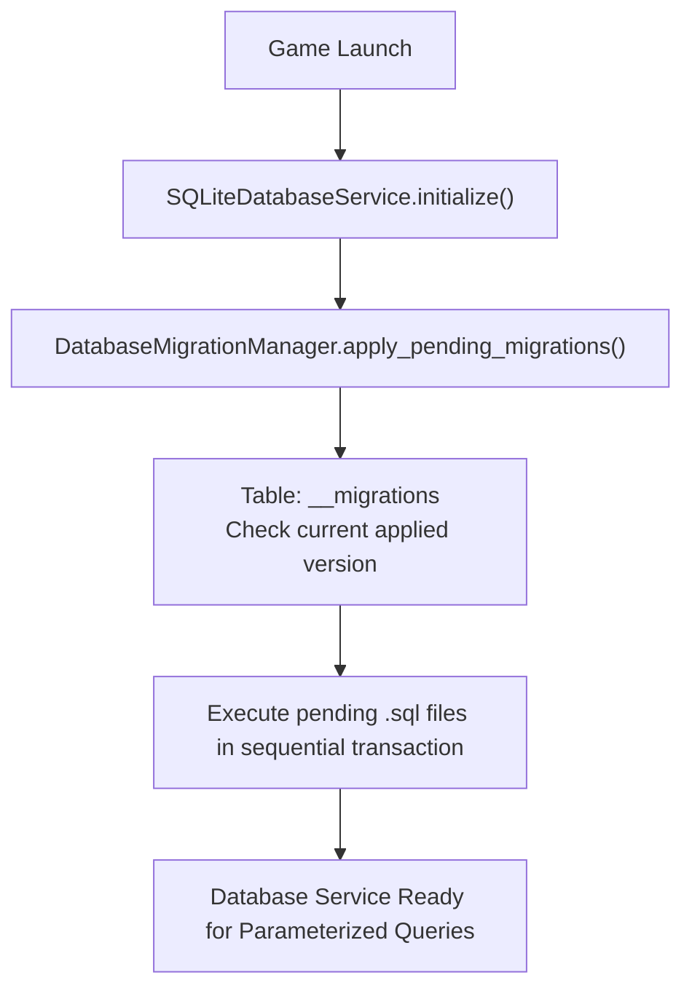

# 🗄️ Godot 4 Local SQLite Database Architecture

This skill provides an enterprise **SQLite Database Engine & Migration Manager** for offline-first, data-heavy Godot 4.x games.

---

## 🏗️ 1. Architecture & Schema Migration Workflow



---

## 💎 2. Database Migration Manager: `DatabaseMigrationManager.gd`

```gdscript
# res://src/core/database/database_migration_manager.gd
class_name DatabaseMigrationManager
extends RefCounted

## Applies incremental schema updates to ensure DB integrity across patches.
static func run_migrations(db: Object) -> bool:
	if db == null:
		return false

	# 1. Create migration table if not exists
	db.query("CREATE TABLE IF NOT EXISTS __migrations (version INTEGER PRIMARY KEY, applied_at DATETIME DEFAULT CURRENT_TIMESTAMP);")

	# 2. Get current version
	db.query("SELECT MAX(version) as max_v FROM __migrations;")
	var current_version: int = 0
	if not db.query_result.is_empty() and db.query_result[0]["max_v"] != null:
		current_version = int(db.query_result[0]["max_v"])

	# 3. List of ordered schema migrations
	var migrations: Array[String] = [
		# Migration 1: Initial Tables
		"""
		CREATE TABLE IF NOT EXISTS player_stats (
			id TEXT PRIMARY KEY,
			level INTEGER DEFAULT 1,
			exp INTEGER DEFAULT 0,
			gold INTEGER DEFAULT 0
		);
		CREATE TABLE IF NOT EXISTS item_records (
			instance_id TEXT PRIMARY KEY,
			item_id TEXT NOT NULL,
			quantity INTEGER DEFAULT 1,
			durability REAL DEFAULT 100.0
		);
		""",
		# Migration 2: Combat Log History
		"""
		CREATE TABLE IF NOT EXISTS combat_logs (
			id INTEGER PRIMARY KEY AUTOINCREMENT,
			target_id TEXT NOT NULL,
			damage_dealt REAL NOT NULL,
			is_crit INTEGER DEFAULT 0,
			timestamp DATETIME DEFAULT CURRENT_TIMESTAMP
		);
		"""
	]

	# Execute pending migrations
	for i in range(current_version, migrations.size()):
		var next_version: int = i + 1
		db.query("BEGIN TRANSACTION;")
		var success: bool = db.query(migrations[i])
		if success:
			db.query("INSERT INTO __migrations (version) VALUES (%d);" % next_version)
			db.query("COMMIT;")
			print("DatabaseMigration: Successfully applied Migration v%d" % next_version)
		else:
			db.query("ROLLBACK;")
			push_error("DatabaseMigration: Failed at Migration v%d. Rolling back." % next_version)
			return false

	return true
```

---

## 💎 3. Database Service Wrapper: `SQLiteDatabaseService.gd`

```gdscript
# res://src/core/database/sqlite_database_service.gd
class_name SQLiteDatabaseService
extends Node

const DB_PATH: String = "user://game_database.db"

var _db: Object = null # References SQLite GDExtension instance

func initialize_database() -> bool:
	if not ClassDB.class_exists("SQLite"):
		push_warning("SQLiteDatabaseService: SQLite GDExtension not installed. Using mock layer.")
		return false

	_db = ClassDB.instantiate("SQLite")
	_db.path = DB_PATH
	_db.open_db()

	return DatabaseMigrationManager.run_migrations(_db)

## Executes a parameterized query to guarantee protection against SQL injection.
func execute_parameterized(query_string: String, params: Array) -> Array[Dictionary]:
	if _db == null:
		return []

	# Note: SQLite GDExtension supports db.query_with_bindings(query, params)
	if _db.has_method("query_with_bindings"):
		_db.query_with_bindings(query_string, params)
		return _db.query_result as Array[Dictionary]
	else:
		_db.query(query_string)
		return _db.query_result as Array[Dictionary]
```
