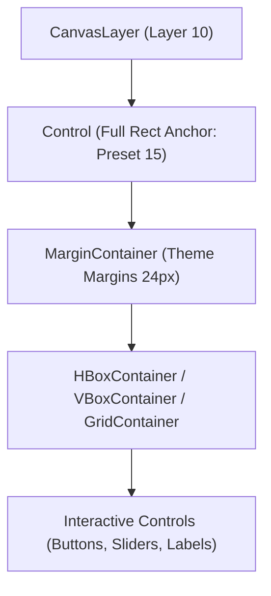

# 🖥️ Godot 4 UI/UX Design System & Responsive Layouts

This skill provides the architectural foundation for building **multi-resolution, responsive, and gamepad-accessible UI** in Godot 4.x.

---

## 📐 1. Responsive Layout & Anchor Rules

Godot's UI system relies on **Control Containers** and **Anchors**. Follow these golden rules:



### 💎 Layout Best Practices:
1. **Never Hardcode Absolute Pixel Offsets**: Always wrap elements in `MarginContainer`, `VBoxContainer`, `HBoxContainer`, or `GridContainer`.
2. **Size Flags**:
   * Use `SIZE_EXPAND_FILL` to make elements dynamically stretch to fill remaining screen space.
   * Use `SIZE_SHRINK_CENTER` for centered dialog popups.
3. **Stretch Mode Configuration**:
   * For Pixel Art: `display/window/stretch/mode="viewport"` + `aspect="keep"`.
   * For Vector / High-Res HD UI: `display/window/stretch/mode="canvas_items"` + `aspect="expand"`.

---

## 🎮 2. Gamepad / Keyboard Focus Navigation: `UIFocusNavigator.gd`

```gdscript
# res://src/ui/core/ui_focus_navigator.gd
class_name UIFocusNavigator
extends Node

@export var initial_focused_control: Control
@export var container_to_auto_wire: Control

func _ready() -> void:
	if container_to_auto_wire:
		_auto_wire_focus(container_to_auto_wire)

	if initial_focused_control and initial_focused_control.is_inside_tree():
		initial_focused_control.grab_focus()

## Automatically links neighbor focus paths for child controls in a container.
func _auto_wire_focus(container: Control) -> void:
	var focusable_nodes: Array[Control] = []
	for child: Node in container.get_children():
		if child is Control and (child as Control).focus_mode != Control.FOCUS_NONE:
			focusable_nodes.append(child as Control)

	for i in range(focusable_nodes.size()):
		var curr: Control = focusable_nodes[i]
		var prev: Control = focusable_nodes[(i - 1 + focusable_nodes.size()) % focusable_nodes.size()]
		var next: Control = focusable_nodes[(i + 1) % focusable_nodes.size()]

		if container is VBoxContainer:
			curr.focus_neighbor_top = prev.get_path()
			curr.focus_neighbor_bottom = next.get_path()
		elif container is HBoxContainer:
			curr.focus_neighbor_left = prev.get_path()
			curr.focus_neighbor_right = next.get_path()
```

---

## 💎 3. Tactile Interactive Button Widget: `NeobrutalismButton.gd`

```gdscript
# res://src/ui/widgets/neobrutalism_button.gd
class_name NeobrutalismButton
extends Button

@export var hover_scale: Vector2 = Vector2(1.04, 1.04)
@export var click_offset: Vector2 = Vector2(2.0, 2.0)
@export var animation_duration: float = 0.08
@export var click_sfx: AudioStream

var _original_position: Vector2
var _current_tween: Tween

func _ready() -> void:
	pivot_offset = size * 0.5
	mouse_entered.connect(_on_mouse_entered)
	mouse_exited.connect(_on_mouse_exited)
	button_down.connect(_on_button_down)
	button_up.connect(_on_button_up)
	focus_entered.connect(_on_focus_entered)
	focus_exited.connect(_on_focus_exited)

func _on_mouse_entered() -> void:
	_animate_scale(hover_scale)

func _on_mouse_exited() -> void:
	_animate_scale(Vector2.ONE)

func _on_focus_entered() -> void:
	_animate_scale(hover_scale)

func _on_focus_exited() -> void:
	_animate_scale(Vector2.ONE)

func _on_button_down() -> void:
	position += click_offset
	if click_sfx and Events and Events.has_signal("sfx_playback_requested"):
		Events.sfx_playback_requested.emit(&"ui_click", Vector3.ZERO, 0.05)

func _on_button_up() -> void:
	position -= click_offset

func _animate_scale(target_scale: Vector2) -> void:
	if _current_tween and _current_tween.is_valid():
		_current_tween.kill()
	_current_tween = create_tween()
	_current_tween.tween_property(self, "scale", target_scale, animation_duration).set_trans(Tween.TRANS_QUAD).set_ease(Tween.EASE_OUT)
```
