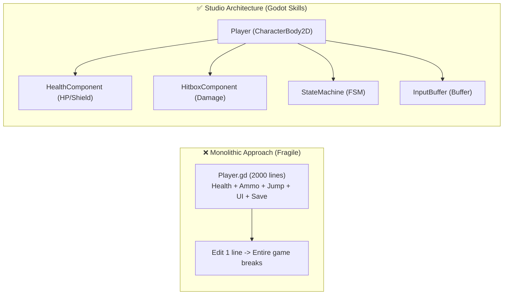
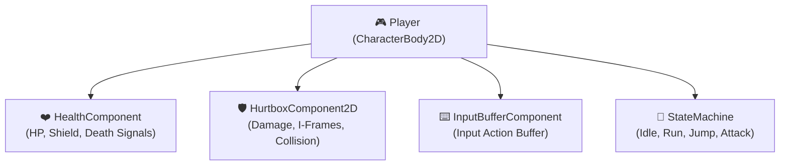

# 🚀 Complete Getting Started Guide: Apply Godot Skills from Scratch

<div align="center">


<p align="center">
  <b>Welcome to Godot Engine 4.3+!</b><br>
  This guide walks you through transforming any fresh, empty Godot project into a <b>Studio-Grade Game Architecture</b> and turning AI coding assistants (Google Antigravity, Cursor, Claude Code, GitHub Copilot) into your <b>Personal Technical Director</b>.
</p>

🌐 **Language:** **English** • [Tiếng Việt](GETTING_STARTED_VI.md)

</div>

---

## 📑 Table of Contents

1. [🤔 Why Beginners Need Godot Skills](#1--why-beginners-need-godot-skills)
2. [⚡ Step 1: Install into Your New Project (3 Easy Methods)](#2--step-1-install-into-your-new-project-3-easy-methods)
3. [🎮 Step 2: Enable Plugin & Run 1-Click AI Setup](#3--step-2-enable-plugin--run-1-click-ai-setup)
4. [🧩 Step 3: Assemble Game Systems with Component Injector](#4--step-3-assemble-game-systems-with-component-injector)
5. [🤖 Step 4: AI Prompting Formula for 100% Type-Safe Code](#5--step-4-ai-prompting-formula-for-100-type-safe-code)
6. [🩺 Step 5: Audit Code Quality with In-Editor Project Doctor](#6--step-5-audit-code-quality-with-in-editor-project-doctor)
7. [🌟 Step 6: Research & Learn via Godot Awesome Hub](#7--step-6-research--learn-via-godot-awesome-hub)
8. [💡 5 Real-World Production Game Recipes](#8--5-real-world-production-game-recipes)
9. [⚠️ Common Beginner Mistakes & GDScript 2.0 Guardrails](#9-️-common-beginner-mistakes--gdscript-20-guardrails)

---

## 1. 🤔 Why Beginners Need Godot Skills

When learning game development with Godot, most beginners hit common roadblocks:
- ❌ Putting 2,000+ lines of code into a single monolithic `Player.gd` file (Movement, HP, Shooting, UI, Inventory, Sound).
- ❌ Modifying one variable breaks 5 other systems, creating unmaintainable "spaghetti code".
- ❌ When asking AI (ChatGPT, Claude, Cursor) for help, the AI frequently hallucinates deprecated Godot 3 syntax (`yield()`, `KinematicBody2D`, `export var`), causing compile errors.

### ✅ The Godot Skills Solution:



1. **LEGO-like Modular Assembly (Component-Based)**: Need health? Attach `HealthComponent`. Need combat? Attach `HitboxComponent`. Want to give health to an Enemy boss? Reuse the exact same component with zero extra code!
2. **Zero AI Hallucinations**: Pre-baked rule contexts (`SKILL.md`) instruct your AI coding assistants to write **100% GDScript 2.0 Static-Typed, warning-free code** tailored for Godot 4.3+.

---

## 2. ⚡ Step 1: Install into Your New Project (3 Easy Methods)

Suppose you just created a new project in Godot Engine at: `C:\MyNewGame`.

### Method 1: Copy Addon Folder (Recommended for Beginners - 100% Visual)
1. Download or locate the `godot-skills` repository.
2. Copy the `addons/godot_skills/` directory into your project's `addons/` folder (`C:\MyNewGame\addons\godot_skills`).
3. That's it! Launch Godot to access the visual dock.

---

### Method 2: Automated One-Liner CLI (PowerShell / Terminal)
Open your terminal in the `godot-skills` repository and run:

```powershell
# Windows (PowerShell):
pwsh install.ps1 -Target "C:\MyNewGame"
```

```bash
# Linux / macOS (Terminal):
./install.sh --target "/path/to/MyNewGame"
```
> This automatically scaffolds Clean Architecture folders (`src/core`, `src/components`, `src/features`), copies all 68+ templates, and generates AI rules!

---

### Method 3: Global System Install (Works for all future projects)
For Google Antigravity or Gemini Code Assist users:
```powershell
pwsh install.ps1 -Global
```
> Installs all 25 Mega Skills to `~/.gemini/config/skills/`. Any Godot project opened on your machine is immediately recognized by the AI!

---

## 3. 🎮 Step 2: Enable Plugin & Run 1-Click AI Setup

1. Open your project in **Godot Engine 4.3+**.
2. Go to **Project -> Project Settings -> Plugins**.
3. Locate **"Godot Skills AI & Component Suite"** and check **Enable**.
4. In the **Right Dock Panel**, select the new **⚡ Godot Skills** tab.
5. In the **⚡ AI Setup** tab, click:
   👉 **`⚡ 1-Click Generate & Sync All AI Rules`**

```
✔ AI Context generation completed successfully! Total agents configured: 4
➜ Created: .gemini/skills/ (25 skills)
➜ Created: .cursor/rules/ (26 rules)
➜ Created: CLAUDE.md
➜ Created: .github/copilot-instructions.md
```

---

## 4. 🧩 Step 3: Assemble Game Systems with Component Injector

Instead of writing physics and combat logic from scratch:

1. Create a new Scene with a `CharacterBody2D` root (name it `Player`).
2. Switch to the **🧩 Components** tab in the Godot Skills dock.
3. Select your `Player` node in the Scene tree.
4. Click the injection buttons:
   - ➕ **Inject Node: `HealthComponent`** -> Adds HP, Shield, and death signal logic.
   - ➕ **Inject Node: `HurtboxComponent2D`** -> Adds damage receiver with collision shape and i-frames.
   - ➕ **Inject Node: `InputBufferComponent`** -> Adds frame-accurate input buffering for responsive jump/attack inputs.
   - ➕ **Inject Node: `StateMachine`** -> Adds a typed Hierarchical State Machine.



> 💡 **Tip:** Component injection fully supports **Ctrl+Z (Undo)**.

---

## 5. 🤖 Step 4: AI Prompting Formula for 100% Type-Safe Code

With AI coding tools (Antigravity, Cursor, Claude Code, GitHub Copilot), mention the skill name directly in your prompt:

### 🎯 The Universal Prompting Formula:
> **"Using the `[skill-name]` skill, implement `[desired feature]` connected to `[existing components]`."**

### 💬 Real-World Prompt Examples:

#### Example 1: 2D Platformer Movement
```text
"Using the godot-character-controllers and godot-state-machine-hsm skills, write a 2D CharacterBody2D player controller with 0.15s coyote time, 0.1s jump buffer, and Idle/Run/Jump states connected to StateMachine."
```

#### Example 2: Melee Attack with Freeze Frame & Screen Shake
```text
"Using the godot-combat-hitbox-hurtbox skill, create a HitboxComponent2D for a sword attack delivering 25 damage, knockback in facing direction, 0.08s freeze-frame hitstop, and screen shake via ScreenShakeDirector."
```

#### Example 3: Monster Loot Drops & Inventory
```text
"Using the godot-inventory-item-system and godot-typed-gdscript-mastery skills, create a monster drop system that rolls items from LootTable upon death and deposits them into Player's InventoryComponent."
```

---

## 6. 🩺 Step 5: Audit Code Quality with In-Editor Project Doctor

1. In the **Godot Skills Dock**, select the **🩺 Doctor** tab.
2. Click **`🩺 Run Type-Safety & Migration Audit`**.
3. Scans all `.gd` files and flags any missing return types, untyped variables, or legacy Godot 3 patterns with instant line-jump suggestions!

---

## 7. 🌟 Step 6: Research & Learn via Godot Awesome Hub

Access 30+ top-tier Godot libraries, masterclass courses, and CC0 asset libraries directly from the **🌟 Godot Awesome** tab:
- **Top Addons**: Phantom Camera, Dialogic 2, Beehave, LimboAI, Godot Jolt (3D physics 10x speed), Terrain3D, Netfox.
- **Learning**: GDQuest clean architecture, Clear Code 10h masterclasses, KidsCanCode recipes.
- **Assets**: Kenney 50,000+ CC0 sprites & 3D models, Sonniss 100GB+ commercial SFX.
- **Click `🌐 Open in Browser`** or **`💡 Ask AI Prompt`** to get immediate integration instructions.

---

## 8. 💡 5 Real-World Production Game Recipes

```carousel
### 🎮 Recipe 1: 2D Precision Platformer
**Key Skills:**
- `godot-character-controllers` (PlatformerController2D)
- `godot-state-machine-hsm` (StateMachine)
- `godot-input-gamepad-remapping` (InputBufferComponent)
- `godot-hud-minimap-camera` (SmartCameraController2D)

```gdscript
extends CharacterBody2D

@onready var input_buffer: InputBufferComponent = $InputBufferComponent
@onready var state_machine: StateMachine = $StateMachine

func _physics_process(delta: float) -> void:
    if input_buffer.is_action_buffered(&"jump") and is_on_floor():
        input_buffer.consume_action(&"jump")
        velocity.y = -450.0
    move_and_slide()
```
<!-- slide -->
### ⚔️ Recipe 2: Top-Down ARPG & Combat Juice
**Key Skills:**
- `godot-combat-hitbox-hurtbox` (Hitbox/Hurtbox/DamagePayload)
- `godot-inventory-item-system` (InventoryComponent)
- `godot-vfx-particles` (ImpactVFXPool)
- `godot-hud-minimap-camera` (FloatingDamageNumberSpawner)

```gdscript
func _on_hurtbox_damage_received(payload: DamagePayload) -> void:
    health_component.apply_damage(payload.damage_amount)
    DamageNumberSpawner.spawn_number(global_position, payload.damage_amount, payload.is_critical)
    ScreenShakeDirector.add_trauma(0.2)
```
<!-- slide -->
### 🧠 Recipe 3: Enemy Sensory AI & Behavior Trees
**Key Skills:**
- `godot-ai-behavior-trees` (BTSequence, Blackboard, PerceptionComponent2D)
- `godot-navigation-server` (NavAgentController2D)

```gdscript
func tick(actor: Node, blackboard: Blackboard) -> BTNode.Status:
    var target_pos: Vector2 = blackboard.get_value(&"target_position", Vector2.ZERO)
    nav_agent.set_target_position(target_pos)
    return BTNode.Status.SUCCESS
```
<!-- slide -->
### 💾 Recipe 4: Secure AES-256 Multi-Slot Saves
**Key Skills:**
- `godot-save-persistence-security` (SaveManager & SaveDataPayload)

```gdscript
func save_game_state() -> void:
    var payload: SaveDataPayload = SaveDataPayload.new()
    payload.player_level = 10
    payload.gold = 5400
    SaveManager.save_slot(1, payload)
```
<!-- slide -->
### 🎨 Recipe 5: Stylized Shaders & Visual Effects
**Key Skills:**
- `godot-shader-development` (dissolve_burn.gdshader, outline_2d.gdshader)
- `godot-vfx-particles` (VFXSpawnerComponent)

```gdscript
func trigger_death_dissolve() -> void:
    var tween: Tween = create_tween()
    tween.tween_property(sprite.material, "shader_parameter/dissolve_amount", 1.0, 0.8)
    tween.tween_callback(queue_free)
```
```

---

## 9. ⚠️ Common Beginner Mistakes & GDScript 2.0 Guardrails

| Anti-Pattern (Godot 3 / Untyped) | Why It Causes Bugs | Production GDScript 2.0 Standard |
| :--- | :--- | :--- |
| `var speed = 300` | Untyped variable -> Slower runtime performance and no IDE autocomplete. | `var speed: float = 300.0` or `var speed := 300.0` |
| `func attack(target):` | Missing return type -> Can lead to silent crashes. | `func attack(target: Node) -> bool:` |
| `yield(get_tree(), "idle_frame")` | `yield()` is completely removed in Godot 4. | `await get_tree().process_frame` |
| `onready var hp = 100` | Missing `@` annotation prefix. | `@onready var hp: int = 100` |
| `export(int) var mana = 50` | Deprecated Godot 3 export syntax. | `@export var mana: int = 50` |
| `get_parent().get_parent().hp -= 10` | Tight coupling -> Scene restructuring breaks all code. | Use **`Events.emit_damage_dealt(...)`** or Components. |

---

## 🎯 Ready to Build Your Dream Game!

Copy `addons/godot_skills/` to your project and start building with confidence and full AI superpowers! 🚀
