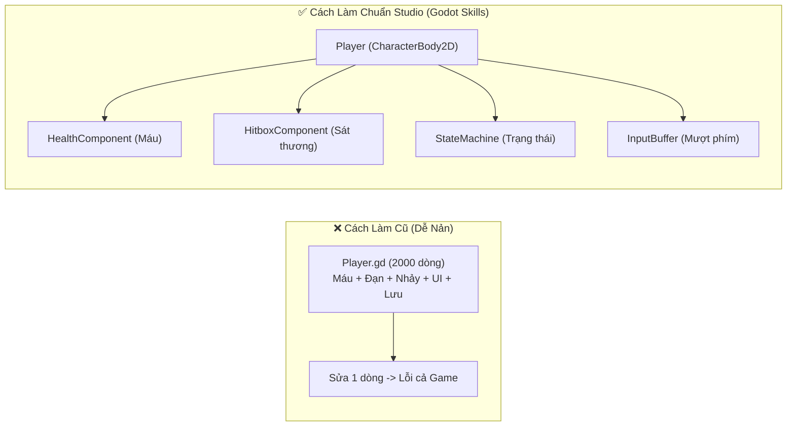
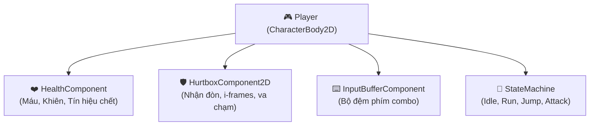

# 🚀 Hướng Dẫn Dành Cho Người Mới: Áp Dụng Godot Skills Từ A-Z

<div align="center">


<p align="center">
  <b>Chào mừng bạn đến với Godot Engine 4.3+!</b><br>
  Tài liệu này sẽ hướng dẫn bạn (ngay cả khi chưa có nhiều kinh nghiệm lập trình) cách biến dự án Godot mới tinh của mình thành một <b>Game Architecture chuẩn Studio</b> và biến các trợ lý AI (Google Antigravity, Cursor, Claude Code, GitHub Copilot) thành <b>Technical Director riêng</b> cho bạn.
</p>

🌐 **Ngôn ngữ:** **Tiếng Việt** • [English](GETTING_STARTED.md)

</div>

---

## 📑 Mục Lục

1. [🤔 Tại sao người mới nên dùng Godot Skills?](#1--tại-sao-người-mới-nên-dùng-godot-skills)
2. [⚡ Bước 1: Cài đặt vào dự án mới (3 cách cực dễ)](#2--bước-1-cài-đặt-vào-dự-án-mới-3-cách-cực-dễ)
3. [🎮 Bước 2: Kích hoạt Plugin & Bật AI Setup trong 1-Click](#3--bước-2-kích-hoạt-plugin--bật-ai-setup-trong-1-click)
4. [🧩 Bước 3: Lắp ráp Game bằng Component Injector (Không cần code tay)](#4--bước-3-lắp-ráp-game-bằng-component-injector-không-cần-code-tay)
5. [🤖 Bước 4: Hướng dẫn Prompting với AI để sinh code chuẩn 100%](#5--bước-4-hướng-dẫn-prompting-với-ai-để-sinh-code-chuẩn-100)
6. [🩺 Bước 5: Bắt lỗi và kiểm tra code bằng Project Doctor](#6--bước-5-bắt-lỗi-và-kiểm-tra-code-bằng-project-doctor)
7. [🌟 Bước 6: Tra cứu thư viện và học hỏi qua Godot Awesome Hub](#7--bước-6-tra-cứu-thư-viện-và-học-hỏi-qua-godot-awesome-hub)
8. [💡 5 Kịch bản làm game thực tế (Copy-Paste dùng ngay)](#8--5-kịch-bản-làm-game-thực-tế-copy-paste-dùng-ngay)
9. [⚠️ Những lỗi sai kinh điển người mới hay gặp & Cách tránh](#9-️-những-lỗi-sai-kinh-điển-người-mới-hay-gặp--cách-tránh)

---

## 1. 🤔 Tại sao người mới nên dùng Godot Skills?

Khi mới học làm game bằng Godot, hầu hết mọi người đều mắc phải một "cái bẫy" quen thuộc:
- ❌ Viết hàng nghìn dòng code dồn hết vào một file `Player.gd` duy nhất (di chuyển, máu, bắn đạn, nhặt đồ, UI...).
- ❌ Sau 2 tuần, code bị rối (Spaghetti code), sửa chỗ này hỏng chỗ kia và dự án bị bỏ dở.
- ❌ Khi nhờ AI (ChatGPT, Claude, Cursor) viết code, AI hay bị "ngáo" sinh ra cú pháp cũ của Godot 3 (`yield`, `KinematicBody`, `export var`) gây lỗi đỏ lòm cả màn hình.

### ✅ Giải pháp từ Godot Skills:



1. **Lắp ráp như LEGO (Component-Based)**: Cần máu? Kéo thả `HealthComponent`. Cần đánh nhau? Kéo thả `HitboxComponent`. Muốn đổi cho quái vật (Enemy)? Tái sử dụng lại ngay mà không cần viết lại 1 dòng code nào!
2. **AI không bao giờ bị lỗi thời**: Cung cấp sẵn 25 bộ quy tắc chuẩn mực (`SKILL.md`) để AI lập trình viên luôn sinh code **100% GDScript 2.0 Static-Type**, không warnings, chuẩn Godot 4.3+.

---

## 2. ⚡ Bước 1: Cài đặt vào dự án mới (3 cách cực dễ)

Giả sử bạn vừa mở Godot Engine và tạo một dự án mới tinh tại thư mục: `D:\GameCuaToi`.

### Cách 1: Copy thư mục Addon (Khuyên dùng cho người mới nhất - Trực quan 100%)
1. Tải về hoặc mở thư mục `godot-skills`.
2. Copy thư mục `addons/godot_skills/` dán vào thư mục `addons/` bên trong dự án của bạn (`D:\GameCuaToi\addons\godot_skills`).
3. Thế là xong! Mở Godot lên là có giao diện trực quan ngay.

---

### Cách 2: Sử dụng 1 Dòng Lệnh Tự Động (PowerShell hoặc Terminal)
Nếu bạn thích dùng dòng lệnh, chỉ cần mở Terminal/PowerShell tại thư mục `godot-skills` và gõ:

```powershell
# Windows (PowerShell):
pwsh install.ps1 -Target "D:\GameCuaToi"
```

```bash
# Linux / macOS (Terminal):
./install.sh --target "/path/to/GameCuaToi"
```
> Script sẽ tự động: Tạo cấu trúc thư mục Clean Architecture (`src/core`, `src/components`, `src/features`), copy toàn bộ templates và tạo sẵn AI context!

---

### Cách 3: Cài đặt Global (Mọi dự án trên máy đều tự hiểu)
Nếu bạn dùng Google Antigravity hoặc Gemini Code Assist:
```powershell
pwsh install.ps1 -Global
```
> Toàn bộ 25 Mega Skills sẽ được nạp vào máy tính (`~/.gemini/config/skills/`). Bất cứ khi nào bạn mở một project Godot bất kỳ, AI đều tự động hiểu toàn bộ 25 skills mà không cần cấu hình lại!

---

## 3. 🎮 Bước 2: Kích hoạt Plugin & Bật AI Setup trong 1-Click

1. Mở dự án `GameCuaToi` trong **Godot Engine 4.3+**.
2. Trên thanh menu trên cùng, vào: **Project -> Project Settings...**
3. Chuyển sang thẻ **Plugins**.
4. Bạn sẽ thấy plugin **"Godot Skills AI & Component Suite"** -> Hãy tích chọn ô **Enable** (Bật).


5. Nhìn sang **bảng điều khiển bên phải (Right Dock)**, bạn sẽ thấy xuất hiện một tab mới tên là **⚡ Godot Skills**!
6. Bấm vào Tab **⚡ AI Setup**, sau đó bấm nút:
   👉 **`⚡ 1-Click Generate & Sync All AI Rules`**

```
✔ AI Context generation completed successfully! Total agents configured: 4
➜ Created: .gemini/skills/ (25 skills)
➜ Created: .cursor/rules/ (26 rules)
➜ Created: CLAUDE.md
➜ Created: .github/copilot-instructions.md
```

> 🎉 **Chúc mừng!** Dự án của bạn giờ đây đã kết nối đồng bộ với toàn bộ AI Coding Assistants.

---

## 4. 🧩 Bước 3: Lắp ráp Game bằng Component Injector (Không cần code tay)

Bây giờ bạn muốn làm nhân vật chính (Player) có máu, nhận sát thương và có bộ đệm phím bấm mượt mà? Đừng ngồi viết code từ đầu!

1. Tạo một Scene mới với gốc là `CharacterBody2D` (đặt tên là `Player`).
2. Nhìn sang dock **Godot Skills** bên phải, chuyển sang thẻ: **🧩 Components**.
3. Chọn Node `Player` trong danh sách Scene Tree.
4. Bấm lần lượt các nút:
   - ➕ **Inject Node: `HealthComponent`** -> Tự động thêm quản lý máu (Max HP, Shield, tín hiệu chết).
   - ➕ **Inject Node: `HurtboxComponent2D`** -> Tự động tạo vùng nhận sát thương kèm `CollisionShape2D` và thời gian bất tử (i-frames).
   - ➕ **Inject Node: `InputBufferComponent`** -> Tự động thêm bộ nhớ đệm phím bấm giúp bấm combo không bị trượt đòn.
   - ➕ **Inject Node: `StateMachine`** -> Tự động dựng khung State Machine (FSM).



> 💡 **Mẹo:** Tính năng này hỗ trợ **Ctrl+Z (Undo)** hoàn hảo. Nếu bạn chèn nhầm, chỉ cần bấm Ctrl+Z là Node sẽ tự động biến mất!

---

## 5. 🤖 Bước 4: Hướng dẫn Prompting với AI để sinh code chuẩn 100%

Khi bạn dùng các công cụ AI như **Google Antigravity**, **Cursor IDE**, **Claude Code**, hoặc **GitHub Copilot**, bạn không cần phải giải thích dài dòng về cách viết GDScript nữa. Hãy dùng tên skill trực tiếp trong câu prompt:

### 🎯 Công thức Prompt thần thánh:
> **"Áp dụng skill `[tên-skill]`, hãy tạo cho tôi `[tính năng mong muốn]` kết nối với `[các components đã có]`."**

### 💬 Ví dụ thực tế:

#### Ví dụ 1: Tạo nhân vật nhảy nhót Platformer 2D
```text
"Áp dụng skill godot-character-controllers và godot-state-machine-hsm, hãy viết script điều khiển Player di chuyển platformer 2D có Coyote Time 0.15s, Jump Buffering 0.1s, và trạng thái Idle/Run/Jump kết nối với StateMachine."
```

#### Ví dụ 2: Tạo kiếm chém gây sát thương và rung màn hình
```text
"Áp dụng skill godot-combat-hitbox-hurtbox, hãy tạo HitboxComponent2D cho đòn đánh kiếm của Player gây 25 sát thương, knockback theo hướng nhìn, có Freeze Frame 0.08s khi chém trúng và kích hoạt ScreenShakeDirector."
```

#### Ví dụ 3: Tạo túi đồ nhặt vật phẩm rơi ra
```text
"Áp dụng skill godot-inventory-item-system và godot-typed-gdscript-mastery, hãy tạo hệ thống nhặt vàng và máu từ LootTable rơi ra từ quái vật khi chết, tự động cộng vào InventoryComponent của Player."
```

---

## 6. 🩺 Bước 5: Bắt lỗi và kiểm tra code bằng Project Doctor

Sau khi viết code hoặc cho AI sinh code xong, làm sao biết dự án có bị dính cú pháp cũ, thiếu type annotation hay tiềm ẩn lỗi crash game?

1. Mở dock **Godot Skills** -> Chọn thẻ **🩺 Doctor**.
2. Bấm nút: **`🩺 Run Type-Safety & Migration Audit`**.
3. Hệ thống sẽ quét toàn bộ file `.gd` trong dự án:
   - Nếu đạt chuẩn: Hiện thông báo màu xanh lá: `✔ 100% Clean & Type-Safe!`.
   - Nếu có lỗi: Hiện danh sách chính xác tên file, số dòng và cách sửa ngay lập tức!

```
[Audit Results]
⚠️ res://src/features/player/Player.gd - Line 24:
   Issue: Function 'take_hit' lacks explicit return type annotation.
   Suggestion: Add return type, e.g. '-> void:'
```

---

## 7. 🌟 Bước 6: Tra cứu thư viện và học hỏi qua Godot Awesome Hub

Trong quá trình làm game, nếu bạn cần:
- Tìm một thư viện vật lý 3D nhanh gấp 10 lần? (Godot Jolt)
- Tìm hệ thống Camera điện ảnh 2D/3D xịn như Unity Cinemachine? (Phantom Camera)
- Tìm kho 50,000+ asset 2D/3D miễn phí thương mại CC0? (Kenney)
- Tìm công thức toán tìm đường A* hay lưới lục giác? (Red Blob Games)

👉 Hãy chuyển sang thẻ **🌟 Godot Awesome** ngay trong Godot Editor:
1. Gõ từ khóa tìm kiếm (ví dụ: `camera`, `jolt`, `math`, `audio`).
2. Bấm **`🌐 Open in Browser`** để mở trang web chính thức.
3. Bấm **`💡 Ask AI Prompt`** để tự động copy câu lệnh hướng dẫn tích hợp thư viện đó vào dự án!

---

## 8. 💡 5 Kịch bản làm game thực tế (Copy-Paste dùng ngay)

Dưới đây là 5 mẫu kiến trúc hoàn chỉnh cho các thể loại game phổ biến nhất mà bạn có thể áp dụng ngay:

```carousel
### 🎮 Kịch bản 1: 2D Platformer (Mario / Celeste Style)
**Các skills cần dùng:**
- `godot-character-controllers` (PlatformerController2D)
- `godot-state-machine-hsm` (FSM: Idle, Run, Jump, Fall, WallSlide)
- `godot-input-gamepad-remapping` (InputBufferComponent)
- `godot-hud-minimap-camera` (SmartCameraController2D)

```gdscript
# Ví dụ kết nối Player với Input Buffer trong GDScript 2.0:
extends CharacterBody2D

@onready var input_buffer: InputBufferComponent = $InputBufferComponent
@onready var state_machine: StateMachine = $StateMachine

func _physics_process(delta: float) -> void:
    if input_buffer.is_action_buffered(&"jump") and is_on_floor():
        input_buffer.consume_action(&"jump")
        velocity.y = -450.0
    move_and_slide()
```
<!-- slide -->
### ⚔️ Kịch bản 2: 2D Top-Down ARPG / Roguelike (Hades / Zelda Style)
**Các skills cần dùng:**
- `godot-combat-hitbox-hurtbox` (Hitbox/Hurtbox/DamagePayload)
- `godot-inventory-item-system` (InventoryComponent & LootTable)
- `godot-vfx-particles` (ImpactVFXPool)
- `godot-hud-minimap-camera` (FloatingDamageNumberSpawner)

```gdscript
# Nhận sát thương và nhảy số damage nổi:
func _on_hurtbox_damage_received(payload: DamagePayload) -> void:
    health_component.apply_damage(payload.damage_amount)
    DamageNumberSpawner.spawn_number(global_position, payload.damage_amount, payload.is_critical)
    ScreenShakeDirector.add_trauma(0.2)
```
<!-- slide -->
### 🧠 Kịch bản 3: AI Quái Vật Thông Minh (Stealth & Patrol)
**Các skills cần dùng:**
- `godot-ai-behavior-trees` (BTSequence, BTSelector, Blackboard)
- `godot-navigation-server` (NavAgentController2D với RVO2 Avoidance)

```gdscript
# AI tự động tìm đường đến mục tiêu lưu trong Blackboard:
func tick(actor: Node, blackboard: Blackboard) -> BTNode.Status:
    var target_pos: Vector2 = blackboard.get_value(&"target_position", Vector2.ZERO)
    nav_agent.set_target_position(target_pos)
    return BTNode.Status.SUCCESS
```
<!-- slide -->
### 💾 Kịch bản 4: Hệ Thống Lưu Game An Toàn (Save/Load AES-256)
**Các skills cần dùng:**
- `godot-save-persistence-security` (SaveManager & SaveDataPayload)

```gdscript
# Lưu game chỉ với 2 dòng code bảo mật tuyệt đối:
func save_player_progress() -> void:
    var payload: SaveDataPayload = SaveDataPayload.new()
    payload.player_level = 5
    payload.gold = 1250
    SaveManager.save_slot(1, payload)
```
<!-- slide -->
### 🎨 Kịch bản 5: Hiệu Ứng Hình Ảnh Đỉnh Cao (Shaders & VFX)
**Các skills cần dùng:**
- `godot-shader-development` (dissolve_burn.gdshader, outline_2d.gdshader)
- `godot-vfx-particles` (VFXSpawnerComponent)

```gdscript
# Hiệu ứng tan biến khi quái vật bị hạ gục:
func trigger_death_dissolve() -> void:
    var tween: Tween = create_tween()
    tween.tween_property(sprite.material, "shader_parameter/dissolve_amount", 1.0, 0.8)
    tween.tween_callback(queue_free)
```
```

---

## 9. ⚠️ Những lỗi sai kinh điển người mới hay gặp & Cách tránh

| Lỗi sai thường gặp | Tại sao sai? | Cách viết đúng chuẩn Godot 4 (godot-skills) |
| :--- | :--- | :--- |
| `var speed = 300` | Thiếu type annotation -> GDScript chạy chậm hơn và không báo lỗi khi gán sai kiểu. | `var speed: float = 300.0` hoặc `var speed := 300.0` |
| `func attack(target):` | Hàm không có kiểu dữ liệu trả về -> Dễ gây crash game lúc chạy thật. | `func attack(target: Node) -> bool:` |
| `yield(get_tree(), "idle_frame")` | `yield()` là cú pháp cũ của Godot 3 (đã bị xóa bỏ). | `await get_tree().process_frame` |
| `onready var hp = 100` | Thiếu dấu `@` ở đầu annotation. | `@onready var hp: int = 100` |
| `export(int) var mana = 50` | Cú pháp export cũ của Godot 3. | `@export var mana: int = 50` |
| `get_parent().get_parent().hp -= 10` | Nối chuỗi trực tiếp quá sâu -> Khi đổi Scene sẽ hỏng toàn bộ code. | Sử dụng **`Events.emit_damage_dealt(...)`** hoặc Component. |

---

## 🎯 Bắt Đầu Ngay Hôm Nay!

Hãy mở Godot Engine, copy `addons/godot_skills/` vào dự án của bạn và tận hưởng cảm giác làm game mượt mà, chuyên nghiệp chuẩn Studio cùng sự hỗ trợ 24/7 từ các trợ lý AI! 🚀
