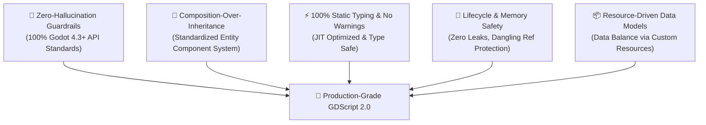
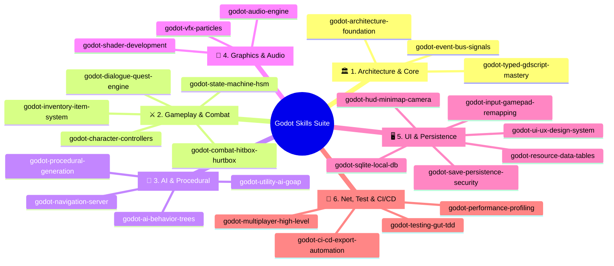

# 🎮 Godot Skills Ecosystem (Godot 4.3+)

<div align="center">


<p align="center">
  <b>Enterprise-Grade AI Agent Skills & Architecture Suite for Godot Game Development</b><br>
  <i>Designed & Engineered by Senior Prompt Developers & Senior Godot Engine Architects.</i>
</p>

🌐 **Language:** **English** • [Tiếng Việt](README_VI.md)

---

[✨ Overview](#-overview) •
[🏛️ Architecture Philosophy](#️-architecture-philosophy) •
[🗺️ 25 Mega Skills Matrix](#️-25-mega-skills-matrix) •
[🌟 Awesome Godot Hub](AWESOME_GODOT.md) •
[🚀 Quickstart](#-quickstart) •
[🧪 Automated Testing & CI/CD](#-automated-testing--cicd) •
[🤝 Contributing](#-contributing) •
[📄 License](#-license)

</div>

---

## ✨ Overview

`godot-skills` is a masterclass repository of specialized **AI Agent Skills**, clean architectural patterns, 100% type-safe GDScript 2.0 standards, and production-ready components built specifically for **Godot 4.x (Godot 4.3+)**.

This suite is engineered to:
1. **Empower AI Coding Assistants** (Antigravity, Cursor, Claude Code, GitHub Copilot) to act as a **Senior Technical Director / Engine Architect**.
2. Provide **25+ modular, production-ready systems** covering the complete game development lifecycle (2D/3D physics, HSM, combat juice, GOAP, shaders, encrypted saves, multiplayer, CI/CD).
3. Completely eliminate **legacy Godot 3 traps and compilation warnings**.

---

## 🏛️ Architecture Philosophy



1. **Strict Static Typing**: 100% of variables, function parameters, return types, arrays, and dictionaries are explicitly annotated (`Array[ItemData]`, `Dictionary[StringName, float]`).
2. **Composition over Inheritance**: Deep inheritance trees are replaced by isolated, reusable components (`HealthComponent`, `HitboxComponent`, `InventoryComponent`).
3. **Decoupled Event Bus**: Subsystems (UI, Gameplay, Audio, Quests) communicate cleanly via a typed global Event Bus.
4. **Data-Driven Workflows**: Game balance, stats, dialogues, and loot tables are driven by Custom Resources (`.tres`) and offline SQLite databases.

---

## 🗺️ 25 Mega Skills Matrix

The suite is organized into **6 core domains containing 25 Mega Skills**:



---

### 📋 Full Catalog Breakdown

#### 🏛️ Domain 1: Architecture & Core Foundations
| Skill Name | Description & Capabilities | Included Templates |
| :--- | :--- | :--- |
| **[`godot-architecture-foundation`](skills/godot-architecture-foundation/SKILL.md)** | Clean Architecture, Feature-First DDD, Component Composition, AutoLoad Governance | [`ServiceLocator.gd`](skills/godot-architecture-foundation/templates/ServiceLocator.gd)<br>[`HealthComponent.gd`](skills/godot-architecture-foundation/templates/HealthComponent.gd) |
| **[`godot-typed-gdscript-mastery`](skills/godot-typed-gdscript-mastery/SKILL.md)** | 100% GDScript 2.0 Static Typing, Custom Resources, Crash-Proof `@tool` Gizmos | [`ItemData.gd`](skills/godot-typed-gdscript-mastery/templates/ItemData.gd)<br>[`CustomGridGizmo.gd`](skills/godot-typed-gdscript-mastery/templates/CustomGridGizmo.gd) |
| **[`godot-event-bus-signals`](skills/godot-event-bus-signals/SKILL.md)** | Domain-Partitioned Typed Event Bus, Async Request-Response Callbacks, One-Shot Signals | [`Events.gd`](skills/godot-event-bus-signals/templates/Events.gd)<br>[`SignalListenerComponent.gd`](skills/godot-event-bus-signals/templates/SignalListenerComponent.gd) |

#### ⚔️ Domain 2: Core Gameplay & Combat Mechanics
| Skill Name | Description & Capabilities | Included Templates |
| :--- | :--- | :--- |
| **[`godot-character-controllers`](skills/godot-character-controllers/SKILL.md)** | Precision 2D Platformer (Coyote time, Jump buffer, Wall jump) & 3D Kinematic FPS/TPS | [`PlatformerController2D.gd`](skills/godot-character-controllers/templates/PlatformerController2D.gd)<br>[`CharacterController3D.gd`](skills/godot-character-controllers/templates/CharacterController3D.gd) |
| **[`godot-state-machine-hsm`](skills/godot-state-machine-hsm/SKILL.md)** | Hierarchical Finite State Machine (HSM), Pushdown Stack, Visual Debug Overlay | [`State.gd`](skills/godot-state-machine-hsm/templates/State.gd)<br>[`StateMachine.gd`](skills/godot-state-machine-hsm/templates/StateMachine.gd)<br>[`PlayerIdleState.gd`](skills/godot-state-machine-hsm/templates/PlayerIdleState.gd) |
| **[`godot-combat-hitbox-hurtbox`](skills/godot-combat-hitbox-hurtbox/SKILL.md)** | Hitbox/Hurtbox Layers, `DamagePayload` DTO, Hitstop Freeze-Frames, Perlin Screen Shake | [`DamagePayload.gd`](skills/godot-combat-hitbox-hurtbox/templates/DamagePayload.gd)<br>[`HitboxComponent2D.gd`](skills/godot-combat-hitbox-hurtbox/templates/HitboxComponent2D.gd)<br>[`HurtboxComponent2D.gd`](skills/godot-combat-hitbox-hurtbox/templates/HurtboxComponent2D.gd)<br>[`ScreenShakeDirector.gd`](skills/godot-combat-hitbox-hurtbox/templates/ScreenShakeDirector.gd) |
| **[`godot-inventory-item-system`](skills/godot-inventory-item-system/SKILL.md)** | Observable Slots, Auto-Stacking, Equipment Manager, Weighted Loot Tables | [`InventorySlot.gd`](skills/godot-inventory-item-system/templates/InventorySlot.gd)<br>[`InventoryComponent.gd`](skills/godot-inventory-item-system/templates/InventoryComponent.gd)<br>[`LootTable.gd`](skills/godot-inventory-item-system/templates/LootTable.gd) |
| **[`godot-dialogue-quest-engine`](skills/godot-dialogue-quest-engine/SKILL.md)** | Branching Dialogue Trees, NPC Interactions, Quest Progression Graphs & Event Bus Sync | [`DialogueNode.gd`](skills/dialogue-quest-engine/templates/DialogueNode.gd)<br>[`QuestResource.gd`](skills/godot-dialogue-quest-engine/templates/QuestResource.gd)<br>[`QuestManager.gd`](skills/godot-dialogue-quest-engine/templates/QuestManager.gd) |

#### 🧠 Domain 3: AI & Procedural Generation
| Skill Name | Description & Capabilities | Included Templates |
| :--- | :--- | :--- |
| **[`godot-ai-behavior-trees`](skills/godot-ai-behavior-trees/SKILL.md)** | Composites (Selector/Sequence), Blackboard Shared Memory, Vision Cones & Alert Levels | [`BTNode.gd`](skills/godot-ai-behavior-trees/templates/BTNode.gd)<br>[`BTSelector.gd`](skills/godot-ai-behavior-trees/templates/BTSelector.gd)<br>[`BTSequence.gd`](skills/godot-ai-behavior-trees/templates/BTSequence.gd)<br>[`Blackboard.gd`](skills/godot-ai-behavior-trees/templates/Blackboard.gd)<br>[`PerceptionComponent2D.gd`](skills/godot-ai-behavior-trees/templates/PerceptionComponent2D.gd) |
| **[`godot-utility-ai-goap`](skills/godot-utility-ai-goap/SKILL.md)** | GOAP A* Action Graph Solver & Sigmoid/Logistic Utility Response Curves | [`GOAPAction.gd`](skills/godot-utility-ai-goap/templates/GOAPAction.gd)<br>[`GOAPGoal.gd`](skills/godot-utility-ai-goap/templates/GOAPGoal.gd)<br>[`GOAPPlanner.gd`](skills/godot-utility-ai-goap/templates/GOAPPlanner.gd)<br>[`UtilityCurve.gd`](skills/godot-utility-ai-goap/templates/UtilityCurve.gd) |
| **[`godot-procedural-generation`](skills/godot-procedural-generation/SKILL.md)** | BSP Dungeon Generator, Cellular Automata Caves, FastNoiseLite Terrain Biomes | [`BSPDungeonGenerator.gd`](skills/godot-procedural-generation/templates/BSPDungeonGenerator.gd)<br>[`CellularAutomataCaveGenerator.gd`](skills/godot-procedural-generation/templates/CellularAutomataCaveGenerator.gd)<br>[`NoiseTerrainGenerator.gd`](skills/godot-procedural-generation/templates/NoiseTerrainGenerator.gd) |
| **[`godot-navigation-server`](skills/godot-navigation-server/SKILL.md)** | NavigationServer2D/3D, RVO2 Dynamic Obstacle Avoidance, Runtime NavMesh Baking | [`NavAgentController2D.gd`](skills/godot-navigation-server/templates/NavAgentController2D.gd)<br>[`NavAgentController3D.gd`](skills/godot-navigation-server/templates/NavAgentController3D.gd)<br>[`RuntimeNavMeshBaker.gd`](skills/godot-navigation-server/templates/RuntimeNavMeshBaker.gd) |

#### 🎨 Domain 4: Graphics, Shaders & Audio
| Skill Name | Description & Capabilities | Included Templates |
| :--- | :--- | :--- |
| **[`godot-shader-development`](skills/godot-shader-development/SKILL.md)** | Custom `.gdshader` Shaders: Noise Dissolve, 2D Outlines, 3D Toon Cel-Shading, Stylized Water | [`dissolve_burn.gdshader`](skills/godot-shader-development/templates/dissolve_burn.gdshader)<br>[`outline_2d.gdshader`](skills/godot-shader-development/templates/outline_2d.gdshader)<br>[`toon_shading_3d.gdshader`](skills/godot-shader-development/templates/toon_shading_3d.gdshader)<br>[`stylized_water.gdshader`](skills/godot-shader-development/templates/stylized_water.gdshader) |
| **[`godot-vfx-particles`](skills/godot-vfx-particles/SKILL.md)** | GPUParticles2D/3D, Sub-Emitters (Collision/Death Bursts), Impact VFX Object Pooling | [`VFXSpawnerComponent.gd`](skills/godot-vfx-particles/templates/VFXSpawnerComponent.gd)<br>[`ImpactVFXPool.gd`](skills/godot-vfx-particles/templates/ImpactVFXPool.gd) |
| **[`godot-audio-engine`](skills/godot-audio-engine/SKILL.md)** | Audio Buses Layout, Dynamic BGM Crossfader Director, SFX Sound Pool with Ducking | [`AudioDirector.gd`](skills/godot-audio-engine/templates/AudioDirector.gd)<br>[`SoundPool.gd`](skills/godot-audio-engine/templates/SoundPool.gd) |

#### 🖥️ Domain 5: UI/UX & Data Persistence
| Skill Name | Description & Capabilities | Included Templates |
| :--- | :--- | :--- |
| **[`godot-ui-ux-design-system`](skills/godot-ui-ux-design-system/SKILL.md)** | Responsive Layouts (Containers/Anchors), Gamepad/Keyboard Focus Navigation, Tactile Widgets | [`UIFocusNavigator.gd`](skills/godot-ui-ux-design-system/templates/UIFocusNavigator.gd)<br>[`NeobrutalismButton.gd`](skills/godot-ui-ux-design-system/templates/NeobrutalismButton.gd) |
| **[`godot-hud-minimap-camera`](skills/godot-hud-minimap-camera/SKILL.md)** | Parabolic Floating Damage Numbers, SubViewport Radar Minimap, Multi-Target Smart Camera | [`FloatingDamageNumberSpawner.gd`](skills/godot-hud-minimap-camera/templates/FloatingDamageNumberSpawner.gd)<br>[`MinimapRadar2D.gd`](skills/godot-hud-minimap-camera/templates/MinimapRadar2D.gd)<br>[`SmartCameraController2D.gd`](skills/godot-hud-minimap-camera/templates/SmartCameraController2D.gd) |
| **[`godot-input-gamepad-remapping`](skills/godot-input-gamepad-remapping/SKILL.md)** | Runtime `InputMap` Rebinding, `ConfigFile` Persistence, Frame-Accurate Action Input Buffer | [`InputRebindManager.gd`](skills/godot-input-gamepad-remapping/templates/InputRebindManager.gd)<br>[`InputBufferComponent.gd`](skills/godot-input-gamepad-remapping/templates/InputBufferComponent.gd) |
| **[`godot-save-persistence-security`](skills/godot-save-persistence-security/SKILL.md)** | AES-256 Multi-Slot Encrypted Saves, SHA-256 Anti-Tamper Checksums & Atomic Write Swaps | [`SaveDataPayload.gd`](skills/godot-save-persistence-security/templates/SaveDataPayload.gd)<br>[`SaveManager.gd`](skills/godot-save-persistence-security/templates/SaveManager.gd) |
| **[`godot-sqlite-local-db`](skills/godot-sqlite-local-db/SKILL.md)** | Offline Relational SQLite Database, Versioned SQL Migrations & Batching | [`DatabaseMigrationManager.gd`](skills/godot-sqlite-local-db/templates/DatabaseMigrationManager.gd)<br>[`SQLiteDatabaseService.gd`](skills/godot-sqlite-local-db/templates/SQLiteDatabaseService.gd) |
| **[`godot-resource-data-tables`](skills/godot-resource-data-tables/SKILL.md)** | Custom Resource Data Tables, $\mathcal{O}(1)$ Keyed Lookups & CSV-to-Resource Importers | [`DataTable.gd`](skills/godot-resource-data-tables/templates/DataTable.gd)<br>[`CSVResourceImporter.gd`](skills/godot-resource-data-tables/templates/CSVResourceImporter.gd) |

#### 🌐 Domain 6: Networking, Testing & CI/CD
| Skill Name | Description & Capabilities | Included Templates |
| :--- | :--- | :--- |
| **[`godot-multiplayer-high-level`](skills/godot-multiplayer-high-level/SKILL.md)** | Server-Authoritative Networking, RPCs, MultiplayerSpawner, Client-Side Prediction | [`NetworkManager.gd`](skills/godot-multiplayer-high-level/templates/NetworkManager.gd)<br>[`NetworkPlayerController.gd`](skills/godot-multiplayer-high-level/templates/NetworkPlayerController.gd) |
| **[`godot-testing-gut-tdd`](skills/godot-testing-gut-tdd/SKILL.md)** | GUT Framework TDD, Signal Watchers/Assertions, Scene Testing & Headless CLI Test Runner | [`test_health_component.gd`](skills/godot-testing-gut-tdd/templates/test_health_component.gd)<br>[`test_inventory_component.gd`](skills/godot-testing-gut-tdd/templates/test_inventory_component.gd)<br>[`run_gut_tests.ps1`](skills/godot-testing-gut-tdd/templates/run_gut_tests.ps1) |
| **[`godot-performance-profiling`](skills/godot-performance-profiling/SKILL.md)** | MultiMesh 50k+ Bullet Batching, Server Bypasses, Background Threaded Streaming & FPS Monitor | [`MultiMeshBulletManager2D.gd`](skills/godot-performance-profiling/templates/MultiMeshBulletManager2D.gd)<br>[`ThreadedSceneLoader.gd`](skills/godot-performance-profiling/templates/ThreadedSceneLoader.gd)<br>[`PerformanceMonitorOverlay.gd`](skills/godot-performance-profiling/templates/PerformanceMonitorOverlay.gd) |
| **[`godot-ci-cd-export-automation`](skills/godot-ci-cd-export-automation/SKILL.md)** | GitHub Actions Matrix CI/CD, Headless Multi-Platform Export & Itch.io Butler Deploy | [`github_ci_cd_workflow.yml`](skills/godot-ci-cd-export-automation/templates/github_ci_cd_workflow.yml)<br>[`export_presets.cfg.template`](skills/godot-ci-cd-export-automation/templates/export_presets.cfg.template)<br>[`export_game.ps1`](skills/godot-ci-cd-export-automation/templates/export_game.ps1) |

---

## 🚀 Quickstart & One-Liner Installation

### 1. Native Godot Editor Plugin (`addons/godot_skills`)
Install and enable the addon directly in your Godot 4.3+ project:
1. Copy the `addons/godot_skills/` folder into your project's `res://addons/` directory.
2. In Godot, go to **Project -> Project Settings -> Plugins** and enable **"Godot Skills AI & Component Suite"**.
3. A new **"Godot Skills"** dock will appear in the right editor panel with 5 tabs:
   - **⚡ 1-Click AI Setup**: Generates `.gemini/skills/`, `.cursor/rules/`, `CLAUDE.md`, and `.github/copilot-instructions.md` with one click.
   - **🧩 Component Injector**: Select a node in the Scene tree and click **"➕ Inject Node"** to insert `HealthComponent`, `HitboxComponent2D`, `StateMachine`, `InputBufferComponent`, or `SmartCameraController2D` with auto-copied dependencies and full Undo/Redo support!
   - **📚 Skills Catalog**: Search, filter, and inspect all 25 Mega Skills with 1-click **Copy AI Prompt** buttons.
   - **🩺 Project Doctor**: Audit all project GDScript files for 100% static typing & legacy Godot 3 patterns with jump-to-code navigation.
   - **🌟 Godot Awesome**: Built-in curated directory of 30+ premier addons (Jolt, Phantom Camera, Dialogic, Terrain3D), masterclass courses (GDQuest, Clear Code), shader libraries, game math algorithms (Red Blob Games), and CC0 asset archives (Kenney, Sonniss) with 1-click **Open in Browser** and **Ask AI Prompt** integrations! (See also [`AWESOME_GODOT.md`](AWESOME_GODOT.md))

### 2. Universal One-Liner Installer (Into ANY Godot Project)
You can inject Clean Architecture and all AI agent rules into **any external Godot project folder**:

```powershell
# Windows PowerShell: Bootstrap current or target project
pwsh install.ps1 -Target "D:\MyGodotProjects\NewGame"

# Or install globally for all projects on your PC:
pwsh install.ps1 -Global
```

```bash
# Linux / macOS:
./install.sh --target "/path/to/my_project"
```

### 3. Standalone CLI Tool (`tools/godot_skills_cli.py`)
```bash
# Audit any Godot project for GDScript 2.0 type violations & Godot 3 legacy code:
python tools/godot_skills_cli.py doctor --target "D:\MyGame"

# Add specific skill templates (e.g. Combat, Inventory, Shaders):
python tools/godot_skills_cli.py add combat --target "D:\MyGame"

# Export multi-agent rules (Antigravity, Cursor, Claude Code, Copilot):
python tools/export_ai_rules.py --target "D:\MyGame" --all
```

### 4. Using with AI Coding Agents (Antigravity / Cursor / Claude Code)
Once installed into your project, simply prompt your AI assistant naturally. The agent will automatically detect and follow the rules:

```text
Sample Agent Prompt:
"Using the godot-combat-hitbox-hurtbox skill, implement a 2D melee sword attack system with freeze-frame hitstop and Perlin screen shake for the player character."
```

---

## 🧪 Automated Testing & CI/CD

Run the test suite headless from PowerShell or terminal:

```powershell
# Run automated GUT unit tests
pwsh skills/godot-testing-gut-tdd/templates/run_gut_tests.ps1 -TestDir "res://test/unit"
```

Export release binaries locally without launching the Godot editor UI:

```powershell
# Export Windows Release binary
pwsh skills/godot-ci-cd-export-automation/templates/export_game.ps1 -Preset "Windows Desktop" -OutputPath "build/windows/GodotSkills.exe"
```

---

## 🤝 Contributing

Contributions are welcome! Please read the engineering requirements and coding standards in:
👉 **[`CONTRIBUTING.md`](CONTRIBUTING.md)**

---

## 📄 License

Distributed under the **MIT License**. Free for commercial and non-commercial game development. See [`LICENSE`](LICENSE) for details.
