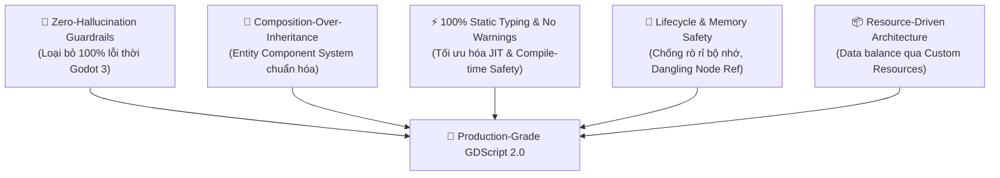
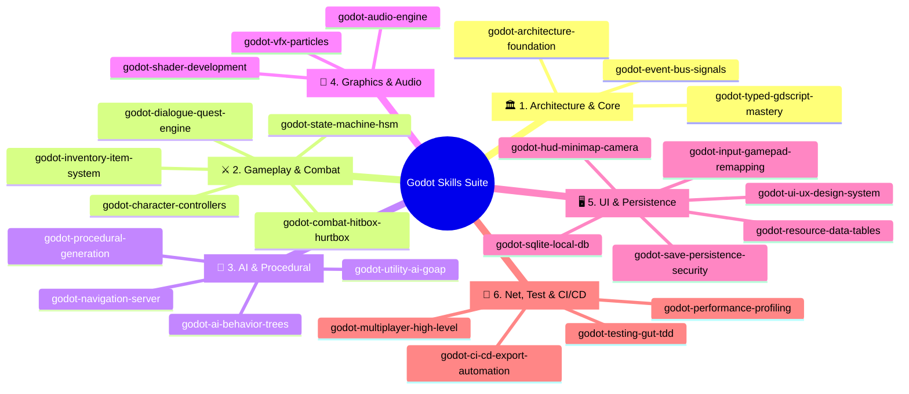

# 🎮 Godot Skills Ecosystem (Godot 4.3+)

<div align="center">


<p align="center">
  <b>Bản đồ & Bộ Kỹ Năng Agent Chuẩn Mực Dành Cho Phát Triển Game Trên Godot Engine</b><br>
  <i>Được biên soạn & chuẩn hóa bởi Senior Prompt Developer & Senior Godot Engine Architect.</i>
</p>

🌐 **Ngôn ngữ:** [English](README.md) • **Tiếng Việt**

---

[✨ Giới Thiệu](#-giới-thiệu) •
[🏛️ Triết Lý Thiết Kế](#️-triết-lý-thiết-kế) •
[🗺️ Ma Trận 25 Mega Skills](#️-ma-trận-25-mega-skills) •
[🚀 Bắt Đầu Nhanh](#-bắt-đầu-nhanh-quickstart) •
[🧪 Kiểm Thử & CI/CD](#-kiểm-thử--cicd) •
[🤝 Đóng Góp](#-đóng-góp-contributing) •
[📄 Bản Quyền](#-bản-quyền-license)

</div>

---

## 📖 Giới Thiệu (Overview)

`godot-skills` là hệ sinh thái kỹ năng AI Agent và thư viện kiến trúc mã nguồn mở toàn diện nhất dành cho **Godot Engine 4.x (Godot 4.3+)**. 

Bộ kỹ năng này được thiết kế để:
1. **Nâng tầm AI Coding Assistants** (Antigravity, Claude, Cursor, Copilot) thành một **Godot Technical Director / Senior Game Developer** thực thụ.
2. Cung cấp hơn **25+ module kiến trúc độc lập, 100% type-safe GDScript 2.0, không warnings, tối ưu hiệu năng JIT** và có thể tích hợp trực tiếp vào mọi dự án game thương mại từ 2D đến 3D.
3. Loại bỏ triệt để các lỗi thời, bẫy cú pháp giữa Godot 3 và Godot 4.

---

## 🏛️ Triết Lý Thiết Kế (Core Architectural Philosophy)



1. **Strict Type-Safety**: 100% biến, tham số hàm, kiểu trả về và mảng/dictionary đều có type annotation (`Array[ItemData]`, `Dictionary[StringName, float]`).
2. **Composition over Inheritance**: Không dùng cây kế thừa sâu (`Node2D -> Entity -> Actor -> Player`). Thay vào đó là các Component độc lập (`HealthComponent`, `HitboxComponent`, `InventoryComponent`).
3. **Decoupled Event Bus**: Tách biệt luồng giao tiếp giữa UI, Gameplay, Audio và Quests thông qua Typed Signal Bus.
4. **Data-Driven Architecture**: Toàn bộ cân bằng game, chỉ số, hội thoại, nhiệm vụ được lưu dưới dạng `Resource` (`.tres`) hoặc SQLite DB.

---

## 🗺️ Ma Trận 25 Mega Skills (Full Catalog)

Hệ sinh thái được chia làm **6 phân hệ chuyên sâu với 25 Mega Skills**:



### 📋 Bảng Chi Tiết Từng Phân Hệ:

#### 🏛️ Phân Hệ 1: Architecture & Core Foundations
| Kỹ Năng (Skill) | Mục Tiêu Chính & Tính Năng | Templates Đính Kèm |
| :--- | :--- | :--- |
| **[`godot-architecture-foundation`](skills/godot-architecture-foundation/SKILL.md)** | Clean Architecture, Feature-First DDD, Component Composition, Quản trị AutoLoad | [`ServiceLocator.gd`](skills/godot-architecture-foundation/templates/ServiceLocator.gd)<br>[`HealthComponent.gd`](skills/godot-architecture-foundation/templates/HealthComponent.gd) |
| **[`godot-typed-gdscript-mastery`](skills/godot-typed-gdscript-mastery/SKILL.md)** | 100% GDScript 2.0 Static Typing, Custom Resources, Crash-proof `@tool` Gizmos | [`ItemData.gd`](skills/godot-typed-gdscript-mastery/templates/ItemData.gd)<br>[`CustomGridGizmo.gd`](skills/godot-typed-gdscript-mastery/templates/CustomGridGizmo.gd) |
| **[`godot-event-bus-signals`](skills/godot-event-bus-signals/SKILL.md)** | Typed Event Bus phân vùng (Gameplay, UI, Audio), Async Callbacks, One-shot Signals | [`Events.gd`](skills/godot-event-bus-signals/templates/Events.gd)<br>[`SignalListenerComponent.gd`](skills/godot-event-bus-signals/templates/SignalListenerComponent.gd) |

#### ⚔️ Phân Hệ 2: Gameplay & Combat Mechanics
| Kỹ Năng (Skill) | Mục Tiêu Chính & Tính Năng | Templates Đính Kèm |
| :--- | :--- | :--- |
| **[`godot-character-controllers`](skills/godot-character-controllers/SKILL.md)** | 2D Platformer (Coyote time, Jump buffer, Wall jump) & 3D Kinematic FPS/TPS SpringArm | [`PlatformerController2D.gd`](skills/godot-character-controllers/templates/PlatformerController2D.gd)<br>[`CharacterController3D.gd`](skills/godot-character-controllers/templates/CharacterController3D.gd) |
| **[`godot-state-machine-hsm`](skills/godot-state-machine-hsm/SKILL.md)** | Hierarchical State Machine (HSM), Pushdown stack, Visual Debugger | [`State.gd`](skills/godot-state-machine-hsm/templates/State.gd)<br>[`StateMachine.gd`](skills/godot-state-machine-hsm/templates/StateMachine.gd)<br>[`PlayerIdleState.gd`](skills/godot-state-machine-hsm/templates/PlayerIdleState.gd) |
| **[`godot-combat-hitbox-hurtbox`](skills/godot-combat-hitbox-hurtbox/SKILL.md)** | Hitbox/Hurtbox layers, `DamagePayload`, Hitstop freeze-frame, Perlin Screen Shake | [`DamagePayload.gd`](skills/godot-combat-hitbox-hurtbox/templates/DamagePayload.gd)<br>[`HitboxComponent2D.gd`](skills/godot-combat-hitbox-hurtbox/templates/HitboxComponent2D.gd)<br>[`HurtboxComponent2D.gd`](skills/godot-combat-hitbox-hurtbox/templates/HurtboxComponent2D.gd)<br>[`ScreenShakeDirector.gd`](skills/godot-combat-hitbox-hurtbox/templates/ScreenShakeDirector.gd) |
| **[`godot-inventory-item-system`](skills/godot-inventory-item-system/SKILL.md)** | Observable Slots, Auto-stacking, Equipment manager, Weighted Loot Tables | [`InventorySlot.gd`](skills/godot-inventory-item-system/templates/InventorySlot.gd)<br>[`InventoryComponent.gd`](skills/godot-inventory-item-system/templates/InventoryComponent.gd)<br>[`LootTable.gd`](skills/godot-inventory-item-system/templates/LootTable.gd) |
| **[`godot-dialogue-quest-engine`](skills/godot-dialogue-quest-engine/SKILL.md)** | Branching Dialogue trees, Quest graph progression & Event Bus Auto-sync | [`DialogueNode.gd`](skills/godot-dialogue-quest-engine/templates/DialogueNode.gd)<br>[`QuestResource.gd`](skills/godot-dialogue-quest-engine/templates/QuestResource.gd)<br>[`QuestManager.gd`](skills/godot-dialogue-quest-engine/templates/QuestManager.gd) |

#### 🧠 Phân Hệ 3: AI & Procedural Generation
| Kỹ Năng (Skill) | Mục Tiêu Chính & Tính Năng | Templates Đính Kèm |
| :--- | :--- | :--- |
| **[`godot-ai-behavior-trees`](skills/godot-ai-behavior-trees/SKILL.md)** | Composites (Selector/Sequence), Blackboard shared memory, Vision Cone & Alert levels | [`BTNode.gd`](skills/godot-ai-behavior-trees/templates/BTNode.gd)<br>[`BTSelector.gd`](skills/godot-ai-behavior-trees/templates/BTSelector.gd)<br>[`BTSequence.gd`](skills/godot-ai-behavior-trees/templates/BTSequence.gd)<br>[`Blackboard.gd`](skills/godot-ai-behavior-trees/templates/Blackboard.gd)<br>[`PerceptionComponent2D.gd`](skills/godot-ai-behavior-trees/templates/PerceptionComponent2D.gd) |
| **[`godot-utility-ai-goap`](skills/godot-utility-ai-goap/SKILL.md)** | GOAP A* Action Graph solver & Sigmoid Utility response curves | [`GOAPAction.gd`](skills/godot-utility-ai-goap/templates/GOAPAction.gd)<br>[`GOAPGoal.gd`](skills/godot-utility-ai-goap/templates/GOAPGoal.gd)<br>[`GOAPPlanner.gd`](skills/godot-utility-ai-goap/templates/GOAPPlanner.gd)<br>[`UtilityCurve.gd`](skills/godot-utility-ai-goap/templates/UtilityCurve.gd) |
| **[`godot-procedural-generation`](skills/godot-procedural-generation/SKILL.md)** | BSP Dungeon generator, Cellular Automata caves, FastNoiseLite terrain biomes | [`BSPDungeonGenerator.gd`](skills/godot-procedural-generation/templates/BSPDungeonGenerator.gd)<br>[`CellularAutomataCaveGenerator.gd`](skills/godot-procedural-generation/templates/CellularAutomataCaveGenerator.gd)<br>[`NoiseTerrainGenerator.gd`](skills/godot-procedural-generation/templates/NoiseTerrainGenerator.gd) |
| **[`godot-navigation-server`](skills/godot-navigation-server/SKILL.md)** | NavigationServer2D/3D, RVO2 Dynamic Avoidance, Runtime NavMesh Rebaking | [`NavAgentController2D.gd`](skills/godot-navigation-server/templates/NavAgentController2D.gd)<br>[`NavAgentController3D.gd`](skills/godot-navigation-server/templates/NavAgentController3D.gd)<br>[`RuntimeNavMeshBaker.gd`](skills/godot-navigation-server/templates/RuntimeNavMeshBaker.gd) |

#### 🎨 Phân Hệ 4: Graphics, Shaders & Audio
| Kỹ Năng (Skill) | Mục Tiêu Chính & Tính Năng | Templates Đính Kèm |
| :--- | :--- | :--- |
| **[`godot-shader-development`](skills/godot-shader-development/SKILL.md)** | Custom `.gdshader` (Noise Dissolve, 2D Outlines, 3D Toon Cel-shading, Stylized Water) | [`dissolve_burn.gdshader`](skills/godot-shader-development/templates/dissolve_burn.gdshader)<br>[`outline_2d.gdshader`](skills/godot-shader-development/templates/outline_2d.gdshader)<br>[`toon_shading_3d.gdshader`](skills/godot-shader-development/templates/toon_shading_3d.gdshader)<br>[`stylized_water.gdshader`](skills/godot-shader-development/templates/stylized_water.gdshader) |
| **[`godot-vfx-particles`](skills/godot-vfx-particles/SKILL.md)** | GPUParticles2D/3D, Sub-emitters (Collision/Death bursts), Impact VFX Object Pooling | [`VFXSpawnerComponent.gd`](skills/godot-vfx-particles/templates/VFXSpawnerComponent.gd)<br>[`ImpactVFXPool.gd`](skills/godot-vfx-particles/templates/ImpactVFXPool.gd) |
| **[`godot-audio-engine`](skills/godot-audio-engine/SKILL.md)** | Audio Buses layout, BGM Tween Crossfader director, Zero-allocation SFX Sound Pool | [`AudioDirector.gd`](skills/godot-audio-engine/templates/AudioDirector.gd)<br>[`SoundPool.gd`](skills/godot-audio-engine/templates/SoundPool.gd) |

#### 🖥️ Phân Hệ 5: UI/UX & Data Persistence
| Kỹ Năng (Skill) | Mục Tiêu Chính & Tính Năng | Templates Đính Kèm |
| :--- | :--- | :--- |
| **[`godot-ui-ux-design-system`](skills/godot-ui-ux-design-system/SKILL.md)** | Responsive Layouts (Containers/Anchors), Gamepad/Keyboard Focus Navigator, Neobrutalism Widgets | [`UIFocusNavigator.gd`](skills/godot-ui-ux-design-system/templates/UIFocusNavigator.gd)<br>[`NeobrutalismButton.gd`](skills/godot-ui-ux-design-system/templates/NeobrutalismButton.gd) |
| **[`godot-hud-minimap-camera`](skills/godot-hud-minimap-camera/SKILL.md)** | Parabolic Damage Numbers, SubViewport Radar Minimap, Smart Multi-Target Camera | [`FloatingDamageNumberSpawner.gd`](skills/godot-hud-minimap-camera/templates/FloatingDamageNumberSpawner.gd)<br>[`MinimapRadar2D.gd`](skills/godot-hud-minimap-camera/templates/MinimapRadar2D.gd)<br>[`SmartCameraController2D.gd`](skills/godot-hud-minimap-camera/templates/SmartCameraController2D.gd) |
| **[`godot-input-gamepad-remapping`](skills/godot-input-gamepad-remapping/SKILL.md)** | Runtime `InputMap` Rebinding, `ConfigFile` persistence, Action Input Buffer | [`InputRebindManager.gd`](skills/godot-input-gamepad-remapping/templates/InputRebindManager.gd)<br>[`InputBufferComponent.gd`](skills/godot-input-gamepad-remapping/templates/InputBufferComponent.gd) |
| **[`godot-save-persistence-security`](skills/godot-save-persistence-security/SKILL.md)** | AES-256 Encrypted Saves, SHA-256 Anti-Tamper Checksums & Atomic Crash Protection | [`SaveDataPayload.gd`](skills/godot-save-persistence-security/templates/SaveDataPayload.gd)<br>[`SaveManager.gd`](skills/godot-save-persistence-security/templates/SaveManager.gd) |
| **[`godot-sqlite-local-db`](skills/godot-sqlite-local-db/SKILL.md)** | Offline Relational SQLite Database, Versioned SQL Migrations & Batching | [`DatabaseMigrationManager.gd`](skills/godot-sqlite-local-db/templates/DatabaseMigrationManager.gd)<br>[`SQLiteDatabaseService.gd`](skills/godot-sqlite-local-db/templates/SQLiteDatabaseService.gd) |
| **[`godot-resource-data-tables`](skills/godot-resource-data-tables/SKILL.md)** | Custom Resource Data Tables, $\mathcal{O}(1)$ Keyed Lookups & CSV-to-Resource Importers | [`DataTable.gd`](skills/godot-resource-data-tables/templates/DataTable.gd)<br>[`CSVResourceImporter.gd`](skills/godot-resource-data-tables/templates/CSVResourceImporter.gd) |

#### 🌐 Phân Hệ 6: Networking, Testing & CI/CD
| Kỹ Năng (Skill) | Mục Tiêu Chính & Tính Năng | Templates Đính Kèm |
| :--- | :--- | :--- |
| **[`godot-multiplayer-high-level`](skills/godot-multiplayer-high-level/SKILL.md)** | Server-Authoritative High-Level Multiplayer, RPCs, MultiplayerSpawner, Client Prediction | [`NetworkManager.gd`](skills/godot-multiplayer-high-level/templates/NetworkManager.gd)<br>[`NetworkPlayerController.gd`](skills/godot-multiplayer-high-level/templates/NetworkPlayerController.gd) |
| **[`godot-testing-gut-tdd`](skills/godot-testing-gut-tdd/SKILL.md)** | GUT Framework TDD, Signal Watchers/Assertions, Scene Testing & Headless CLI Runner | [`test_health_component.gd`](skills/godot-testing-gut-tdd/templates/test_health_component.gd)<br>[`test_inventory_component.gd`](skills/godot-testing-gut-tdd/templates/test_inventory_component.gd)<br>[`run_gut_tests.ps1`](skills/godot-testing-gut-tdd/templates/run_gut_tests.ps1) |
| **[`godot-performance-profiling`](skills/godot-performance-profiling/SKILL.md)** | MultiMesh 50k+ Bullet Batching, Server Bypasses, Background Threaded Streaming | [`MultiMeshBulletManager2D.gd`](skills/godot-performance-profiling/templates/MultiMeshBulletManager2D.gd)<br>[`ThreadedSceneLoader.gd`](skills/godot-performance-profiling/templates/ThreadedSceneLoader.gd)<br>[`PerformanceMonitorOverlay.gd`](skills/godot-performance-profiling/templates/PerformanceMonitorOverlay.gd) |
| **[`godot-ci-cd-export-automation`](skills/godot-ci-cd-export-automation/SKILL.md)** | GitHub Actions Matrix CI/CD, Headless Multi-Platform Export & Itch.io Deploy | [`github_ci_cd_workflow.yml`](skills/godot-ci-cd-export-automation/templates/github_ci_cd_workflow.yml)<br>[`export_presets.cfg.template`](skills/godot-ci-cd-export-automation/templates/export_presets.cfg.template)<br>[`export_game.ps1`](skills/godot-ci-cd-export-automation/templates/export_game.ps1) |

---

## 🚀 Bắt Đầu Nhanh (Quickstart & One-Liner Installer)

### 1. Sử Dụng Godot Editor Addon Trực Tiếp (`addons/godot_skills`)
Cài đặt và kích hoạt Plugin ngay trong Godot Editor 4.3+:
1. Copy thư mục `addons/godot_skills/` vào thư mục `res://addons/` của dự án bạn.
2. Trong Godot, vào **Project -> Project Settings -> Plugins** và bật **"Godot Skills AI & Component Suite"**.
3. Tab **"Godot Skills"** sẽ xuất hiện ở thanh bên phải của Editor với 4 tính năng mạnh mẽ:
   - **⚡ 1-Click AI Setup**: Tự động sinh file `.gemini/skills/`, `.cursor/rules/`, `CLAUDE.md`, và `.github/copilot-instructions.md` chỉ với 1 click.
   - **🧩 Component Injector**: Chọn Node trên Scene tree và bấm **"➕ Inject Node"** để chèn nhanh `HealthComponent`, `HitboxComponent2D`, `StateMachine`, `InputBufferComponent`, `SmartCameraController2D` có hỗ trợ Undo/Redo (Ctrl+Z) và tự động nạp dependencies!
   - **📚 Skills Catalog**: Tra cứu, lọc theo phân hệ và copy prompt AI của 25 Mega Skills.
   - **🩺 Project Doctor**: Quét toàn bộ mã nguồn GDScript trong dự án để phát hiện thiếu type-safe hoặc dính cú pháp cũ Godot 3.

### 2. Cài Đặt Nhanh 1 Dòng Lệnh Vào Bất Kỳ Dự Án Godot Nào
Bạn có thể cài đặt bộ khung Clean Architecture và toàn bộ AI Agent rules vào **bất kỳ thư mục dự án Godot nào trên máy**:

```powershell
# Windows PowerShell: Khởi tạo cho dự án hiện tại hoặc dự án mục tiêu
pwsh install.ps1 -Target "D:\MyGodotProjects\NewGame"

# Hoặc cài đặt Global cho toàn bộ các project trên máy tính:
pwsh install.ps1 -Global
```

```bash
# Linux / macOS:
./install.sh --target "/path/to/my_project"
```

### 3. Sử Dụng Công Cụ CLI (`tools/godot_skills_cli.py`)
```bash
# Quét và kiểm tra độ chuẩn mực Type-Safety & lỗi thời Godot 3:
python tools/godot_skills_cli.py doctor --target "D:\MyGame"

# Chèn template của phân hệ mong muốn (Combat, Inventory, AI...):
python tools/godot_skills_cli.py add combat --target "D:\MyGame"

# Xuất AI rules sang Antigravity, Cursor, Claude Code, Copilot:
python tools/export_ai_rules.py --target "D:\MyGame" --all
```

### 4. Prompting Với AI Coding Assistants (Antigravity / Cursor / Claude Code)
Sau khi cài đặt vào dự án, bạn chỉ cần gõ prompt như bình thường. AI sẽ tự động kích hoạt kiến thức chuyên gia:

```text
Prompt mẫu cho AI:
"Áp dụng skill godot-combat-hitbox-hurtbox để dựng hệ thống combat melee kiếm thuật cho Player kèm theo Freeze Frame và Screen Shake."
```

---

## 🧪 Kiểm Thử & CI/CD

Chạy toàn bộ test suite tự động không cần mở giao diện Godot:

```powershell
# Chạy Unit Tests tự động bằng PowerShell
pwsh skills/godot-testing-gut-tdd/templates/run_gut_tests.ps1 -TestDir "res://test/unit"
```

Xuất bản game đa nền tảng (Windows / Linux / Web) tự động:

```powershell
# Xuất bản bản build Windows Release
pwsh skills/godot-ci-cd-export-automation/templates/export_game.ps1 -Preset "Windows Desktop" -OutputPath "build/windows/MyGame.exe"
```

---

## 🤝 Đóng Góp (Contributing)

Chúng tôi hoan nghênh mọi đóng góp từ cộng đồng! Vui lòng đọc kĩ hướng dẫn đóng góp và quy chuẩn code tại:
👉 **[`CONTRIBUTING.md`](CONTRIBUTING.md)**

---

## 📄 Bản Quyền (License)

Dự án này được phân phối dưới giấy phép **MIT License**. Bạn có toàn quyền sử dụng, sửa đổi và đóng gói trong cả các dự án game thương mại hoặc mã nguồn mở. Xem chi tiết tại [`LICENSE`](LICENSE).
