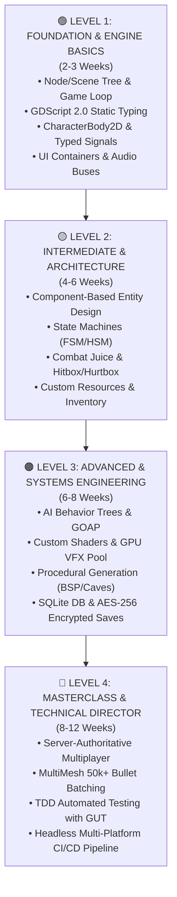

# 🎓 Godot 4 Master Curriculum: Beginner to Advanced & Masterclass

  <b>The definitive, studio-grade game engineering roadmap for Godot Engine 4.3+</b> 
  <i>Authored by Senior Godot Engine Architects & Prompt Engineers. Features structured architectural theory, practical hands-on exercises, level capstone projects, and seamless mapping to the 25 Mega Skills in the <code>godot-skills</code> ecosystem.</i>

🌐 **Language:** **English** • [Tiếng Việt](ROADMAP_CURRICULUM_VI.md)

---

## 🗺️ 4-Level Mastery Roadmap Matrix

| Level | Phase Name | Duration | Core Engineering Focus | Level Capstone Project | Mapped Mega Skills |
| :--- | :--- | :--- | :--- | :--- | :--- |
| **🟢 Level 1** | **Foundation & Basics** | 2 - 3 weeks | Node Tree, GDScript 2.0 Typed, CharacterBody2D, Signals, UI Layout | 🎮 *2D Pixel Coin Runner* | `godot-typed-gdscript-mastery` `godot-event-bus-signals` `godot-ui-ux-design-system` |
| **🟡 Level 2** | **Intermediate & Architecture** | 4 - 6 weeks | Component Architecture, HSM, Hitbox/Hurtbox, Custom Resources, Inventory, NavServer | ⚔️ *2D Top-Down ARPG Slayer* | `godot-architecture-foundation` `godot-character-controllers` `godot-state-machine-hsm` `godot-combat-hitbox-hurtbox` `godot-inventory-item-system` `godot-navigation-server` `godot-hud-minimap-camera` |
| **🟠 Level 3** | **Advanced & Systems** | 6 - 8 weeks | Behavior Trees, GOAP, Shaders, GPU Particles, Procedural Maps, 3D Kinematic, SQLite, AES-256 | 🧠 *Procedural Roguelike Survival* | `godot-ai-behavior-trees` `godot-utility-ai-goap` `godot-shader-development` `godot-vfx-particles` `godot-procedural-generation` `godot-save-persistence-security` `godot-sqlite-local-db` `godot-input-gamepad-remapping` |
| **🔴 Level 4** | **Master & Technical Director** | 8 - 12 weeks | Server-Authoritative Netcode, Prediction, MultiMesh 50k Batching, Server Bypasses, GUT TDD, CI/CD | 🌐 *Online Arena MMO / Bullet Hell* | `godot-multiplayer-high-level` `godot-performance-profiling` `godot-testing-gut-tdd` `godot-ci-cd-export-automation` |

---

## 🟢 LEVEL 1: FOUNDATION & ENGINE BASICS

> **Goal**: Master the core architecture of Godot 4.3+, eliminate untyped dynamic scripting habits, understand game loop execution phases, and build your first complete 2D action game.

### 📚 Detailed Syllabus:

#### 1.1 Node & Scene Tree Hierarchy & Engine Lifecycles
- Scene-as-Node philosophy and parent-child encapsulation.
- Execution lifecycle order: `_init()` ➡️ `_enter_tree()` ➡️ `_ready()` ➡️ `_process(delta)` / `_physics_process(delta)` ➡️ `_exit_tree()`.
- Critical distinction between variable frame rendering (`_process`) vs deterministic fixed 60Hz physics tick (`_physics_process`).

#### 1.2 GDScript 2.0 Static Typing Mastery
- Strict variable contracts: `var speed: float = 300.0`, `var score: int = 0`, `var is_alive: bool = true`.
- Safe type inference: `var dir := Vector2.ZERO`.
- High-performance data structures: `StringName` (`&"action_name"`), `Array[int]`, `Dictionary[StringName, float]`.
- Essential Godot 4 Annotations: `@onready`, `@export`, `@export_range(0, 100, 1)`, `@export_group()`, `@tool`.
- Mandatory function return type declarations: `func take_damage(amount: float) -> bool:`.

#### 1.3 2D Physics & CharacterBody2D Movement
- Physics bodies: `StaticBody2D`, `AnimatableBody2D`, `Area2D`, `CharacterBody2D`.
- Godot 4 parameterless `move_and_slide()` and internal `velocity` property manipulation.
- Global vs local coordinate transforms (`global_position` vs `position`).

#### 1.4 Typed Signals & Decoupled Communication
- Declaring typed signals: `signal health_changed(current: float, max_val: float)`.
- Connecting signals via type-safe Callables: `health_changed.connect(_on_health_changed)`.
- Eliminating legacy string connections: ❌ `connect("health_changed", self, "_on_health_changed")`.
- Memory safety with one-shot connections: `signal_name.connect(callback, CONNECT_ONE_SHOT)`.

#### 1.5 UI Design Systems (Control Nodes & Anchors)
- Auto-resizing layout containers: `VBoxContainer`, `HBoxContainer`, `GridContainer`, `MarginContainer`.
- Responsive anchoring models (Anchors & Size Flags: Fill, Expand, Shrink Center).
- Multi-resolution health bars (`ProgressBar`) and dynamic labels.

#### 1.6 Audio Engine Fundamentals (Audio Buses)
- Routing audio signals through Master, Music, and SFX buses.
- Positional audio with `AudioStreamPlayer2D` and looping soundtrack orchestration with `AudioStreamPlayer`.

---

### 🎮 Level 1 Capstone Project: "2D Pixel Coin Runner"
- **Technical Deliverables**:
  1. Responsive character movement with smooth acceleration and gravity curves.
  2. Collectible coin entities (`Area2D`) with audio feedback and pop animations.
  3. Dynamic UI health bar and score counter updated exclusively via Typed Signals.
  4. 100% static typed GDScript 2.0 passing the Project Doctor audit with zero warnings.
- **Applied Skills**: [`godot-typed-gdscript-mastery`](skills/godot-typed-gdscript-mastery/SKILL.md), [`godot-event-bus-signals`](skills/godot-event-bus-signals/SKILL.md), [`godot-ui-ux-design-system`](skills/godot-ui-ux-design-system/SKILL.md).

---

## 🟡 LEVEL 2: INTERMEDIATE & GAMEPLAY ARCHITECTURE

> **Goal**: Eradicate monolithic Godot scripts, master Component-Based Entity Design, build robust Hierarchical State Machines, implement frame-perfect combat juice, and leverage Custom Resources for data-driven game balancing.

### 📚 Detailed Syllabus:

#### 2.1 Component-Based Entity Design & Clean Architecture
- Replacing deep inheritance (`Player -> Fighter -> Hero`) with composition (`Player has HealthComponent, HitboxComponent, MovementComponent`).
- Feature-First file organization: `src/core/`, `src/components/`, `src/features/player/`, `src/features/enemies/`.
- Safe AutoLoad management with `ServiceLocator` to prevent circular dependencies.

#### 2.2 Finite State Machines (FSM) & Hierarchical State Machines (HSM)
- Abstract base `State.gd` (`enter()`, `exit()`, `physics_update(delta)`, `handle_input(event)`).
- Managing typed state transitions via `StateMachine.gd`.
- Nested states: Grounded (Idle, Run) vs InAir (Jump, Fall, WallSlide).
- Pushdown state stacks for transient states (Stun, Knockback, Attack interruption).

#### 2.3 Frame-Perfect Combat Systems (Hitbox & Hurtbox)
- Layer & Mask matrix configuration (World, Player, Enemy, Hitboxes, Hurtboxes).
- Data Transfer Objects: `DamagePayload` (Amount, Knockback vector, Elemental type, Critical multiplier, Attacker reference).
- Invulnerability frames (i-frames) with cooldown timers and flash feedback.

#### 2.4 Game Juice & Dynamic Camera Directors
- Freeze-frame hitstop triggers via `Engine.time_scale` or local tree pausing.
- Directional Perlin Noise Screen Shake trauma with decay equations.
- Smart Camera Directors (Phantom Camera style): Dynamic framing, lookahead smoothing, and camera deadzones.

#### 2.5 Data-Driven Architecture with Custom Resources (`.tres`)
- Replacing manual JSON files with typed `class_name ItemData extends Resource`.
- Exposing balance parameters directly to the Godot Inspector.
- Binary serialization and hot-reloading benefits.

#### 2.6 Inventory Systems & Weighted Loot Tables
- Observable slot models with auto-stacking, item splitting, and weight restrictions.
- Weighted probability loot generation algorithms for monster drop tables.

#### 2.7 2D NavigationServer & RVO2 Avoidance
- NavigationPolygon and NavigationRegion2D baking.
- Real-time pathfinding with `NavigationAgent2D`.
- Dynamic obstacle and entity avoidance loops via `velocity_computed`.

#### 2.8 Branching Narrative & Quest Progression
- Branching dialogue trees with portraits and typewriter effects.
- Event-driven Quest State Machines (`NOT_STARTED`, `ACTIVE`, `COMPLETED`, `FAILED`).

---

### 🎮 Level 2 Capstone Project: "2D Top-Down ARPG Dungeon Slayer"
- **Technical Deliverables**:
  1. Character driven by a 5-state HSM (Idle, Run, AttackCombo, RollDodge, Hurt).
  2. Frame-perfect melee sword attack with Hitbox/Hurtbox layers, freeze-frame hitstop, and screen shake trauma.
  3. Enemy AI pathfinding via NavigationAgent2D with dynamic RVO2 crowd avoidance.
  4. Monster loot drop system generating items from LootTable into an interactive inventory UI.
  5. Smooth camera framing with floating damage popups on critical strikes.
- **Applied Skills**: [`godot-architecture-foundation`](skills/godot-architecture-foundation/SKILL.md), [`godot-combat-hitbox-hurtbox`](skills/godot-combat-hitbox-hurtbox/SKILL.md), [`godot-state-machine-hsm`](skills/godot-state-machine-hsm/SKILL.md), [`godot-inventory-item-system`](skills/godot-inventory-item-system/SKILL.md), [`godot-navigation-server`](skills/godot-navigation-server/SKILL.md), [`godot-hud-minimap-camera`](skills/godot-hud-minimap-camera/SKILL.md).

---

## 🟠 LEVEL 3: ADVANCED & SYSTEMS ENGINEERING

> **Goal**: Build complex systems found in commercial AA/Indie games: AI decision trees (Behavior Trees / GOAP), custom 2D/3D shaders, procedural map generation (PCG), AES-256 encrypted saves, and offline SQLite relational databases.

### 📚 Detailed Syllabus:

#### 3.1 AI Behavior Trees & Sensory Perception
- Behavior Tree architecture: Composites (`BTSequence`, `BTSelector`), Decorators (`BTInverter`, `BTCooldown`), Action Leaves.
- Shared `Blackboard` memory facilitating asynchronous AI tasks (`RUNNING`, `SUCCESS`, `FAILURE`).
- Sensory perception: Vision cone with RayCasts, hearing radius, and progressive alert meters.

#### 3.2 Multi-Goal AI Planning (GOAP & Utility AI)
- Goal-Oriented Action Planning: Solving dynamic action sequences using A* search over world states.
- Mathematical Utility Curves (Logistic / Sigmoid equations) for balancing competing NPC needs.

#### 3.3 Godot Shading Language Mastery (`.gdshader`)
- Spatial and CanvasItem shader stages (`VERTEX`, `FRAGMENT`, `LIGHT`).
- 2D Shaders: Pixel-perfect outline strokes, noise dissolve death effects with burning edges.
- 3D Shaders: Stylized water with depth-tested foam, stepped lighting Toon/Cel-shading.
- Screen-space post-processing shaders (Vignette, Chromatic Aberration).

#### 3.4 GPU Particle Systems & Zero-Allocation VFX Pooling
- GPUParticles2D and GPUParticles3D with `ParticleProcessMaterial`.
- Sub-emitters for secondary collision and expiration bursts.
- VFX Object Pooling architecture eliminating garbage collection stutters.

#### 3.5 Procedural Content Generation (PCG)
- Binary Space Partitioning (BSP) dungeon generator (Rooms and Corridors).
- Cellular Automata (4-5 rule) for organic subterranean cave networks.
- FastNoiseLite multi-octave biome terrain generation.
- Flood-Fill validation algorithms ensuring 100% beatable maps.

#### 3.6 3D Kinematic FPS/TPS Controllers
- 3D Camera Rig with `SpringArm3D` collision avoidance and mouse smoothing.
- Smooth slope sliding, step-up stair climbing, sprint, crouch, and air-dash mechanics.

#### 3.7 Encrypted Multi-Slot Saves & Crash Resilience (AES-256)
- AES-256 encrypted payload serialization via `FileAccess.open_encrypted_with_pass`.
- Anti-tamper verification with SHA-256 cryptographic checksums.
- Atomic file write swaps (crash-safe `.tmp` replacement preventing corrupted player data).

#### 3.8 Offline SQLite Relational Database & Migrations
- Integrating SQLite via GDExtension (`godot-sqlite`).
- Automated schema migrations (`UP` and `DOWN` SQL scripts).
- Parameterized queries and ACID batch transactions.

#### 3.9 Dynamic Input Rebinding & Buffering
- Runtime InputMap rebinding across Keyboard, Mouse, and Gamepad.
- ConfigFile serialization (`user://input_bindings.cfg`).
- Frame-accurate action input buffering preventing missed player inputs.

---

### 🎮 Level 3 Capstone Project: "Procedural Roguelike Survival 2D/3D"
- **Technical Deliverables**:
  1. 100% procedural dungeon level generated via BSP or Cellular Automata with Flood-Fill reachability checks.
  2. Enemy AI utilizing Vision Cone perception and Behavior Trees with Blackboard target tracking.
  3. Custom Dissolve Burn shader upon enemy defeat and Stylized Water environment shaders.
  4. Multi-slot AES-256 encrypted Save/Load persistence with anti-corruption atomic swaps.
  5. Full input remapping menu with Gamepad axis deadzone calibration.
- **Applied Skills**: [`godot-ai-behavior-trees`](skills/godot-ai-behavior-trees/SKILL.md), [`godot-shader-development`](skills/godot-shader-development/SKILL.md), [`godot-vfx-particles`](skills/godot-vfx-particles/SKILL.md), [`godot-procedural-generation`](skills/godot-procedural-generation/SKILL.md), [`godot-save-persistence-security`](skills/godot-save-persistence-security/SKILL.md), [`godot-sqlite-local-db`](skills/godot-sqlite-local-db/SKILL.md), [`godot-input-gamepad-remapping`](skills/godot-input-gamepad-remapping/SKILL.md).

---

## 🔴 LEVEL 4: MASTERCLASS & ENGINE ARCHITECTURE (TECHNICAL DIRECTOR)

> **Goal**: Attain the technical expertise of a Lead Engine Architect / Technical Director. Master server-authoritative multiplayer netcode with prediction/rollback, draw call batching (50k+ entities @ 60 FPS), automated TDD testing, headless CI/CD export automation, and C++/Rust GDExtensions.

### 📚 Detailed Syllabus:

#### 4.1 High-Level Server-Authoritative Networking
- Server-authoritative model (Clients send Inputs, Server returns State).
- `ENetMultiplayerPeer` (High-speed UDP) and `WebSocketPeer` (HTML5 Web).
- Modern `@rpc("authority", "call_remote", "reliable/unreliable")` annotations.
- Dynamic replication with `MultiplayerSpawner` and `MultiplayerSynchronizer`.

#### 4.2 Lag Compensation: Prediction, Reconciliation & Rollback
- Client-Side Prediction for instantaneous local player response.
- Server Reconciliation correcting state discrepancies without visual jitter.
- Snapshot Interpolation for silky smooth remote entity movement.
- Rollback networking for deterministic physics with Netfox and Rapier.

#### 4.3 Draw Call Optimization & MultiMesh Batching (50k+ Entities)
- Performance disparity: 10,000 Nodes (5 FPS) vs 1 `MultiMeshInstance2D/3D` (1 Draw Call, 60 FPS).
- Managing 50,000 bullet-hell projectiles via direct transform array buffers.
- Engine profiling: Draw Calls, VRAM, Render Time, Frame Time, and Object Count.

#### 4.4 Low-Level Engine Server Bypasses
- Bypassing the Node scene graph with direct `RenderingServer` canvas item draw calls.
- High-frequency physics raycasting directly via `PhysicsServer2D` / `PhysicsServer3D`.

#### 4.5 Asynchronous Multi-Threading & Background Streaming
- Seamless background level loading using `ResourceLoader.load_threaded_request()`.
- Thread safety: Managing concurrent worker threads with `Mutex` and `Semaphore` synchronization.

#### 4.6 Test-Driven Development (TDD) with GUT Framework
- Writing automated Unit & Integration test suites prior to implementing features.
- Signal watching and verification via `watch_signals()` and `assert_signal_emitted()`.
- Asynchronous testing using `await wait_for_signal()`.
- Headless CLI test runners for CI/CD integration.

#### 4.7 Headless Multi-Platform CI/CD Pipeline (GitHub Actions)
- GitHub Actions workflows enforcing static analysis and test validation upon every push.
- Automated multi-platform matrix exports: Windows (.exe), Linux (.x86_64), macOS (.zip), Web (WASM), Android (APK).
- Automated publishing to **itch.io** via **Butler CLI** and GitHub Release asset creation.

#### 4.8 Native GDExtension Engineering (C++ / Rust)
- Godot 4 GDExtension architecture: Writing custom C++ modules compiled into dynamic libraries.
- Accelerating CPU-intensive algorithms (NavMesh generation, procedural world computation, custom cryptography).

---

### 🎮 Level 4 Capstone Project: "Production-Ready Online Co-op Arena MMO"
- **Technical Deliverables**:
  1. Complete Server-Authoritative multiplayer loop with client-side prediction and lag reconciliation.
  2. MultiMesh-based bullet system handling 30,000+ simultaneous projectiles at constant 60 FPS.
  3. Comprehensive GUT TDD test suite covering 100% of core domain and component logic.
  4. Fully automated GitHub Actions CI/CD pipeline exporting binaries and pushing to itch.io upon release tags.
- **Applied Skills**: [`godot-multiplayer-high-level`](skills/godot-multiplayer-high-level/SKILL.md), [`godot-performance-profiling`](skills/godot-performance-profiling/SKILL.md), [`godot-testing-gut-tdd`](skills/godot-testing-gut-tdd/SKILL.md), [`godot-ci-cd-export-automation`](skills/godot-ci-cd-export-automation/SKILL.md).

---

## 🎯 Mega Skills Progression Mapping

| Your Current Learning Level | Mega Skills to Activate in Your AI Prompts |
| :--- | :--- |
| **🟢 Level 1** | `godot-typed-gdscript-mastery`, `godot-event-bus-signals`, `godot-ui-ux-design-system` |
| **🟡 Level 2** | `godot-architecture-foundation`, `godot-character-controllers`, `godot-state-machine-hsm`, `godot-combat-hitbox-hurtbox`, `godot-inventory-item-system`, `godot-navigation-server`, `godot-hud-minimap-camera`, `godot-dialogue-quest-engine`, `godot-audio-engine` |
| **🟠 Level 3** | `godot-ai-behavior-trees`, `godot-utility-ai-goap`, `godot-shader-development`, `godot-vfx-particles`, `godot-procedural-generation`, `godot-save-persistence-security`, `godot-sqlite-local-db`, `godot-input-gamepad-remapping`, `godot-resource-data-tables` |
| **🔴 Level 4** | `godot-multiplayer-high-level`, `godot-performance-profiling`, `godot-testing-gut-tdd`, `godot-ci-cd-export-automation` |
