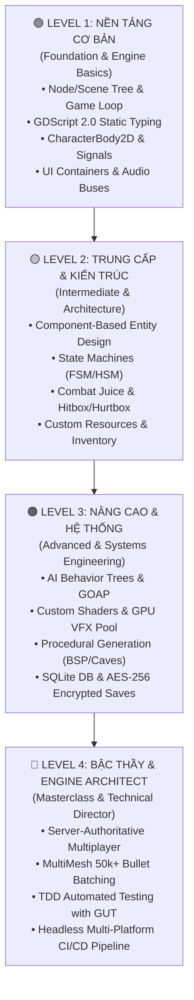

# 🎓 Giáo Trình Đào Tạo Godot 4: Từ Cơ Bản Đến Nâng Cao & Master

  <b>Lộ trình đào tạo lập trình game chuyên nghiệp và bài bản nhất dành cho Godot Engine 4.3+</b> 
  <i>Được biên soạn bởi Senior Godot Engine Architects & Prompt Engineers. Kết hợp lý thuyết kiến trúc chuẩn Studio, bài tập thực chiến, dự án tốt nghiệp từng cấp độ và ánh xạ trực tiếp vào 25 Mega Skills của hệ sinh thái <code>godot-skills</code>.</i>

🌐 **Ngôn ngữ:** **Tiếng Việt** • [English](ROADMAP_CURRICULUM.md)

---

## 🗺️ Tổng Quan Lộ Trình 4 Cấp Độ (Roadmap Matrix)

| Cấp độ | Tên Giai Đoạn | Thời Lượng | Trọng Tâm Kiến Thức | Dự Án Tốt Nghiệp Cấp Độ | Skills Ánh Xạ |
| :--- | :--- | :--- | :--- | :--- | :--- |
| **🟢 Level 1** | **Nền Tảng Cơ Bản** | 2 - 3 tuần | Node Tree, GDScript 2.0 Typed, CharacterBody2D, Signals, UI Layout | 🎮 *2D Pixel Coin Runner* | `godot-typed-gdscript-mastery` `godot-event-bus-signals` `godot-ui-ux-design-system` |
| **🟡 Level 2** | **Trung Cấp & Thực Chiến** | 4 - 6 tuần | Component Architecture, HSM, Hitbox/Hurtbox, Custom Resources, Inventory, NavServer | ⚔️ *2D Top-Down ARPG Slayer* | `godot-architecture-foundation` `godot-character-controllers` `godot-state-machine-hsm` `godot-combat-hitbox-hurtbox` `godot-inventory-item-system` `godot-navigation-server` `godot-hud-minimap-camera` |
| **🟠 Level 3** | **Nâng Cao & Hệ Thống** | 6 - 8 tuần | Behavior Trees, GOAP, Shaders, GPU Particles, Procedural Maps, 3D Kinematic, SQLite, AES-256 | 🧠 *Procedural Roguelike Survival* | `godot-ai-behavior-trees` `godot-utility-ai-goap` `godot-shader-development` `godot-vfx-particles` `godot-procedural-generation` `godot-save-persistence-security` `godot-sqlite-local-db` `godot-input-gamepad-remapping` |
| **🔴 Level 4** | **Master & Technical Director** | 8 - 12 tuần | Server-Authoritative Netcode, Prediction, MultiMesh 50k Batching, Server Bypasses, GUT TDD, CI/CD | 🌐 *Online Arena MMO / Bullet Hell* | `godot-multiplayer-high-level` `godot-performance-profiling` `godot-testing-gut-tdd` `godot-ci-cd-export-automation` |

---

## 🟢 LEVEL 1: NỀN TẢNG CƠ BẢN (FOUNDATION & BASICS)

> **Mục tiêu**: Nắm vững tư duy gốc của Godot 4.3+, xóa bỏ thói quen code động không kiểu dữ liệu, thành thạo vòng đời game loop và xây dựng game 2D hoàn chỉnh đầu tiên.

### 📚 Danh mục bài học chi tiết:

#### 1.1 Tư duy Node, Scene Tree & Vòng đời Engine
- Cây phân cấp Node (Parent - Child relationship) và tư duy "Mọi thứ đều là Scene".
- Thứ tự thực thi vòng đời: `_init()` ➡️ `_enter_tree()` ➡️ `_ready()` ➡️ `_process(delta)` / `_physics_process(delta)` ➡️ `_exit_tree()`.
- Sự khác biệt cốt tử giữa `_process` (render frame-dependent) và `_physics_process` (fixed 60 Hz physics tick).

#### 1.2 GDScript 2.0 Static Typing Toàn Diện
- Khai báo biến chuẩn: `var speed: float = 300.0`, `var score: int = 0`, `var is_alive: bool = true`.
- Kiểu suy luận an toàn: `var dir := Vector2.ZERO`.
- Kiểu dữ liệu nâng cao: `StringName` (ký hiệu `&"jump"` tối ưu bộ nhớ), `Array[int]`, `Dictionary[StringName, float]`.
- Chú thích Annotations bắt buộc: `@onready`, `@export`, `@export_range(0, 100, 1)`, `@export_group()`, `@tool`.
- Hàm có kiểu trả về bắt buộc: `func take_damage(amount: float) -> bool:`.

#### 1.3 Vật lý 2D & CharacterBody2D Movement
- Khối vật lý: `StaticBody2D` (địa hình tĩnh), `AnimatableBody2D` (thang máy/nền di chuyển), `Area2D` (vùng kích hoạt cảm biến), `CharacterBody2D` (nhân vật điều khiển).
- Di chuyển với `velocity` và hàm `move_and_slide()` trong Godot 4 (không truyền tham số).
- Phân biệt tọa độ toàn cục `global_position` vs tọa độ cục bộ `position`.

#### 1.4 Hệ Thống Tín Hiệu (Signals) & Giao Tiếp Độc Lập
- Định nghĩa typed signal: `signal health_changed(current: float, max_val: float)`.
- Kết nối signal bằng code chuẩn GDScript 2.0: `health_changed.connect(_on_health_changed)`.
- Tránh bẫy kết nối chuỗi cũ: ❌ `connect("health_changed", self, "_on_health_changed")`.
- Khái niệm One-Shot Signals: `signal_name.connect(callback, CONNECT_ONE_SHOT)`.

#### 1.5 Giao Diện UI Cơ Bản (Control Nodes & Anchors)
- Các Container tự co giãn: `VBoxContainer`, `HBoxContainer`, `GridContainer`, `MarginContainer`.
- Cơ chế neo màn hình (Anchors & Size Flags: Fill, Expand, Shrink Center).
- Tạo thanh máu `ProgressBar` và nhãn hiển thị điểm `Label` tự co giãn trên nhiều kích thước màn hình.

#### 1.6 Hệ Thống Âm Thanh (Audio Buses)
- Thiết lập Audio Bus Layout: `Master`, `Music`, `SFX`.
- Phát âm thanh hiệu ứng bằng `AudioStreamPlayer2D` và nhạc nền vòng lặp `AudioStreamPlayer`.

---

### 🎮 Dự án tốt nghiệp Level 1: "2D Pixel Coin Runner"
- **Yêu cầu kỹ thuật**:
  1. Điều khiển nhân vật chạy, nhảy mượt mà có trọng lực gia tốc.
  2. Thu thập các đồng xu `Area2D` có âm thanh và hiệu ứng biến mất.
  3. Thanh máu UI và điểm số cập nhật thông qua tín hiệu Typed Signal.
  4. 100% code viết bằng GDScript 2.0 Static Typing, không có bất kỳ warning nào khi chạy Doctor.
- **Skills sử dụng**: [`godot-typed-gdscript-mastery`](skills/godot-typed-gdscript-mastery/SKILL.md), [`godot-event-bus-signals`](skills/godot-event-bus-signals/SKILL.md), [`godot-ui-ux-design-system`](skills/godot-ui-ux-design-system/SKILL.md).

---

## 🟡 LEVEL 2: TRUNG CẤP & KIẾN TRÚC THỰC CHIẾN (INTERMEDIATE & ARCHITECTURE)

> **Mục tiêu**: Xóa bỏ hoàn toàn code spaghetti, tách biệt tính năng theo mô hình Component (LEGO), làm chủ máy trạng thái State Machine, xây dựng hệ thống combat chuẩn mực và quản lý dữ liệu bằng Custom Resources.

### 📚 Danh mục bài học chi tiết:

#### 2.1 Kiến Trúc Component-Based Entity Design & Clean Architecture
- Tại sao không nên kế thừa sâu (`Player -> Fighter -> Hero`) mà nên dùng Component (`Player has HealthComponent, HitboxComponent, MovementComponent`).
- Cấu trúc thư mục Feature-First: `src/core/`, `src/components/`, `src/features/player/`, `src/features/enemies/`.
- Sử dụng `ServiceLocator` để truy cập dịch vụ toàn cục mà không tạo phụ thuộc vòng (cyclic dependency).

#### 2.2 Finite State Machine (FSM) & Hierarchical State Machine (HSM)
- Xây dựng lớp cơ sở `State.gd` (`enter()`, `exit()`, `physics_update(delta)`, `handle_input(event)`).
- Xây dựng lớp quản lý `StateMachine.gd` quản lý chuyển đổi trạng thái an toàn có kiểu dữ liệu.
- Phân cấp trạng thái: `Grounded` (Idle, Run) vs `InAir` (Jump, Fall, WallSlide).
- Lịch sử trạng thái (Pushdown Stack) để quay lại trạng thái trước đó (ví dụ: bị choáng Stun rồi quay lại Attack).

#### 2.3 Hệ Thống Combat Frame-Perfect (Hitbox & Hurtbox)
- Thiết lập ma trận Collision Layers & Masks (Layer 1: World, Layer 2: Player, Layer 3: Enemy, Layer 4: PlayerHitbox, Layer 5: EnemyHitbox, Layer 6: Hurtboxes).
- Đóng gói dữ liệu sát thương bằng DTO Object: `DamagePayload` (Sát thương, Knockback Vector, Loại nguyên tố, Tỷ lệ chí mạng, Nguồn gây damage).
- Cơ chế bất tử tạm thời (i-frames: Invulnerability frames) với Timer và hiệu ứng nhấp nháy.

#### 2.4 Game Feel, Juice & Dynamic Camera
- Hiệu ứng dừng hình va chạm (**Hitstop / Freeze-frame**) bằng `Engine.time_scale` hoặc cục bộ `get_tree().paused`.
- Rung chấn màn hình đa hướng (**Perlin Noise Screen Shake**) với biến năng lượng `trauma` suy giảm theo thời gian.
- Camera 2D thông minh (**Phantom Camera style**): Vùng chết (Deadzone), Bám mục tiêu mượt mà (Smoothing & Damping), Dự đoán hướng di chuyển (Lookahead).

#### 2.5 Lập Trình Hướng Dữ Liệu Với Custom Resources (`.tres`)
- Thay thế file JSON thủ công bằng `class_name ItemData extends Resource`.
- Khai báo thuộc tính cân bằng game có thể chỉnh sửa trực tiếp trong Godot Inspector.
- Tải và nạp dữ liệu tức thì với tốc độ nhị phân tối ưu.

#### 2.6 Hệ Thống Túi Đồ (Inventory) & Bảng Tỷ Lệ Rơi Đồ (Loot Tables)
- Xây dựng `InventorySlot` và `InventoryComponent` có cơ chế tự gộp (Auto-stacking) và chia stack.
- Thuật toán tạo bảng rơi đồ ngẫu nhiên có trọng số (Weighted Probability Loot Tables).

#### 2.7 Điều Hướng AI 2D (NavigationServer2D & RVO2 Avoidance)
- Bản đồ dẫn đường NavigationPolygon và NavigationRegion2D.
- Sử dụng `NavigationAgent2D` để tìm đường vòng qua chướng ngại vật.
- Tránh va chạm động RVO2 giữa các quái vật bằng tín hiệu `velocity_computed`.

#### 2.8 Hệ Thống Hội Thoại Phân Nhánh & Quản Lý Nhiệm Vụ (Quests)
- Tích hợp cây hội thoại phân nhánh, avatar nhân vật và tốc độ gõ chữ Typewriter.
- Máy trạng thái nhiệm vụ (Quest State Machine: `NOT_STARTED`, `ACTIVE`, `COMPLETED`, `FAILED`) lắng nghe sự kiện từ Event Bus.

---

### 🎮 Dự án tốt nghiệp Level 2: "2D Top-Down ARPG Dungeon Slayer"
- **Yêu cầu kỹ thuật**:
  1. Nhân vật có State Machine 5 trạng thái (Idle, Run, AttackCombo, RollDodge, Hurt).
  2. Hệ thống đòn đánh kiếm có Hitbox gây sát thương qua DamagePayload, kích hoạt Hitstop và Screen Shake.
  3. Quái vật AI tìm đường bằng NavigationAgent2D có né tránh đồng loại RVO2.
  4. Quái chết rơi vật phẩm ngẫu nhiên từ LootTable nhặt vào Inventory có UI quản lý slot.
  5. Camera bám theo mượt mà và hiển thị số sát thương bay (Floating Numbers).
- **Skills sử dụng**: [`godot-architecture-foundation`](skills/godot-architecture-foundation/SKILL.md), [`godot-combat-hitbox-hurtbox`](skills/godot-combat-hitbox-hurtbox/SKILL.md), [`godot-state-machine-hsm`](skills/godot-state-machine-hsm/SKILL.md), [`godot-inventory-item-system`](skills/godot-inventory-item-system/SKILL.md), [`godot-navigation-server`](skills/godot-navigation-server/SKILL.md), [`godot-hud-minimap-camera`](skills/godot-hud-minimap-camera/SKILL.md).

---

## 🟠 LEVEL 3: NÂNG CAO & KỸ THUẬT HỆ THỐNG (ADVANCED & SYSTEMS)

> **Mục tiêu**: Xây dựng các hệ thống game phức tạp chuẩn AA/Indie thương mại: AI thông minh tự lập kế hoạch (GOAP / BT), đồ họa Shaders & VFX tùy biến, sinh map ngẫu nhiên (PCG), bảo mật file save và cơ sở dữ liệu SQLite.

### 📚 Danh mục bài học chi tiết:

#### 3.1 Trí Tuệ Nhân Tạo Behavior Trees & Giác Quan (Perception)
- Cấu trúc cây hành vi: Composites (`BTSequence`, `BTSelector`), Decorators (`BTInverter`, `BTCooldown`, `BTRepeater`), Action Leaves.
- Bộ nhớ chia sẻ `Blackboard` truyền dữ liệu giữa các node AI bất đồng bộ (`RUNNING`, `SUCCESS`, `FAILURE`).
- Hệ thống giác quan `PerceptionComponent2D`: Nón tầm nhìn (Vision Cone với RayCast), Bán kính thính giác và Đồng hồ cảnh giác (Alert Meter).

#### 3.2 AI Lập Kế Hoạch Đa Mục Tiêu (GOAP & Utility AI)
- Goal-Oriented Action Planning: Tìm kiếm đường đi hành động tối ưu bằng thuật toán A* trên đồ thị trạng thái thế giới (World State Preconditions & Effects).
- Đường cong tiện ích (Utility Curves - Logistic / Sigmoid Equations) giúp NPC tự cân nhắc giữa các nhu cầu (Máu yếu ➡️ Tìm bình thuốc; Địch đông ➡️ Rút lui; Thấy vàng ➡️ Nhặt).

#### 3.3 Lập Trình Shaders 2D/3D (`.gdshader`)
- Không gian tọa độ Shader: `VERTEX`, `FRAGMENT`, `LIGHT` passes.
- Viết Shader 2D: Viền pixel hoàn hảo (Pixel Outline), Cháy tan biến (Noise Dissolve Burn với glow mép).
- Viết Shader 3D: Nước Stylized với bọt sóng và đo độ sâu Scene Depth, Chiếu sáng Toon/Cel-Shading theo từng nấc sáng.
- Hậu kỳ Post-Processing (Vignette, Chromatic Aberration, Scanlines).

#### 3.4 Hệ Thống Hạt GPU & Tối Ưu Bộ Nhớ VFX Pool
- GPUParticles2D & GPUParticles3D với `ParticleProcessMaterial`.
- Sub-emitters: Bắn tia nổ thứ cấp khi hạt va chạm hoặc hết hạn (Collision/Death bursts).
- Thiết kế `ImpactVFXPool`: Tái sử dụng node hiệu ứng, triệt tiêu phân mảnh bộ nhớ và hiện tượng khựng giật (GC micro-stutters).

#### 3.5 Sinh Bản Đồ Thủ Tục (Procedural Content Generation - PCG)
- Thuật toán chia không gian nhị phân (**Binary Space Partitioning - BSP**) tạo ngục tối (Phòng ốc và Hành lang kết nối).
- Thuật toán tế bào tự động (**Cellular Automata 4-5 Rule**) sinh mạng lưới hang động hữu cơ.
- Thuật toán **FastNoiseLite** sinh địa hình nhiều tầng độ cao (Biomes: Nước, Cát, Rừng, Tuyết).
- Thuật toán **Flood-Fill** kiểm tra tính liên thông đảm bảo người chơi luôn có đường phá đảo.

#### 3.6 Bộ Điều Khiển 3D Kinematic FPS / TPS
- Ráp Camera Rig 3D với `SpringArm3D` chống xuyên tường và làm mịn xoay chuột.
- Xử lý trượt dốc (Slope Sliding), leo bậc thang (Step-up Stair Handling) không bị rung camera.
- Cơ chế chạy nhanh (Sprint), ngồi (Crouch), nhảy và lướt trên không (Air Dash).

#### 3.7 Lưu Game Đa Slot Mã Hóa & Chống Hỏng File (AES-256)
- Mã hóa toàn bộ dữ liệu người chơi bằng thuật toán **AES-256** qua `FileAccess.open_encrypted_with_pass`.
- Kiểm tra tính toàn vẹn bằng mã băm **SHA-256 Checksum** chống người chơi chỉnh sửa file save hex.
- Cơ chế ghi nguyên tử (**Atomic Write Swap**): Ghi ra file `.tmp` trước khi đổi tên đè lên file chính thức để chống hỏng file save khi game bị crash/sập nguồn.

#### 3.8 Cơ Sở Dữ Liệu SQLite Cục Bộ & Migration
- Tích hợp SQLite trong Godot qua GDExtension (`godot-sqlite`).
- Quản lý phiên bản bảng dữ liệu bằng hệ thống Migration tự động (`UP` / `DOWN` SQL scripts).
- Thực thi truy vấn tham số hóa (Parameterized Queries) và xử lý giao dịch hàng loạt (ACID Batch Transactions) không block main loop.

#### 3.9 Đổi Phím Động & Bộ Đệm Phím (Input Rebinding & Buffering)
- Thay đổi phím bấm động trong Runtime trên cả Bàn phím, Chuột và Tay cầm (Gamepad).
- Lưu trữ thiết lập điều khiển ra `user://input_bindings.cfg`.
- Xây dựng `InputBufferComponent`: Lưu tạm lệnh đánh trước khi animation kết thúc giúp combat nhạy bén, loại bỏ cảm giác "nuốt nút".

---

### 🎮 Dự án tốt nghiệp Level 3: "Procedural Roguelike Survival 2D/3D"
- **Yêu cầu kỹ thuật**:
  1. Bản đồ hầm ngục sinh ngẫu nhiên 100% bằng thuật toán BSP hoặc Cellular Automata có kiểm tra tính liên thông Flood-Fill.
  2. Kẻ địch có giác quan nón tầm nhìn, ra quyết định thông minh bằng Behavior Tree và chia sẻ vị trí qua Blackboard.
  3. Đồ họa có Shader Dissolve khi tiêu diệt quái và Shader Stylized Water trong môi trường.
  4. Hệ thống lưu game AutoSave / Multi-Slot mã hóa AES-256 và chống hỏng file.
  5. Menu cài đặt cho phép đổi nút điều khiển phím/gamepad mượt mà.
- **Skills sử dụng**: [`godot-ai-behavior-trees`](skills/godot-ai-behavior-trees/SKILL.md), [`godot-shader-development`](skills/godot-shader-development/SKILL.md), [`godot-vfx-particles`](skills/godot-vfx-particles/SKILL.md), [`godot-procedural-generation`](skills/godot-procedural-generation/SKILL.md), [`godot-save-persistence-security`](skills/godot-save-persistence-security/SKILL.md), [`godot-sqlite-local-db`](skills/godot-sqlite-local-db/SKILL.md), [`godot-input-gamepad-remapping`](skills/godot-input-gamepad-remapping/SKILL.md).

---

## 🔴 LEVEL 4: BẬC THẦY & ENGINE ARCHITECT (MASTER / TECHNICAL DIRECTOR)

> **Mục tiêu**: Đạt cảnh giới của một Giám đốc Kỹ thuật (Technical Director / Senior Architect). Làm chủ mạng Multiplayer thời gian thực có chống lag, tối ưu hiệu năng hàng chục ngàn thực thể ở 60 FPS, viết Unit Test TDD và xây dựng hệ thống CI/CD xuất bản game tự động.

### 📚 Danh mục bài học chi tiết:

#### 4.1 Lập Trình Mạng Server-Authoritative Cao Cấp
- Mô hình Server-Authoritative: Máy chủ là trọng tài tối cao, Client chỉ gửi Input, Server trả về State (Chống hack 100%).
- `ENetMultiplayerPeer` (Desktop/Mobile UDP tốc độ cao) và `WebSocketPeer` (Trình duyệt Web HTML5).
- Khai báo RPC hiện đại với `@rpc("authority", "call_remote", "reliable/unreliable")`.
- Đồng bộ hóa động với `MultiplayerSpawner` (Spawn đạn/quái) và `MultiplayerSynchronizer` (Đồng bộ vị trí nén delta).

#### 4.2 Chống Lag Mạng: Prediction, Reconciliation & Rollback
- Dự đoán phía Client (**Client-Side Prediction**): Nhân vật của người chơi di chuyển tức thì không chờ phản hồi từ server.
- Hòa giải máy chủ (**Server Reconciliation**): Tự động nắn chỉnh lại vị trí khi có sai lệch giữa Client và Server mà không gây giật hình.
- Nội suy trạng thái (**Snapshot Interpolation**) làm mượt chuyển động của đối thủ.
- Rollback Netcode với Netfox và Rapier Physics cho game đối kháng/hành động chính xác tuyệt đối.

#### 4.3 Tối Ưu Hóa Draw Calls Hàng Loạt (MultiMesh 50k+ Entities)
- Sự khác biệt giữa 10.000 Node riêng lẻ (Drop FPS xuống 5) vs 1 Node `MultiMeshInstance2D/3D` (1 Draw Call duy nhất, chạy mượt mà 60 FPS).
- Quản lý 50.000 viên đạn Bullet-Hell hoặc rừng cây cỏ bằng Transform Direct Array Buffer.
- Đo lường Profiler: Draw Calls, VRAM, Render Time, Frame Time và Object Count.

#### 4.4 Bỏ Qua Hệ Thống Node: Trực Tiếp Can Thiệp Low-Level Engine Servers
- Bỏ qua cây Node để vẽ trực tiếp bằng `RenderingServer.canvas_item_create()` và `RenderingServer.canvas_item_add_circle()`.
- Tương tác trực tiếp với `PhysicsServer2D` / `PhysicsServer3D` để raycast hàng ngàn tia cùng lúc với chi phí CPU gần như bằng 0.

#### 4.5 Đa Luồng Bất Đồng Bộ & Tải Màn Chơi Chạy Ngầm
- Tải Scene dung lượng lớn không làm đơ game bằng `ResourceLoader.load_threaded_request()` và `ResourceLoader.load_threaded_get_status()`.
- Quản lý đa luồng an toàn bằng `Thread`, bảo vệ dữ liệu không bị xung đột bộ nhớ bằng `Mutex` và `Semaphore`.

#### 4.6 Phát Triển Theo Hướng Kiểm Thử (TDD) Với GUT Framework
- Viết Unit Tests & Integration Tests tự động trước khi viết code logic game.
- Bắt và kiểm tra tín hiệu với `watch_signals(node)` và `assert_signal_emitted(node, "died")`.
- Kiểm thử bất đồng bộ với `await wait_for_signal(node.health_changed, 2.0)`.
- Chạy toàn bộ test suite headless từ dòng lệnh (CLI Test Runner).

#### 4.7 Tự Động Hóa CI/CD Xuất Bản Đa Nền Tảng (GitHub Actions Matrix)
- Thiết lập kịch bản GitHub Actions tự động kiểm tra code formatting và chạy toàn bộ GUT tests mỗi khi `git push`.
- Xuất bản tự động (Headless Export) cùng lúc các bản build:
  - 🪟 Windows Desktop (`.exe`)
  - 🐧 Linux (`.x86_64`)
  - 🍎 macOS (`.zip`)
  - 🌐 Web HTML5 / WASM
  - 📱 Android APK
- Tự động đẩy bản build mới nhất lên kênh phát hành của **itch.io** bằng **Butler CLI** và tạo GitHub Releases.

#### 4.8 Mở Rộng Native Bằng GDExtension (C++ / Rust)
- Kiến trúc GDExtension trong Godot 4: Tự viết thư viện C++ biên dịch thành dynamic library (`.dll`, `.so`) nạp vào engine mà không cần biên dịch lại Godot.
- Tối ưu hóa các thuật toán xử lý nặng (Pathfinding quy mô lớn, nén nén bản đồ, thuật toán mã hóa tùy chỉnh).

---

### 🎮 Dự án tốt nghiệp Level 4: "Production-Ready Online Co-op Arena MMO"
- **Yêu cầu kỹ thuật**:
  1. Chơi mạng trực tuyến Server-Authoritative hoàn chỉnh có Client-Side Prediction và Server Reconciliation.
  2. Màn chơi có cơ chế đạn bão (Bullet Hell) với hơn 30.000 viên đạn chạy đồng thời trên `MultiMeshInstance2D` giữ vững 60 FPS.
  3. Toàn bộ logic core có bộ Unit Tests TDD viết bằng GUT vượt qua 100% assertions.
  4. Mỗi khi push code lên GitHub, pipeline CI/CD tự động chạy test, build ra file chạy Windows/Web và deploy trực tiếp lên itch.io.
- **Skills sử dụng**: [`godot-multiplayer-high-level`](skills/godot-multiplayer-high-level/SKILL.md), [`godot-performance-profiling`](skills/godot-performance-profiling/SKILL.md), [`godot-testing-gut-tdd`](skills/godot-testing-gut-tdd/SKILL.md), [`godot-ci-cd-export-automation`](skills/godot-ci-cd-export-automation/SKILL.md).

---

## 🎯 Bảng Ánh Xạ Học Tập Với 25 Mega Skills

| Cấp Độ Bạn Đang Học | Các Mega Skills Cần Kích Hoạt Trong Prompt AI |
| :--- | :--- |
| **🟢 Level 1** | `godot-typed-gdscript-mastery`, `godot-event-bus-signals`, `godot-ui-ux-design-system` |
| **🟡 Level 2** | `godot-architecture-foundation`, `godot-character-controllers`, `godot-state-machine-hsm`, `godot-combat-hitbox-hurtbox`, `godot-inventory-item-system`, `godot-navigation-server`, `godot-hud-minimap-camera`, `godot-dialogue-quest-engine`, `godot-audio-engine` |
| **🟠 Level 3** | `godot-ai-behavior-trees`, `godot-utility-ai-goap`, `godot-shader-development`, `godot-vfx-particles`, `godot-procedural-generation`, `godot-save-persistence-security`, `godot-sqlite-local-db`, `godot-input-gamepad-remapping`, `godot-resource-data-tables` |
| **🔴 Level 4** | `godot-multiplayer-high-level`, `godot-performance-profiling`, `godot-testing-gut-tdd`, `godot-ci-cd-export-automation` |

---

## 🚀 Lời Khuyên Dành Cho Lập Trình Viên

1. **Đừng học vẹt cú pháp**: Hãy tập trung hiểu **tại sao** kiến trúc được thiết kế như vậy (tại sao dùng Component thay vì kế thừa, tại sao dùng Event Bus thay vì gọi trực tiếp `get_parent()`).
2. **Làm dự án thực chiến**: Sau mỗi module, hãy tự tay code dự án mini tốt nghiệp của cấp độ đó.
3. **Tận dụng tối đa AI Trợ lý**: Khi gặp bài toán hóc búa, hãy gõ prompt chuẩn kèm tên skill trong danh mục trên để AI giải thích và minh họa code chuẩn mực cho bạn!
