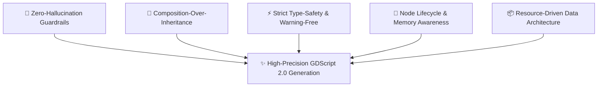
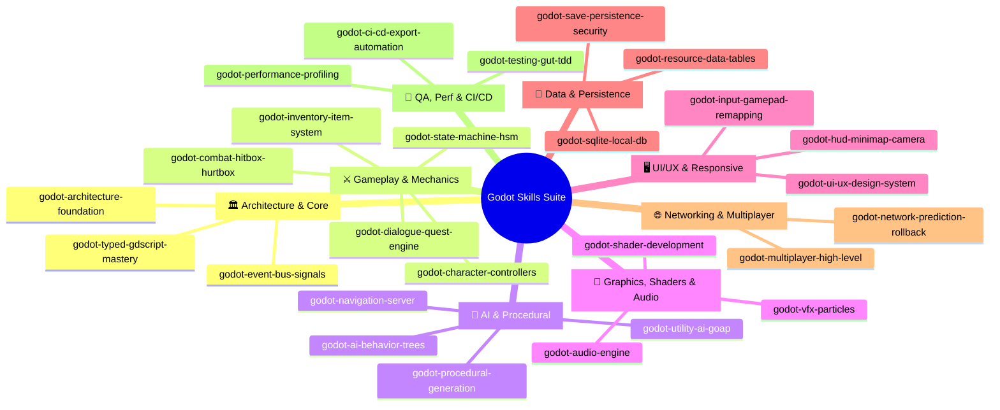
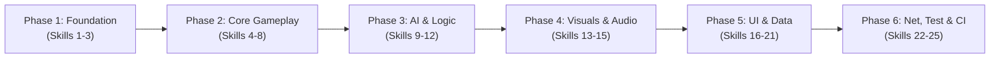

# 🎮 GODOT SKILLS ECOSYSTEM: MASTER PLAN & ARCHITECTURE BLUEPRINT

> **Mục tiêu**: Xây dựng hệ thống Agent Skills chuyên sâu, chuẩn mực và đồ sộ bậc nhất cho Godot Engine (Godot 4.x+), phục vụ quy trình phát triển game end-to-end từ Prototype đến Production. Được biên soạn theo tiêu chuẩn của **Senior Prompt Developer** kết hợp với **Senior Godot Engine Architect**.

---

## 🏛️ 1. TRIẾT LÝ THIẾT KẾ (DESIGN PHILOSOPHY & PROMPT STANDARDS)

Để các bộ Skills đạt chuẩn **Senior Prompt Developer**, mọi kỹ năng phải đáp ứng 5 nguyên tắc bất biến:



### 1.1. Zero-Hallucination Guardrails (Loại bỏ triệt để xung đột Godot 3 vs Godot 4)
*   **Bắt buộc GDScript 2.0**: Tuyệt đối không sinh cú pháp lỗi thời (`yield` ➔ `await`, `export var` ➔ `@export`, `connect("signal", self, "func")` ➔ `signal.connect(_on_func)`, `KinematicBody2D/3D` ➔ `CharacterBody2D/3D`).
*   **Static Typing Tuyệt Đối**: 100% biến, tham số hàm, kiểu trả về phải có type annotation (`func take_damage(amount: float) -> void:`).
*   **Safe Node Access**: Ưu tiên `@onready @export var target: Node` hoặc `%UniqueName`, cấm dùng string path cứng (`$Path/To/Node`) không qua kiểm tra null.

### 1.2. Senior Skill Anatomy (Cấu trúc giải phẫu 1 file `SKILL.md`)
Mỗi skill folder chứa một kiến trúc chuẩn hóa:
```text
skills/
└── [skill-name]/
    ├── SKILL.md                   # Core Prompt & Instruction Specification
    ├── references/                # Godot 4.x API references, math formulas, shader algorithms
    ├── templates/                 # Production-ready .gd, .tscn, .tres boilerplates
    └── scripts/                   # Python/Shell helper scripts (linter, generator, validator)
```

---

## 🗺️ 2. MA TRẬN 8 PHÂN HỆ SKILLS (TAXONOMY & COVERAGE)

Hệ sinh thái bao gồm **8 Phân hệ - 24+ Mega Skills** bao phủ trọn vẹn toàn bộ chu trình phát triển game:



---

## 📋 3. CHI TIẾT DANH MỤC 24 MEGA SKILLS

### Phân hệ 1: Architecture & Core Foundations (Kiến trúc lõi)
1.  **`godot-architecture-foundation`**
    *   *Nhiệm vụ*: Kiến trúc Clean Architecture / Feature-First trong Godot, Composition vs Inheritance, Service Locator / Dependency Injection, Quản lý AutoLoad (Singleton) đúng chuẩn.
    *   *Anti-pattern*: Tránh lạm dụng Singletons gây rò rỉ bộ nhớ và tightly-coupled code.
2.  **`godot-typed-gdscript-mastery`**
    *   *Nhiệm vụ*: Hướng dẫn viết GDScript 2.0 chuẩn chỉ, Static Analysis, `@warning_ignore`, custom `@tool` scripts chạy mượt mà trong editor, Custom Resources.
3.  **`godot-event-bus-signals`**
    *   *Nhiệm vụ*: Thiết lập hệ thống Event Bus phân tán, Signal Bus định kiểu tĩnh (Typed Signal Bus), Loose Coupling giữa các hệ thống UI, Gameplay, Audio.

---

### Phân hệ 2: Gameplay Mechanics & Combat (Cơ chế Gameplay & Combat)
4.  **`godot-character-controllers`**
    *   *Nhiệm vụ*: 2D Platformer physics (Coyote time, Jump buffering, Wall jump, Slopes), 3D Kinematic/RigidBody Controllers (FPS, TPS, Top-Down, Sprint, Crouch, SpringArm3D Camera Rig).
5.  **`godot-state-machine-hsm`**
    *   *Nhiệm vụ*: Hierarchical State Machine (HSM) định kiểu chặt chẽ, State transitions, Pushdown Automata, Visual Debugging overlay trong gameplay.
6.  **`godot-combat-hitbox-hurtbox`**
    *   *Nhiệm vụ*: Hệ thống Hitbox/Hurtbox chuẩn fighting/action game, Frame-perfect collision, Damage Calculator, Hitstop (freeze frames), Screen Shake, Knockback vectors, Combo counters.
7.  **`godot-inventory-item-system`**
    *   *Nhiệm vụ*: Hệ thống Inventory dạng Grid (Resident Evil / Diablo), Slot-based, Weight-based, Equipment slots, Dynamic Loot Tables từ Resource/JSON.
8.  **`godot-dialogue-quest-engine`**
    *   *Nhiệm vụ*: Hệ thống hội thoại phân nhánh (Branching Dialogue), tích hợp Dialogue Manager / YarnSpinner, Quest Tracker (cây nhiệm vụ, điều kiện hoàn thành, phần thưởng).

---

### Phân hệ 3: AI & Procedural Generation (Trí tuệ nhân tạo & Tạo map thủ tục)
9.  **`godot-ai-behavior-trees`**
    *   *Nhiệm vụ*: Behavior Tree (Composite, Decorator, Action nodes), Blackboard data sharing, Sensory system (Sight cone, Hearing radius, Alert levels).
10. **`godot-utility-ai-goap`**
    *   *Nhiệm vụ*: Goal-Oriented Action Planning (GOAP) và Utility AI cho NPC có hành vi phức tạp, tính toán đường đi nhu cầu (Needs/Curves).
11. **`godot-procedural-generation`**
    *   *Nhiệm vụ*: Thuật toán tạo Dungeon 2D/3D (Binary Space Partitioning - BSP, Cellular Automata, Wave Function Collapse, Room-and-Corridor), FastNoiseLite terrain generation.
12. **`godot-navigation-server`**
    *   *Nhiệm vụ*: NavigationServer2D/3D nâng cao, Dynamic Obstacle Avoidance (RVO2), Runtime NavMesh baking, Smart Agent Path Smoothing.

---

### Phân hệ 4: Graphics, Shaders & Audio (Đồ họa, Hiệu ứng & Âm thanh)
13. **`godot-shader-development`**
    *   *Nhiệm vụ*: Thư viện Shaders Godot 4 (CanvasItem & Spatial): Dissolve effect, 2D/3D Outlines, Stylized Water/Foam, Toon/Cel Shading, Pixelation, Fullscreen Post-processing.
14. **`godot-vfx-particles`**
    *   *Nhiệm vụ*: GPUParticles2D/3D chuyên nghiệp: Sub-emitters, Particle collisions, Trail systems, Shader-driven particle materials, Impact burst kits.
15. **`godot-audio-engine`**
    *   *Nhiệm vụ*: Audio Buses routing, Dynamic Adaptive Music mixing, Positional 3D Audio, Audio Ducking, Sound Pooling để tối ưu performance.

---

### Phân hệ 5: UI/UX & Responsive Controls (Giao diện & Điều khiển)
16. **`godot-ui-ux-design-system`**
    *   *Nhiệm vụ*: Hệ thống Theme tokens, StyleBoxes, Control Containers (HBox, VBox, Grid, Margin), Responsive Layouts theo đa màn hình (Mobile/PC/Steam Deck), Focus Navigation cho Gamepad.
17. **`godot-hud-minimap-camera`**
    *   *Nhiệm vụ*: Dynamic HUD, Floating Damage Numbers, Minimap 2D/3D bằng `SubViewport`, Dynamic Camera Framing (Phantom Camera style).
18. **`godot-input-gamepad-remapping`**
    *   *Nhiệm vụ*: Input Action System, Runtime Input Remapping (Keyboard, Mouse, Gamepad), Input Buffering, Deadzone calibration.

---

### Phân hệ 6: Data, Persistence & Databases (Dữ liệu & Lưu trữ)
19. **`godot-save-persistence-security`**
    *   *Nhiệm vụ*: Multi-slot Save System, mã hóa AES-256 (ConfigFile / JSON / Binary Resources), Checksum anti-tamper, Save state serialization, Cloud Save ready.
20. **`godot-sqlite-local-db`**
    *   *Nhiệm vụ*: Tích hợp SQLite offline vào Godot cho các game RPG đồ sộ, quản lý Item Database, Quest state, Achievement logs.
21. **`godot-resource-data-tables`**
    *   *Nhiệm vụ*: Quản trị dữ liệu game qua Custom Resources (`.tres`), CSV/JSON importer to Resource, Data-driven game balance.

---

### Phân hệ 7: Networking & Multiplayer (Mạng & Nhiều người chơi)
22. **`godot-multiplayer-high-level`**
    *   *Nhiệm vụ*: High-Level Multiplayer API (`MultiplayerSynchronizer`, `MultiplayerSpawner`, `@rpc`), Server-Authoritative architecture, Client-Side Prediction, Server Reconciliation, Matchmaking Lobbies.

---

### Phân hệ 8: Testing, Performance & CI/CD (Kiểm thử, Tối ưu & Tự động hóa)
23. **`godot-testing-gut-tdd`**
    *   *Nhiệm vụ*: TDD (Test-Driven Development) với GUT (Godot Unit Test), Scene Testing, Mocking, Headless CLI test execution.
24. **`godot-performance-profiling`**
    *   *Nhiệm vụ*: Godot Profiler & Monitors, Giảm Draw Calls bằng `MultiMeshInstance2D/3D`, Tối ưu Physics/Rendering Servers, Threaded Resource Loading (`load_threaded_request`).
25. **`godot-ci-cd-export-automation`**
    *   *Nhiệm vụ*: GitHub Actions CI/CD xuất bản tự động đa nền tảng (Windows, Linux, macOS, Android APK, Web HTML5/WASM), tự động đẩy lên Itch.io (Butler) & Steam.

---

## 🛠️ 4. BẢNG MẪU CHUẨN HÓA MỘT SKILL (SKILL BLUEPRINT SPECIFICATION)

Mỗi file `SKILL.md` sẽ tuân theo cấu trúc mẫu tiêu chuẩn sau:

```yaml
---
name: [tên-skill-kebab-case]
description: |
  [Mô tả mục đích cốt lõi, giá trị mang lại].
  Use this skill whenever:
    1. [Kịch bản kích hoạt 1]
    2. [Kịch bản kích hoạt 2]
    3. [Kịch bản kích hoạt 3]
  Do NOT use when:
    1. [Trường hợp không dùng]
license: MIT
metadata:
  version: v1.0
  engine_target: "Godot 4.3+"
  author: "Senior Godot AI Architect"
---
```

### Các Section Bắt Buộc trong Mỗi `SKILL.md`:
1.  **⚡ Core Architectural Principles**: Các nguyên lý nền tảng, sơ đồ kiến trúc Mermaid.
2.  **🚫 Anti-Patterns & Common Pitfalls**: Danh sách bẫy lỗi hay gặp (so sánh sai vs đúng).
3.  **💎 Production-Ready Implementations**: Các đoạn mã GDScript 2.0 hoàn chỉnh, chú thích chi tiết, static typing 100%.
4.  **🧩 Composition & Integration Guide**: Cách gắn kết hệ thống vào Scene Tree của Godot.
5.  **🧪 Verification & Testing Checklist**: Các bước kiểm thử logic và hiệu năng.

---

## 🚀 5. LỘ TRÌNH TRIỂN KHAI THEO PHASES (ROADMAP)



| Giai đoạn | Mục tiêu chính | Danh sách Skills | Kết quả đầu ra |
| :--- | :--- | :--- | :--- |
| **Phase 1: Foundation** | Xây dựng bộ khung chuẩn mực và quy ước mã nguồn | `godot-architecture-foundation`<br>`godot-typed-gdscript-mastery`<br>`godot-event-bus-signals` | Bộ khung tiêu chuẩn, linter/type rules, Event Bus template |
| **Phase 2: Gameplay Core** | Bộ kit gameplay cốt lõi (Physics, State, Combat, Inventory, Dialogue) | `godot-character-controllers`<br>`godot-state-machine-hsm`<br>`godot-combat-hitbox-hurtbox`<br>`godot-inventory-item-system`<br>`godot-dialogue-quest-engine` | Có thể dựng ngay 1 game Action/RPG/Platformer hoàn chỉnh |
| **Phase 3: AI & Procedural** | Trí tuệ nhân tạo NPC và thuật toán sinh bản đồ | `godot-ai-behavior-trees`<br>`godot-utility-ai-goap`<br>`godot-procedural-generation`<br>`godot-navigation-server` | Hệ thống AI thông minh và generator map tự động |
| **Phase 4: Graphics & Audio** | Hiệu ứng hình ảnh, Shaders, Hạt và Âm thanh | `godot-shader-development`<br>`godot-vfx-particles`<br>`godot-audio-engine` | Thư viện Shader, Particle kits, Audio manager chuyên nghiệp |
| **Phase 5: UI & Persistence** | Giao diện chuẩn đa nền tảng và hệ thống Save/Data | `godot-ui-ux-design-system`<br>`godot-hud-minimap-camera`<br>`godot-input-gamepad-remapping`<br>`godot-save-persistence-security`<br>`godot-sqlite-local-db`<br>`godot-resource-data-tables` | UI Kit đa độ phân giải, Save game mã hóa AES, SQLite DB |
| **Phase 6: Net, Test & CI/CD** | Multiplayer, TDD kiểm thử tự động và xuất bản game | `godot-multiplayer-high-level`<br>`godot-testing-gut-tdd`<br>`godot-performance-profiling`<br>`godot-ci-cd-export-automation` | Hệ thống Network đồng bộ, Test suites GUT, CI/CD Actions |

---

## 💡 6. KẾ HOẠCH BẮT ĐẦU TRIỂN KHAI NGAY
1.  **Khởi tạo cấu trúc thư mục `skills/` trong workspace**.
2.  **Triển khai ngay Phase 1 (Foundation Skills)** để đặt nền móng chuẩn mực cho tất cả các skills tiếp theo.
3.  **Tạo các file mẫu `.gd` và `test_*.gd`** đính kèm trong thư mục `templates/` của từng skill.
