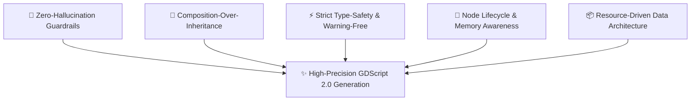
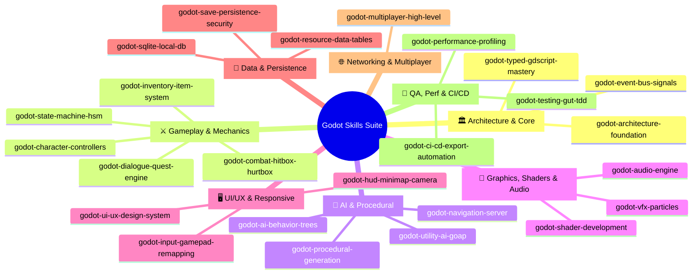
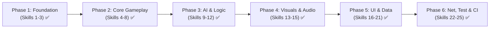

# 🎮 GODOT SKILLS ECOSYSTEM: MASTER PLAN & ARCHITECTURE BLUEPRINT

> **Mission**: Build an industry-grade, comprehensive Agent Skills suite for Godot Engine (Godot 4.x+), supporting the end-to-end game development lifecycle from rapid prototyping to production release. Engineered to the highest standards of a **Senior Prompt Developer** and **Senior Godot Engine Architect**.

---

## 🏛️ 1. DESIGN PHILOSOPHY & PROMPT STANDARDS

To achieve Senior Prompt Developer quality, every skill must adhere to 5 immutable principles:



### 1.1. Zero-Hallucination Guardrails (Eliminate Godot 3 vs Godot 4 Conflicts)
*   **Mandatory GDScript 2.0**: Never generate outdated syntax (`yield` ➔ `await`, `export var` ➔ `@export`, `connect("signal", self, "func")` ➔ `signal.connect(_on_func)`, `KinematicBody2D/3D` ➔ `CharacterBody2D/3D`).
*   **Absolute Static Typing**: 100% of variables, function parameters, and return types must have explicit type annotations (`func take_damage(amount: float) -> void:`).
*   **Safe Node Access**: Favor `@onready @export var target: Node` or `%UniqueName`; avoid unverified hardcoded string paths (`$Path/To/Node`).

### 1.2. Senior Skill Anatomy
Every skill directory contains a standardized layout:
```text
skills/
└── [skill-name]/
    ├── SKILL.md                   # Core Prompt & Instruction Specification
    ├── references/                # Godot 4.x API references, formulas, shader math
    ├── templates/                 # Production-ready .gd, .tscn, .tres boilerplates
    └── scripts/                   # Python/Shell helper scripts (linter, generator, validator)
```

---

## 🗺️ 2. SKILL TAXONOMY MATRIX (8 DOMAINS - 25 MEGA SKILLS)

The ecosystem is structured into **8 Domains with 25 Mega Skills**:



---

## 📋 3. 25 MEGA SKILLS CATALOG DETAILS

### Domain 1: Architecture & Core Foundations
1.  **`godot-architecture-foundation`**: Clean Architecture, Feature-First DDD, Component Composition, Service Locator, AutoLoad governance.
2.  **`godot-typed-gdscript-mastery`**: 100% GDScript 2.0 Static Typing, Custom Resources, `@tool` Gizmos, Warning-free workflows.
3.  **`godot-event-bus-signals`**: Domain-partitioned Typed Event Bus, Async Request-Response Callbacks, Signal safety protocols.

### Domain 2: Gameplay Mechanics & Combat
4.  **`godot-character-controllers`**: 2D Platformer (Coyote time, Jump buffering, Wall jumps) & 3D Kinematic FPS/TPS Controllers.
5.  **`godot-state-machine-hsm`**: Hierarchical State Machines (HSM), Pushdown stack, In-game Visual State Debugger.
6.  **`godot-combat-hitbox-hurtbox`**: Hitbox/Hurtbox layers, `DamagePayload` DTO, Freeze-frame Hitstop, Perlin Screen Shake.
7.  **`godot-inventory-item-system`**: Observable Slots, Auto-stacking, Equipment Manager, Weighted Loot Tables.
8.  **`godot-dialogue-quest-engine`**: Branching Dialogue trees, NPC interactions, Quest graph progression & Event Bus sync.

### Domain 3: AI & Procedural Generation
9.  **`godot-ai-behavior-trees`**: Composites (Selector/Sequence), Blackboard shared memory, Vision Cones & Alert level meters.
10. **`godot-utility-ai-goap`**: Goal-Oriented Action Planning (GOAP) A* solver & Sigmoid Utility response curves.
11. **`godot-procedural-generation`**: Binary Space Partitioning (BSP) Dungeon generator, Cellular Automata caves, FastNoiseLite biomes.
12. **`godot-navigation-server`**: NavigationServer2D/3D, RVO2 Dynamic Obstacle Avoidance loops, Runtime NavMesh Baking.

### Domain 4: Graphics, Shaders & Audio
13. **`godot-shader-development`**: Custom `.gdshader` (Noise Dissolve, 2D Outlines, 3D Toon Cel-shading, Stylized Water).
14. **`godot-vfx-particles`**: GPUParticles2D/3D, Sub-emitters (Collision/Death bursts), Impact VFX Object Pooling.
15. **`godot-audio-engine`**: Audio Buses layout, BGM Tween Crossfader director, Zero-allocation SFX Sound Pool with Ducking.

### Domain 5: UI/UX & Responsive Controls
16. **`godot-ui-ux-design-system`**: Responsive Layouts (Containers/Anchors), Gamepad/Keyboard Focus Navigation, Neobrutalism Widgets.
17. **`godot-hud-minimap-camera`**: Parabolic Floating Damage Numbers, SubViewport Radar Minimap, Smart Multi-Target Dynamic Camera.
18. **`godot-input-gamepad-remapping`**: Runtime `InputMap` Rebinding (Keyboard/Gamepad), `ConfigFile` persistence, Action Input Buffer.

### Domain 6: Data, Persistence & Databases
19. **`godot-save-persistence-security`**: AES-256 Encrypted Saves, SHA-256 Anti-Tamper Checksums & Atomic writing crash safety.
20. **`godot-sqlite-local-db`**: Offline Relational SQLite Database, Versioned SQL Schema Migrations & Transaction Batching.
21. **`godot-resource-data-tables`**: Custom Resource Data Tables, $\mathcal{O}(1)$ Keyed Lookups & Automated CSV-to-Resource Importers.

### Domain 7: Networking & Multiplayer
22. **`godot-multiplayer-high-level`**: Server-Authoritative Networking, RPCs, MultiplayerSpawner/Synchronizer, Client-Side Prediction.

### Domain 8: Testing, Performance & CI/CD
23. **`godot-testing-gut-tdd`**: Automated GUT Unit/Integration Tests, Signal Watchers/Assertions & Headless CLI Test Runner.
24. **`godot-performance-profiling`**: MultiMesh 50k+ Bullet Batching, Server Bypasses, Background Threaded Streaming & Performance Overlay.
25. **`godot-ci-cd-export-automation`**: GitHub Actions Matrix CI/CD, Headless Multi-Platform Export (Win/Linux/Mac/Web/Android) & Itch.io Deploy.

---

## 🚀 4. ROLLOUT ROADMAP: 100% COMPLETE


