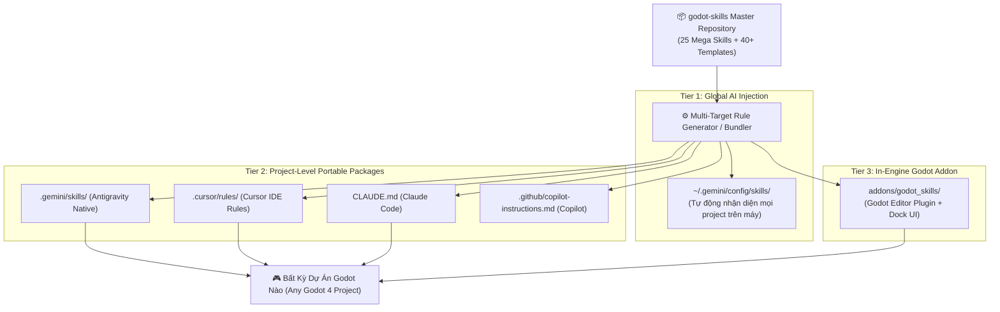
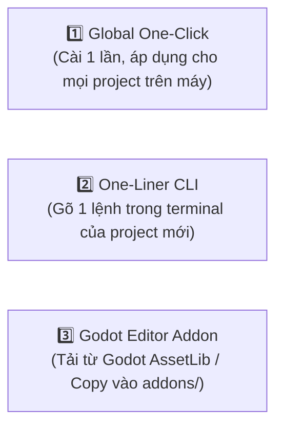
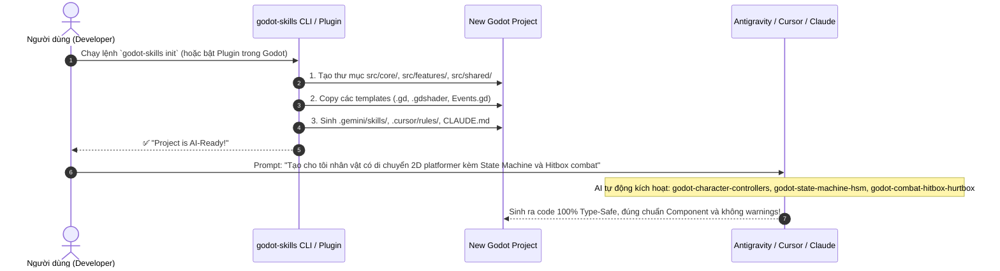
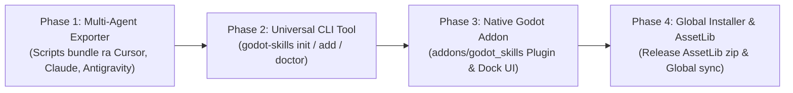

# 📦 GODOT SKILLS: PACKAGING & UNIVERSAL DISTRIBUTION PLAN

> **Mục tiêu tối thượng**: Đóng gói toàn bộ 25+ Mega Skills của `godot-skills` thành một **Package / Plugin / CLI Suite** có thể cài đặt vào **bất kỳ dự án Godot nào chỉ bằng 1 câu lệnh hoặc 1 click chuột**, giúp mọi AI Agent (Antigravity, Cursor, Claude Code, Copilot) khi mở dự án đó đều **tự động hiểu và kích hoạt toàn bộ kho kiến thức & template ngay lập tức**.

---

## 🏛️ 1. MÔ HÌNH KIẾN TRÚC PHÂN PHỐI ĐA NỀN TẢNG (UNIVERSAL ECOSYSTEM)

Để AI Agent ở bất kỳ môi trường nào cũng hiểu ngay toàn bộ skills khi mở project, chúng ta xây dựng kiến trúc **3 tầng phân phối (3-Tier Distribution Architecture)**:



---

## 🎯 2. BA HÌNH THỨC CÀI ĐẶT & KÍCH HOẠT (INSTALLATION MODES)

Chúng ta cung cấp 3 phương thức cài đặt linh hoạt tùy theo nhu cầu:



---

## 🛠️ 3. CHI TIẾT TỪNG THÀNH PHẦN ĐÓNG GÓI

### Thành phần 1: Universal AI Rule Compiler (`scripts/bundle_skills.py` hoặc `.ps1`)
*   **Chức năng**: Đọc toàn bộ thư mục `skills/` và tự động compile thành các định dạng AI tương thích:
    *   **Antigravity**: Copy trực tiếp các thư mục `skills/[skill-name]/` vào `.gemini/skills/` của project mục tiêu (hoặc global `~/.gemini/config/skills/`).
    *   **Cursor IDE**: Tạo các file rule độc lập trong `.cursor/rules/godot-[skill].mdc` có gắn glob `*.gd, *.tscn, *.gdshader, project.godot` để Cursor tự động nạp context.
    *   **Claude Code**: Sinh file `CLAUDE.md` tổng hợp toàn bộ quy chuẩn GDScript 2.0, kiến trúc Component, danh mục 25 skills và lệnh chạy GUT tests.
    *   **GitHub Copilot**: Sinh `.github/copilot-instructions.md`.

---

### Thành phần 2: Godot Editor Plugin (`addons/godot_skills`)
Một Addon Godot 4 chuẩn chỉnh, có thể kích hoạt trong `Project Settings -> Plugins`:

```text
addons/godot_skills/
├── plugin.cfg                         # Plugin configuration metadata
├── plugin.gd                          # EditorPlugin entry point
├── ui/
│   ├── skills_dock.tscn               # Dock panel bên cạnh Scene/FileSystem
│   └── skills_dock.gd                 # Logic giao diện quản lý skills
├── core/
│   ├── skill_installer.gd             # Logic copy templates và sinh AI context
│   └── gdscript_validator.gd          # Quét linter & cảnh báo cú pháp sai
└── templates/                         # Toàn bộ template .gd/.gdshader nén gọn
```

#### ✨ Tính Năng Của Addon Trong Godot Editor:
1.  **Tab "Godot Skills" trong Editor**: Duyệt trực quan danh mục 25 skills.
2.  **Nút "1-Click AI Setup"**: Tự động sinh toàn bộ file `.gemini/skills/`, `.cursor/rules/`, `CLAUDE.md` cho project hiện tại chỉ với 1 click.
3.  **Nút "Insert Component"**: Click để chèn nhanh `HealthComponent`, `HitboxComponent`, `StateMachine` vào Scene đang mở mà không cần viết code tay.
4.  **"Project Type-Safety Doctor"**: Nút quét toàn bộ script trong project và cảnh báo các đoạn code thiếu type annotation hoặc dính lỗi thời Godot 3.

---

### Thành phần 3: Standalone CLI Package (`godot-skills-cli`)
Một công cụ dòng lệnh cực nhẹ (viết bằng Python / PowerShell / Node.js) không phụ thuộc nặng:

#### Các lệnh hỗ trợ:
```bash
# Cài đặt toàn bộ skills & AI rules vào project hiện tại
godot-skills init

# Cài đặt global cho toàn máy (Antigravity / Gemini CLI)
godot-skills install --global

# Chỉ cài đặt các skills thuộc phân hệ mong muốn (ví dụ: combat và ai)
godot-skills add combat ai

# Kiểm tra độ tương thích type-safe của project
godot-skills doctor

# Cập nhật skills lên phiên bản mới nhất từ remote repo
godot-skills update
```

---

## 🔄 4. TRẢI NGHIỆM NGƯỜI DÙNG ĐÍCH (END-TO-END WORKFLOW)

Khi người dùng tạo một dự án Godot hoàn toàn mới (ví dụ: `C:\MyNewGame`):



---

## 📅 5. LỘ TRÌNH TRIỂN KHAI THEO PHASES (ROADMAP)



| Giai đoạn | Nội dung công việc | Đầu ra sản phẩm |
| :--- | :--- | :--- |
| **Phase 1: Multi-Agent Exporter** | Xây dựng script `tools/export_ai_rules.py` (hoặc `.ps1`) để từ 25 skills sinh ra `.gemini/skills/`, `.cursor/rules/`, `CLAUDE.md`, `.github/copilot-instructions.md`. | Script tự động hóa sinh AI rules đa nền tảng |
| **Phase 2: CLI Package** | Xây dựng CLI script (`install.ps1`, `install.sh`, `godot-skills.py`) hỗ trợ các lệnh `init`, `add`, `update`, `doctor`. | Lệnh 1 dòng cài đặt vào bất kỳ project nào |
| **Phase 3: Godot Plugin (`addons/godot_skills`)** | Tạo Godot EditorPlugin hoàn chỉnh với Dock UI trực quan, nút 1-click AI Setup và Component Injector. | Addon nạp trực tiếp vào Godot Editor |
| **Phase 4: Global Sync & Packaging** | Hỗ trợ cài đặt global vào `~/.gemini/config/skills/`, đóng gói `.zip` sẵn sàng upload lên Godot Asset Library / GitHub Releases. | File phân phối đóng gói chuẩn quốc tế |

---

## 🚀 6. KẾ HOẠCH BẮT ĐẦU NGAY
1. **Bước 1**: Tạo thư mục `tools/` và xây dựng script xuất khẩu đa nền tảng **`tools/export_ai_rules.py`** (hỗ trợ tạo `.gemini/skills`, `.cursor/rules`, `CLAUDE.md`, Copilot).
2. **Bước 2**: Tạo script cài đặt nhanh **`install.ps1`** và **`install.sh`** cho phép chạy 1 lệnh để setup mọi project Godot.
3. **Bước 3**: Xây dựng Addon **`addons/godot_skills`** với giao diện Dock UI trong Godot Editor.
